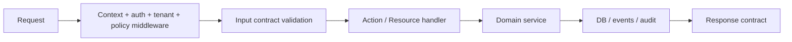

# Developer Deep Dive — Bun-Native AI-First Application Platform

> Companion document to `Goal.md`.
>
> Read order:
> 1. `Goal.md` — product vision, system constraints, trust model, package taxonomy, platform principles.
> 2. `Developer_DeepDive.md` (this document) — implementation contract for Codex and human developers.
>
> This document is intentionally opinionated. When a choice exists, it names:
> - the **default**,
> - the **reason**,
> - the **trade-offs**,
> - the **approved alternative**,
> - and **what not to do**.
>
> Implementation note:
> - examples in this document that refer to `packages/*` now map to `framework/core/*` or `framework/libraries/*` in the live repository.
> - examples that refer to `plugins/foundations/*` now map to `framework/builtin-plugins/*` in the live repository.

---

## 1. Purpose of this document

This is the implementation guide for building the platform described in `Goal.md`. It defines:

- repository structure,
- package syntax and DSLs,
- coding conventions,
- base library choices and adapters,
- kernel/module boundaries,
- app/plugin/library patterns,
- database patterns,
- frontend patterns,
- security and permission enforcement patterns,
- testing, release, and CI expectations,
- Codex rules of engagement.

This document is written so that a coding agent can build the platform with minimal ambiguity.

---

## 2. Core implementation stance

### 2.1 We are building a platform, not a collection of scripts

The system is composed of:

- a **kernel**,
- **platform foundations**,
- **domain base apps**,
- **feature packs**,
- **connectors**,
- **migration packs**,
- **vertical packs**,
- **bundles**,
- **UI surfaces**.

### 2.2 One package system, different kinds

Everything is a **package**.

Some packages are:
- libraries,
- apps,
- feature packs,
- connectors,
- migrations,
- bundles,
- UI zones,
- AI packs.

This means:
- one package format,
- one manifest grammar,
- one dependency solver,
- one signing/governance process.

### 2.3 Default implementation priorities

1. **Bun-native runtime first**.
2. **Drizzle + PostgreSQL first**.
3. **REST + OpenAPI first**.
4. **Admin shell and portal shell first**.
5. **Same-process trusted code only for first-party/core packages**.
6. **Unknown plugins get no direct DB or privileged execution**.
7. **Shell-embedded UI by default; zone UI only when the product truly needs it**.

---

## 3. Recommended base libraries and adapters

The framework must wrap third-party libraries behind stable platform packages. Never expose third-party APIs directly as the public framework contract.

## 3.1 Runtime, HTTP, and core infrastructure

| Concern | Default library / runtime | Wrap as | Why | Approved alternative | Avoid |
|---|---|---|---|---|---|
| Runtime | Bun | `@platform/runtime-bun` | Native runtime, native server, native SQL, test runner | none in core | Node-specific assumptions in kernel |
| HTTP server | `Bun.serve` | `@platform/http` | Smallest dependency surface and best control over gateway + shells | `@platform/http-hono-adapter` for optional ecosystems | making Hono/Elysia the kernel |
| WebSockets | Bun WebSockets | `@platform/realtime` | Native and simple | SSE for low-complexity cases | treating node-local realtime as multi-node state |
| File I/O | Bun file APIs + `node:fs` fallback | `@platform/fs` | Fast native path | none | direct filesystem assumptions for durable state |
| Child processes | Bun spawn APIs | `@platform/process` | only for trusted/ops code | none | exposing to plugin authors by default |

### Implementation rule

- The kernel owns only `@platform/runtime-bun` and `@platform/http`.
- Optional ecosystem bridges (Hono/Elysia) must be adapters, not foundations.

---

## 3.2 Data layer

| Concern | Default | Wrap as | Why | Alternative | Avoid |
|---|---|---|---|---|---|
| ORM / schema | Drizzle ORM | `@platform/db-drizzle` | Type-safe, Bun-compatible, explicit schema ownership | none in core | building a custom ORM |
| Postgres runtime driver | Bun SQL | inside `@platform/db-drizzle` | Bun-native, low friction | `pg` only for special tools/edge cases | exposing driver-specific APIs to packages |
| SQLite runtime driver | `bun:sqlite` via Drizzle | inside `@platform/db-drizzle` | Great local/dev fit | `better-sqlite3` only if needed outside Bun | abstracting away SQLite limitations |
| Migrations | `drizzle-kit` | `@platform/migrate` CLI wrapper | Explicit migration pipeline | none in core | runtime schema mutation |
| Validation / contracts | Zod 4 | `@platform/schema` | TS-first, metadata-friendly, JSON Schema output | Valibot adapter later | handwritten validation everywhere |
| OpenAPI generation | Zod + internal generator or `zod-to-openapi` adapter | `@platform/openapi` | Shared schemas across REST, UI, AI | codegen adapter later | separate schema languages |

### Implementation rule

- All platform contracts start in Zod.
- Drizzle schemas and Zod schemas are connected, but not identical.
- DB tables are not the public API.
- Domain contracts are explicit.

---

## 3.3 Auth and identity

| Concern | Default | Wrap as | Why | Alternative | Avoid |
|---|---|---|---|---|---|
| Auth engine | Better Auth | `@platform/auth` | Framework-agnostic, plugin ecosystem, auth features out of the box | custom adapter later if truly required | writing auth from scratch |
| Admin auth ops | Better Auth admin plugin | `@platform/auth-admin` | common admin actions | internal wrapper only | leaking Better Auth raw APIs into app code |
| Multi-tenant auth context | platform layer above Better Auth | `@platform/auth-context` | tenant/org awareness is platform-specific | none | assuming auth library == tenant model |

### Implementation rule

- Better Auth is an implementation detail behind `@platform/auth`.
- The platform owns:
  - tenant resolution,
  - permission context,
  - actor context,
  - impersonation rules,
  - audit linkage.

---

## 3.4 API and GraphQL

| Concern | Default | Wrap as | Why | Alternative | Avoid |
|---|---|---|---|---|---|
| REST | platform-native generator | `@platform/api-rest` | contract-first, permission-aware | none | handwritten CRUD everywhere |
| GraphQL | GraphQL Yoga | `@platform/api-graphql` | cross-platform, Bun integration, plugin model | disable entirely in simple installs | GraphQL as core business layer |
| GraphQL plugin model | Envelop via Yoga | internal to `@platform/api-graphql` | fine-grained customization | none | custom GraphQL execution framework |

### Implementation rule

- REST is the default.
- GraphQL is optional and generated from the same resource/action graph.
- GraphQL must never become the only path to business logic.

---

## 3.5 Frontend stack

| Concern | Default | Wrap as | Why | Alternative | Avoid |
|---|---|---|---|---|---|
| Shell framework | React | `@platform/ui-shell` | ecosystem and component support | none | multiple shell frameworks at once |
| Embedded routing | TanStack Router | `@platform/ui-router` | strong TS routing, search params, route loaders | React Router adapter later if needed | raw router usage everywhere |
| Server-state/query cache | TanStack Query | `@platform/ui-query` | standard server state, invalidation, caching | SWR adapter later | ad hoc fetch state |
| Tables/datagrids | TanStack Table | `@platform/ui-table` | headless + typed | AG Grid adapter only for premium use cases | locking into a rigid datagrid early |
| Forms | React Hook Form | `@platform/ui-form` | great performance, simple model | TanStack Form adapter later | custom form state per package |
| Design system base | Radix UI + shadcn/ui patterns | `@platform/ui-kit` | accessible primitives + open-code composition | Headless UI adapter later | closed third-party UI kits as framework core |
| Rich text | Tiptap OSS core | `@platform/ui-editor` | headless editor, extension model | Pro/Cloud features only as optional connector packs | baking commercial Tiptap features into core |
| Email templates | React Email | `@platform/email-templates` | TS/React email templates | MJML adapter later | string-built HTML emails |

### Implementation rule

- The shared admin/portal/site shells use **React**.
- The default embedded shell routing uses **TanStack Router**.
- Next.js is an optional **zone adapter**, not the default shell foundation.

---

## 3.6 Zone frontends

| Concern | Default | Wrap as | Why | Alternative | Avoid |
|---|---|---|---|---|---|
| Separate product UI zone | Next.js zone adapter | `@platform/ui-zone-next` | strong app-zone model for large product UIs | Bun+React static zone, custom SPA adapter | making every plugin a Next app |
| Embedded static UI | Bun bundler / React app | `@platform/ui-zone-static` | lightweight zone when SSR is not needed | none | SSR everywhere |
| Design token bridge | shared package | `@platform/design-tokens` | consistent UI across shells and zones | none | plugin-local design systems |
| Session bridge | platform cookie/session contract | `@platform/session-bridge` | avoid duplicate auth flows | none | independent login flows per zone |

### Implementation rule

A plugin may:
- register **embedded pages/widgets**,
- mount a **product zone**,
- or do both.

But every surface must be declared in the manifest.

---

## 3.7 Jobs, events, and observability

| Concern | Default | Wrap as | Why | Alternative | Avoid |
|---|---|---|---|---|---|
| Jobs abstraction | Platform jobs API | `@platform/jobs` | keep queue engine swappable | BullMQ adapter first, pg-boss adapter later if Bun support is proven | coupling core directly to queue vendor |
| Queue backend | BullMQ adapter | `@platform/jobs-bullmq` | mature Redis queue model; good for multi-node jobs | future Postgres-backed adapter | using Bun Workers as durable job foundation |
| Event bus | platform outbox + handlers | `@platform/events` | typed domain events | NATS/Kafka adapters later | plugin-to-plugin direct coupling |
| Logs | Pino | `@platform/logger` | structured logging with transports | console adapter only in local dev | unstructured logs |
| Observability | OpenTelemetry | `@platform/observability` | vendor-neutral traces/metrics/logs | backend-specific exporters behind adapters | hard-wiring one SaaS vendor |
| Error tracking | adapter package | `@platform/error-tracker-*` | optional | Sentry-like adapter | making it required |

### Implementation rule

- The public contract is `@platform/jobs`, not BullMQ.
- If Redis is already part of deployment topology, BullMQ is the first queue adapter.
- If later a Postgres-backed queue proves Bun-compatible and operationally fit, add it as another adapter rather than replacing the contract.

---

## 3.8 Search, geo, analytics, and media

| Concern | Default | Wrap as | Why | Alternative | Avoid |
|---|---|---|---|---|---|
| Default search | Postgres-based search primitives first | `@platform/search` | keep infra small early | Meilisearch/OpenSearch adapters | requiring external search on day one |
| Geo | internal abstractions + provider adapters | `@platform/geo` | multiple use cases need geocoding/distance/maps | provider-specific adapters | vendor lock-in in domain code |
| BI/analytics modeling | internal metrics layer | `@platform/analytics` | platform-defined KPIs and segments | warehouse/export adapters | making warehouse vendor the primary analytics model |
| Video/image processing | internal media contract | `@platform/media` | needed for OTT and content | external transcoding/CDN adapters | reimplementing global media infra first |

---

## 4. Monorepo structure

Use a monorepo from day one.

```txt
repo/
  apps/
    docs/
    examples/
    playground/
    platform-dev-console/

  packages/
    kernel/
      src/
    runtime-bun/
      src/
    http/
      src/
    config/
      src/
    schema/
      src/
    api-rest/
      src/
    api-graphql/
      src/
    db-drizzle/
      src/
    migrate/
      src/
    auth/
      src/
    auth-admin/
      src/
    permissions/
      src/
    plugin-solver/
      src/
    ui-shell/
      src/
    ui-router/
      src/
    ui-query/
      src/
    ui-form/
      src/
    ui-table/
      src/
    ui-kit/
      src/
    ui-editor/
      src/
    ui-zone-next/
      src/
    ui-zone-static/
      src/
    jobs/
      src/
    jobs-bullmq/
      src/
    events/
      src/
    logger/
      src/
    observability/
      src/
    email-templates/
      src/
    search/
      src/
    geo/
      src/
    analytics/
      src/
    ai/
      src/

  plugins/
    foundations/
      auth-core/
      user-directory/
      org-tenant-core/
      role-policy-core/
      audit-core/
      ...
    domain/
      crm-core/
      sales-core/
      marketing-core/
      commerce-core/
      finance-core/
      ...
    feature-packs/
      seo-core/
      localization-multi-currency/
      analytics-funnels/
      ai-rag/
      ...
    connectors/
      stripe-adapter/
      sendgrid-adapter/
      google-workspace-suite/
      ...
    migrations/
      shopify-import/
      woo-import/
      salesforce-import/
      ...
    verticals/
      school-core/
      hospital-core/
      ott-core/
      lms-core/
      ...
    bundles/
      school-suite/
      headless-commerce-suite/
      ott-streaming-suite/
      ...

  tooling/
    create-platform-app/
    codemods/
    release/
    security/
    sbom/
    scaffolds/

  docs/
    Goal.md
    Developer_DeepDive.md
    RFCs/
    package-contracts/
```

### Rules

1. `packages/` are framework/runtime/shared implementation packages.
2. `plugins/` are installable governed packages.
3. `apps/` are runnable products/examples/docs/playgrounds.
4. `tooling/` owns generators, CI helpers, security automation, and Codex templates.
5. Never mix platform packages and installable plugins in one directory.

---

## 5. Naming, IDs, and namespace rules

### 5.1 IDs

Use kebab-case package IDs.

Examples:
- `crm-core`
- `school-admissions-pack`
- `stripe-adapter`
- `woocommerce-import`
- `headless-commerce-suite`

### 5.2 Domain namespaces

Use dotted canonical ownership namespaces in manifests:

- `crm.contacts`
- `sales.opportunities`
- `finance.invoices`
- `commerce.orders`
- `streaming.channels`
- `learning.courses`
- `booking.reservations`

### 5.3 Rules

- package IDs are kebab-case,
- domain ownership is dotted,
- route IDs are slash-based,
- capability IDs are dotted,
- slot IDs are kebab-case,
- bundle IDs end with `-suite` or `-bundle`.

---

## 6. The implementation DSLs

Codex should use platform DSLs, not invent its own patterns.

## 6.1 `definePackage`

```ts
import { definePackage } from "@platform/kernel";

export default definePackage({
  id: "crm-core",
  kind: "app",
  version: "0.1.0",
  displayName: "CRM Core",
  description: "Canonical contact/account/activity backbone.",
  extends: [],
  dependsOn: ["auth-core", "org-tenant-core", "role-policy-core", "audit-core"],
  optionalWith: ["analytics-core"],
  conflictsWith: [],
  providesCapabilities: [
    "crm.contacts",
    "crm.accounts",
    "crm.activities",
  ],
  requestedCapabilities: [
    "ui.register.admin",
    "api.rest.mount",
    "data.write.crm",
  ],
  ownsData: [
    "crm.contacts",
    "crm.accounts",
    "crm.activities",
  ],
  slotClaims: [],
  trustTier: "first-party",
  reviewTier: "R1",
  isolationProfile: "same-process-trusted",
});
```

### Rules

- every installable plugin must have one root `plugin.ts` or `package.ts`,
- one `definePackage` call per package,
- no runtime-generated manifests.

---

## 6.2 `defineResource`

Resources model canonical business entities or extension-backed entities.

```ts
import { defineResource } from "@platform/schema";
import { z } from "zod";
import { contacts } from "./db/schema";

export const ContactResource = defineResource({
  id: "crm.contacts",
  table: contacts,
  contract: z.object({
    id: z.string().uuid(),
    tenantId: z.string().uuid(),
    name: z.string().min(2),
    email: z.string().email().optional(),
    status: z.enum(["lead", "active", "inactive"]),
    createdAt: z.string(),
  }),
  fields: {
    name: { searchable: true, sortable: true, label: "Name" },
    email: { searchable: true, sortable: true, label: "Email" },
    status: { filter: "select", label: "Status" },
  },
  admin: {
    autoCrud: true,
    defaultColumns: ["name", "email", "status", "createdAt"],
  },
  portal: {
    enabled: false,
  },
});
```

### Rules

- every canonical domain entity gets a resource,
- resource IDs must match ownership namespaces,
- resources are not raw tables; they are table + contract + field behavior.

---

## 6.3 `defineAction`

Actions model explicit business transitions.

```ts
import { defineAction } from "@platform/schema";
import { z } from "zod";

export const archiveContact = defineAction({
  id: "crm.contacts.archive",
  input: z.object({
    contactId: z.string().uuid(),
  }),
  output: z.object({
    ok: z.literal(true),
  }),
  permission: "crm.contacts.archive",
  idempotent: true,
  audit: true,
  handler: async ({ input, services, ctx }) => {
    await services.crm.archiveContact(ctx, input.contactId);
    return { ok: true };
  },
});
```

### Rules

- all dangerous or meaningful business transitions are explicit actions,
- do not hide real business state changes behind CRUD updates,
- actions are the primary surface for AI tools.

---

## 6.4 `definePolicy`

```ts
import { definePolicy } from "@platform/permissions";

export const crmPolicy = definePolicy({
  id: "crm.default",
  rules: [
    {
      permission: "crm.contacts.read",
      allowIf: ["role:sales", "role:manager"],
    },
    {
      permission: "crm.contacts.archive",
      allowIf: ["role:manager"],
      requireReason: true,
      audit: true,
    },
  ],
});
```

### Rules

- policies are explicit objects,
- policies never live as unstructured conditionals deep in route handlers,
- policy evaluation happens before domain mutation.

---

## 6.5 `defineConnector`

```ts
import { defineConnector } from "@platform/kernel";

export default defineConnector({
  id: "stripe-adapter",
  kind: "connector",
  dependsOn: ["payments-core", "integration-hub"],
  requestedCapabilities: [
    "network.egress",
    "secrets.read",
    "webhooks.receive",
    "data.write.finance",
  ],
  requestedHosts: ["api.stripe.com"],
  connector: {
    provider: "stripe",
    secrets: ["STRIPE_SECRET_KEY", "STRIPE_WEBHOOK_SECRET"],
    webhooks: [
      {
        event: "payment_intent.succeeded",
        route: "/webhooks/stripe/payment-intent-succeeded",
      },
    ],
  },
});
```

### Rules

- connectors never own canonical business data,
- connectors may own mapping/config tables,
- connectors must declare egress hosts and secret references,
- connectors should usually run in `sidecar` isolation unless first-party and low risk.

---

## 6.6 `defineMigrationPack`

```ts
import { defineMigrationPack } from "@platform/kernel";

export default defineMigrationPack({
  id: "woocommerce-import",
  kind: "migration-pack",
  dependsOn: ["commerce-core", "catalog-core", "crm-core", "data-pipeline-core"],
  sourceSystem: "woocommerce",
  targetDomains: [
    "catalog.products",
    "commerce.orders",
    "crm.contacts",
  ],
  phases: ["discover", "map", "dry-run", "delta-sync", "cutover", "reconcile"],
});
```

### Rules

- migration packs are temporary operational packages,
- they must not become hidden permanent runtime dependencies,
- they must declare source system and target domain scope explicitly.

---

## 6.7 `defineBundle`

```ts
import { defineBundle } from "@platform/kernel";

export default defineBundle({
  id: "school-suite",
  includes: [
    "school-core",
    "school-admissions-pack",
    "student-records-pack",
    "class-timetable-pack",
    "attendance-pack",
    "exam-management-pack",
    "fee-management-pack",
    "parent-portal-pack",
  ],
  optionalIncludes: [
    "transport-pack",
    "hostel-pack",
    "whatsapp-adapter",
  ],
});
```

### Rules

- bundles contain no hidden runtime logic,
- bundles are just tested compositions + metadata,
- permissions are aggregated from included packages,
- optional members must be explicit.

---

## 6.8 `defineUiSurface`

```ts
import { defineUiSurface } from "@platform/ui-shell";

export const crmAdminPages = defineUiSurface({
  embeddedPages: [
    {
      shell: "admin",
      route: "/admin/crm/contacts",
      component: "ContactsListPage",
      permission: "crm.contacts.read",
    },
    {
      shell: "admin",
      route: "/admin/crm/contacts/:id",
      component: "ContactDetailPage",
      permission: "crm.contacts.read",
    },
  ],
  widgets: [
    {
      shell: "admin",
      slot: "dashboard.sales",
      component: "PipelineSummaryWidget",
      permission: "crm.dashboard.read",
    },
  ],
});
```

### Rules

- embedded surfaces must declare shell, route/slot, and permission,
- embedded surfaces are preferred by default,
- do not create a separate zone for ordinary CRUD.

---

## 6.9 `defineZone`

```ts
import { defineZone } from "@platform/ui-zones";

export const ottStudioZone = defineZone({
  id: "ott-studio",
  adapter: "next-zone",
  mountPath: "/apps/ott-studio",
  assetPrefix: "/_assets/plugins/ott-studio",
  authMode: "platform-session",
  telemetryNamespace: "streaming.ottStudio",
  deepLinks: [
    "/apps/ott-studio/library",
    "/apps/ott-studio/schedule",
    "/apps/ott-studio/analytics",
  ],
  routeOwnership: ["/apps/ott-studio/*"],
});
```

### Rules

- zones must claim a mount path,
- zones must claim an asset prefix,
- zones must not overlap with other zones,
- zones are for product-shaped interfaces only.

---

## 7. Implementation architecture by package kind

## 7.1 Libraries

### When to use
Use a library when the package:
- provides utilities,
- provides schemas/helpers,
- provides shared UI components,
- provides an adapter implementation detail,
- does not need store governance as a business feature.

### Required structure

```txt
packages/money-utils/
  src/
    index.ts
    amount.ts
    currency.ts
  package.ts (optional if internal only)
```

### Rules
- no migrations,
- no route registration,
- no capability requests by default,
- no direct plugin store listing by default.

### Example
- `money-utils`
- `date-utils`
- `csv-utils`
- `design-tokens`
- `analytics-math`

---

## 7.2 Apps

### When to use
Use an app when the package:
- owns canonical business data,
- has resources/actions/policies,
- may expose APIs and UI,
- may have migrations.

### Required structure

```txt
plugins/domain/crm-core/
  package.ts
  src/
    resources/
      contacts.resource.ts
      accounts.resource.ts
    actions/
      archive-contact.action.ts
      merge-accounts.action.ts
    policies/
      crm.policy.ts
    services/
      crm.service.ts
    ui/
      admin/
      portal/
    hooks/
  db/
    schema.ts
    migrations/
  tests/
```

### Rules
- every app must declare owned domains,
- every app must declare public capabilities,
- domain services are the only place with mutation orchestration,
- route handlers must stay thin.

---

## 7.3 Feature packs

### When to use
Use a feature pack when the package:
- extends an app,
- adds optional business behavior,
- adds no new canonical ownership outside its namespace.

### Example
`lead-scoring-pack`

```txt
plugins/feature-packs/lead-scoring-pack/
  package.ts
  src/
    scoring/
    actions/
    widgets/
  db/
    schema.ts
```

### Rules
- must `extends` or `dependsOn` a base app,
- must not silently replace canonical ownership,
- may add extension tables, actions, dashboards, jobs.

---

## 7.4 Connectors

### When to use
Use a connector when the package:
- talks to an external system,
- holds sync mappings,
- defines webhook handlers,
- needs egress and secrets.

### Required structure

```txt
plugins/connectors/stripe-adapter/
  package.ts
  src/
    provider/
      client.ts
      mappers.ts
      webhooks.ts
    actions/
    settings/
  tests/
```

### Rules
- no canonical data ownership,
- provider-specific logic isolated under `provider/`,
- outgoing API calls only through adapter client,
- all webhooks must verify signatures,
- all egress hosts must be declared.

---

## 7.5 Migration packs

### When to use
Use a migration pack when the package:
- imports from a competitor/incumbent system,
- exports to a structured format,
- performs cutover/reconciliation.

### Required structure

```txt
plugins/migrations/shopify-import/
  package.ts
  src/
    discover/
    map/
    import/
    reconcile/
    cutover/
  tests/
```

### Rules
- no permanent business ownership,
- must emit migration reports,
- must support dry run,
- must define source and target domains,
- privileged scopes expire after cutover.

---

## 7.6 Bundles

### When to use
Use a bundle when you need:
- a tested composition,
- a one-click install set,
- a repeatable AI or human starter.

### Required structure

```txt
plugins/bundles/school-suite/
  package.ts
  bundle.lock.ts
```

### Rules
- no direct business logic,
- no hidden permissions,
- explicit required/optional members only,
- version bundle independently from members.

---

## 7.7 UI surface packages

### When to use
Use a UI-surface package when the package:
- contributes widgets,
- contributes shell pages,
- contributes a zone,
- contributes blocks/builders/editors.

### Required structure

```txt
plugins/feature-packs/page-builder-blocks/
  package.ts
  src/
    blocks/
    widgets/
    embedded/
    zone/ (optional)
```

### Rules
- UI packages do not own canonical domain truth,
- they consume domain APIs/resources,
- route ownership must be declared,
- zone UI must not bypass permissions or audit.

---

## 7.8 AI packs

### When to use
Use an AI pack when the package:
- connects to models,
- adds copilots,
- adds RAG,
- adds evaluation or guardrails,
- adds tool schemas.

### Required structure

```txt
plugins/feature-packs/ai-rag/
  package.ts
  src/
    retrieval/
    chunking/
    indexing/
    tools/
    policies/
```

### Rules
- AI packs never get blanket DB access,
- AI tools always call explicit actions or curated read models,
- guardrails and audit are mandatory for sensitive AI flows.

---

## 8. Package implementation rules

## 8.1 Every package must be explicit

Codex must never:
- infer routes from arbitrary file names,
- infer permissions from naming alone,
- infer ownership from tables alone,
- infer zone mounts from folders alone.

Everything important must be declared in metadata.

---

## 8.2 Stable public APIs only

Each package must expose:
- one public entrypoint,
- one typed public contract,
- no deep imports into internal files from outside the package.

### Good
```ts
import { ContactResource } from "@plugins/crm-core";
```

### Bad
```ts
import { something } from "@plugins/crm-core/src/resources/internal/private-file";
```

---

## 8.3 The service layer is mandatory

Every domain app should use:

- `resources/` for contracts and UI metadata,
- `actions/` for explicit transitions,
- `services/` for orchestration,
- `db/` for Drizzle schema and query modules,
- `policies/` for authorization,
- `ui/` for shell/zone wiring.

### Good
`route -> action -> service -> repository -> DB`

### Bad
`route -> raw SQL`

---

## 8.4 Repository patterns

### Read repository
- optimized reads
- list/filter/search/paginate
- no side effects

### Write service
- mutations
- transaction orchestration
- audit/event publishing
- policy enforcement checkpoint

### Example

```ts
// good
await services.finance.issueInvoice(ctx, input);

// bad
await db.insert(invoices).values(...)
```

The second pattern is allowed only inside the finance service/repository layer.

---

## 9. Drizzle and database implementation patterns

## 9.1 Schema file layout

### Small package
```txt
db/
  schema.ts
  migrations/
```

### Larger package
```txt
db/
  schema/
    contacts.ts
    accounts.ts
    activities.ts
  indexes.ts
  relations.ts
  migrations/
```

### Rule
Split by bounded context, not by arbitrary technical layer.

---

## 9.2 Example Drizzle schema

```ts
import { pgTable, uuid, text, timestamp } from "drizzle-orm/pg-core";

export const contacts = pgTable("contacts", {
  id: uuid("id").primaryKey(),
  tenantId: uuid("tenant_id").notNull(),
  name: text("name").notNull(),
  email: text("email"),
  status: text("status").notNull(),
  createdAt: timestamp("created_at").notNull().defaultNow(),
});
```

---

## 9.3 Query module pattern

```ts
import { db } from "@platform/db";
import { contacts } from "../db/schema";
import { and, eq } from "drizzle-orm";

export async function listContactsByTenant(tenantId: string) {
  return db.select().from(contacts).where(eq(contacts.tenantId, tenantId));
}
```

### Rules
- query modules return raw DB results or mapped typed DTOs,
- query modules do not publish domain events,
- query modules do not do permission logic,
- tenant scoping must be explicit or guaranteed by RLS/context.

---

## 9.4 Transaction pattern

```ts
export async function archiveContact(ctx: ActionContext, contactId: string) {
  return ctx.db.transaction(async (tx) => {
    await tx
      .update(contacts)
      .set({ status: "inactive" })
      .where(eq(contacts.id, contactId));

    await ctx.audit.log(tx, {
      action: "crm.contacts.archive",
      actorId: ctx.actor.id,
      tenantId: ctx.tenant.id,
      targetId: contactId,
    });

    await ctx.events.publish(tx, {
      type: "crm.contact.archived",
      contactId,
      tenantId: ctx.tenant.id,
    });
  });
}
```

### Rules
- every business mutation uses the framework transaction context,
- audit and event writes belong in the same transaction where feasible,
- long external calls must happen outside the DB transaction unless intentionally coordinated.

---

## 9.5 Migrations

### Default strategy
Use **expand / backfill / switch / contract**.

#### Example
1. add nullable column,
2. backfill data,
3. switch readers,
4. switch writers,
5. remove old column later.

### Rules
- never rely on destructive migrations without rollback planning,
- never auto-run unreviewed destructive migrations in production,
- every migration pack must support dry run,
- cross-package migrations must be ordered by the solver.

---

## 9.6 RLS conventions

For shared tenant tables:
- include `tenant_id`,
- enable RLS,
- use transaction-local settings for `app.tenant_id`,
- make runtime roles non-owning,
- audit any SECURITY DEFINER usage.

Codex should not invent its own tenant isolation pattern per package.

---

## 10. API implementation patterns

## 10.1 REST routing conventions

Generated conventions:

- `GET /api/v1/<resource>`
- `GET /api/v1/<resource>/:id`
- `POST /api/v1/<resource>`
- `PATCH /api/v1/<resource>/:id`
- `DELETE /api/v1/<resource>/:id` only when explicitly safe
- `POST /api/v1/actions/<action-id>`

### Rule
High-risk or domain-specific operations must go under action endpoints, not PATCH.

### Good
`POST /api/v1/actions/crm.contacts.archive`

### Bad
`PATCH /api/v1/contacts/:id { status: "inactive" }` for a business archive transition

---

## 10.2 Request flow



### Rules
- validate input before service entry,
- validate output before returning if the contract is public,
- attach request, tenant, actor, and plugin metadata to audit/telemetry.

---

## 10.3 OpenAPI generation rules

OpenAPI must be generated from the same source of truth as:
- REST routes,
- schemas,
- action definitions.

Codex should never write separate request/response type definitions for OpenAPI manually unless the generator lacks a needed feature and the override is declared.

---

## 10.4 GraphQL rules

If GraphQL is enabled:
- generate types and resolvers from the same resource/action registry,
- keep GraphQL resolvers thin,
- inject platform context into Yoga context,
- keep authorization in services/policies, not hidden in field resolvers.

---

## 10.5 Webhook patterns

### Receive
- verify signature,
- parse idempotency key,
- store inbound delivery event,
- enqueue processing job,
- return fast.

### Send
- sign payload,
- retry with backoff,
- dead-letter after threshold,
- expose replay admin tools.

---

## 11. Frontend implementation patterns

## 11.1 Default shell structure

```txt
packages/ui-shell/
  src/
    admin/
    portal/
    site/
    widgets/
    layouts/
    providers/
    navigation/
```

### Rule
The shell must be generic and plugin-composable.  
No domain-specific logic in the shell package.

---

## 11.2 Embedded page package pattern

```txt
plugins/domain/crm-core/src/ui/admin/
  pages/
    contacts-list.page.tsx
    contact-detail.page.tsx
  widgets/
    pipeline-summary.widget.tsx
  routes.ts
```

### Rules
- embedded pages are registered through metadata,
- pages use shell providers,
- pages use platform query hooks and form adapters,
- pages do not fetch via ad hoc raw URLs.

---

## 11.3 Zone package pattern

```txt
plugins/verticals/ott-core/src/ui/zone-next/
  app/
  components/
  routes/
  next.config.ts
  zone.ts
```

### Rules
- the zone declares its mount path and asset prefix in manifest metadata,
- auth/session comes from the platform contract,
- the zone calls platform APIs, not raw DB,
- the zone uses shared design tokens,
- cross-zone links are explicit.

---

## 11.4 When to use a separate product zone

Use a zone for:
- page builders,
- OTT control rooms,
- LMS instructor studio,
- workflow designers,
- analytics studios,
- dispatch boards,
- scheduling boards,
- large admin consoles.

Do not use a zone for:
- ordinary CRUD,
- simple settings,
- small reports,
- basic detail pages,
- tiny dashboards.

---

## 11.5 Query patterns

Use TanStack Query wrappers:

```ts
export function useContact(id: string) {
  return usePlatformQuery({
    queryKey: ["crm", "contact", id],
    queryFn: () => api.crm.getContact(id),
  });
}
```

### Rules
- query keys are stable and typed,
- mutations invalidate explicit scopes,
- plugin UIs do not manage server state by hand if a query wrapper exists.

---

## 11.6 Table patterns

Use TanStack Table through platform helpers:

```ts
const table = usePlatformTable({
  data,
  columns: [
    column.text("name", { header: "Name" }),
    column.text("email", { header: "Email" }),
    column.enum("status", { header: "Status" }),
  ],
});
```

### Rules
- column builders must be standardized,
- sorting/filtering conventions must match generated REST filters,
- pagination should default to server-side for large data.

---

## 11.7 Form patterns

Use RHF through platform wrappers:

```ts
const form = usePlatformForm({
  schema: ContactCreateSchema,
  defaultValues,
  onSubmit: async (values) => {
    await actions.crm.createContact(values);
  },
});
```

### Rules
- forms use Zod-backed schemas,
- platform form wrapper handles error mapping,
- no per-package custom validation engine.

---

## 11.8 Design system rules

- use Radix primitives as base accessibility layer,
- use shadcn/ui pattern as the code-distribution/design-system approach,
- expose shared `ui-kit` primitives to plugin authors,
- forbid plugin-local reinvention of shell primitives unless justified.

---

## 12. Jobs, workflows, and events

## 12.1 Jobs

All jobs must be declared through `@platform/jobs`.

```ts
defineJob({
  id: "crm.sync-segments",
  queue: "crm-sync",
  payload: z.object({
    tenantId: z.string().uuid(),
  }),
  handler: async ({ payload, services }) => {
    await services.marketing.syncSegments(payload.tenantId);
  },
});
```

### Rules
- no invisible cron jobs,
- every scheduled job has manifest metadata,
- queue/worker behavior is observable,
- jobs have concurrency/retry/time budget settings.

---

## 12.2 Workflows

Workflow definitions belong to `workflow-core` and feature/vertical packs.

```ts
defineWorkflow({
  id: "invoice-approval",
  initialState: "draft",
  states: {
    draft: { on: { submit: "pending_approval" } },
    pending_approval: {
      on: {
        approve: "approved",
        reject: "rejected",
      },
    },
    approved: {},
    rejected: {},
  },
});
```

### Rules
- workflow state machines are explicit,
- transitions map to actions,
- approvals are audited,
- workflow side effects are not buried in UI code.

---

## 12.3 Events

Use typed domain events only.

```ts
defineEvent<{
  type: "crm.contact.archived";
  tenantId: string;
  contactId: string;
}>()
```

### Rules
- no stringly-typed ad hoc event payloads,
- no plugin-to-plugin direct callbacks when an event contract is better,
- event consumers must be idempotent.

---

## 13. Security implementation patterns

## 13.1 Every installable plugin needs governance metadata

Codex must include:
- `trustTier`
- `reviewTier`
- `requestedCapabilities`
- `isolationProfile`

for every installable package.

No exceptions.

---

## 13.2 Same-process code rules

Allowed:
- first-party foundations,
- carefully reviewed first-party/partner packages.

Not allowed:
- unknown code,
- community code with secrets/egress/DB access,
- high-risk migration or restore tools.

---

## 13.3 Unknown plugin rules

Unknown plugins:
- do not get raw DB access,
- do not get arbitrary network egress,
- do not get secret access,
- do not get lifecycle execution by default,
- may run only in restricted/declarative mode until promoted.

---

## 13.4 Secret handling rules

Packages never read environment variables directly in business code.

Use:
- secret references,
- platform secret provider,
- injection via runtime context.

### Good
```ts
const secret = await ctx.secrets.get("STRIPE_SECRET_KEY");
```

### Bad
```ts
const secret = process.env.STRIPE_SECRET_KEY;
```

The second is allowed only inside framework boot code or adapter bootstrapping layers.

---

## 13.5 Network rules

- all egress hosts declared,
- no wildcard egress for non-core packages,
- connectors get allowlisted domains only,
- all webhook receivers verify signatures,
- all outgoing webhooks sign payloads.

---

## 13.6 Audit rules

Every sensitive action must emit:
- package ID,
- actor ID,
- tenant ID,
- action ID,
- request ID,
- target resource IDs,
- reason metadata where required.

---

## 14. Database security patterns for Codex

## 14.1 Same-process packages

Same-process packages do **not** get their own DB credentials.

They use:
- platform repositories,
- platform services,
- platform transaction context.

This is the default and must be preferred.

---

## 14.2 Isolated plugin packages

If a package runs in:
- a sidecar process,
- a separate worker,
- a separate product zone backend,

then it may get:
- a separate narrow DB role,
- access only to:
  - its own schema,
  - curated `api` schema views/functions,
  - permitted read models.

---

## 14.3 DB role classes in code/docs

Codex must assume the following roles exist:

- `app_migrator`
- `app_runtime`
- `app_jobs`
- `app_readonly`
- `backup_restore`
- `plugin_<id>_runtime` only for isolated packages

Never invent one role per plugin in the monolith by default.

---

## 14.4 RLS assumptions in package code

Package code must assume:
- tenant context is already set,
- the runtime role does not own tables,
- direct cross-tenant reads are forbidden.

Never bypass tenancy in plugin code unless the package is a privileged operational tool.

---

## 14.5 API schema access

For isolated packages, Codex should prefer:
- views in `api` schema,
- purpose-built functions,
- materialized read models.

Not:
- arbitrary joins across core schemas.

---

## 15. Recommended coding standards

## 15.1 TypeScript

- strict mode on,
- no implicit any,
- no ignored type errors in framework code,
- no silent `as any` escapes except inside narrow adapters with comments.

## 15.2 Errors

Use typed platform errors:
- `PermissionDeniedError`
- `ValidationError`
- `ConflictError`
- `NotFoundError`
- `ExternalServiceError`
- `PluginActivationError`

Do not throw naked strings.

## 15.3 Logging

- structured logs only,
- never log secrets,
- redact PII where required,
- attach request/plugin/tenant IDs.

## 15.4 File naming

Use:
- `*.resource.ts`
- `*.action.ts`
- `*.policy.ts`
- `*.service.ts`
- `*.job.ts`
- `*.widget.tsx`
- `*.page.tsx`
- `*.zone.ts`

## 15.5 Imports

- public package imports only,
- no deep imports across package boundaries,
- plugin code must not import Bun internals directly except through platform wrappers if a wrapper exists.

---

## 16. Testing strategy

## 16.1 Required test layers

| Layer | Required for |
|---|---|
| unit tests | all core packages |
| integration tests | domain apps, connectors, DB packages |
| contract tests | APIs, manifests, bundles |
| permission tests | security-sensitive packages |
| migration tests | any package with migrations |
| UI smoke tests | shell pages and zones |
| E2E tests | major bundles |
| fixture/reference app tests | release candidates |

## 16.2 Bun test runner

Use `bun:test` as the default test runner.  
Use Playwright for browser E2E.

### Rules
- unit/integration tests live near packages,
- bundle tests live in integration suites,
- permission and trust-state tests are mandatory for installable plugins,
- golden reference apps must exist for:
  - CRM,
  - commerce,
  - school,
  - helpdesk,
  - OTT,
  - LMS.

---

## 16.3 Example package test layout

```txt
plugins/domain/crm-core/
  tests/
    unit/
    integration/
    permissions/
    fixtures/
```

### Test checklist for every installable package
- [ ] manifest validates
- [ ] dependencies resolve
- [ ] permissions declared correctly
- [ ] migrations apply and rollback as expected
- [ ] API routes generate
- [ ] UI registration works
- [ ] telemetry and audit hooks do not break
- [ ] package can be disabled cleanly

---

## 17. CI/CD and release rules

## 17.1 CI stages

1. lint + typecheck
2. unit tests
3. integration tests
4. contract tests
5. manifest validation
6. SBOM generation
7. vulnerability scan
8. package build
9. signing/provenance
10. preview environment
11. smoke bundle tests
12. publish/promote

---

## 17.2 Release rules

- no direct publish from a workstation,
- every installable plugin must be built in CI,
- signatures and provenance are mandatory,
- permission diff is computed on every update,
- bundle compatibility is rechecked on every release.

---

## 17.3 Versioning rules

- package semver,
- bundle semver,
- breaking manifest contract changes require major version,
- cross-package compatibility ranges must be explicit,
- deprecations require migration notes.

---

## 18. Codex rules of engagement

Codex must follow these rules while implementing.

## 18.1 Never invent new patterns if a platform contract exists

If a platform package exists, use it.

### Good
- `definePackage`
- `defineResource`
- `defineAction`
- `definePolicy`
- `usePlatformQuery`
- `usePlatformForm`

### Bad
- inventing local manifest syntax
- inventing local action schemas
- inventing local permission systems
- inventing custom data loaders without integration

---

## 18.2 Prefer explicit over clever

- explicit manifests,
- explicit dependencies,
- explicit ownership,
- explicit routes,
- explicit package boundaries.

Do not hide behavior in naming conventions or magical loaders.

---

## 18.3 Always choose the lower-risk interpretation

If the spec is ambiguous:
1. choose the more restrictive permission model,
2. choose the more explicit manifest shape,
3. choose embedded UI over zone UI unless the product is clearly app-like,
4. choose API/service access over raw DB access,
5. choose sidecar over same-process for medium/high-risk integrations.

---

## 18.4 Do not collapse package kinds

Codex must not treat:
- library,
- app,
- connector,
- migration pack,
- bundle

as interchangeable.

---

## 18.5 Do not overfit to one example

A school plugin should follow the same architectural contracts as a hospital plugin or OTT plugin:
- base package,
- atomic subapps,
- explicit UI surfaces,
- declared dependencies,
- clear ownership.

---

## 18.6 If a package needs something new, add a platform contract first

Do not hack around missing platform contracts in package-local code.  
Instead:
1. propose/implement a new core contract,
2. then use it consistently.

---

## 19. Anti-patterns for implementors

Do not do any of the following.

1. Put 20 subapps in one plugin without separate manifests.
2. Let a connector own canonical business data.
3. Give a same-process plugin raw DB credentials.
4. Let a zone frontend talk directly to the database.
5. Introduce route ownership without manifest claims.
6. Add Next.js zones for ordinary CRUD pages.
7. Rebuild auth, ORM, or validation from scratch in package code.
8. Encode permissions in UI only.
9. Use runtime migrations without review.
10. Leak third-party library APIs as framework APIs.
11. Assume MySQL is equal to Postgres in behavior.
12. Hardcode a vendor where the framework contract should be generic.
13. Mix migration code permanently into live domain plugins.
14. Let AI tools call raw repositories instead of actions.
15. Use Bun Workers as the first durable jobs substrate.
16. Treat unknown/community code as trusted because it has a manifest.

---

## 20. Implementation order for Codex

Build in this sequence.

### 20.1 Platform packages first
1. `kernel`
2. `runtime-bun`
3. `http`
4. `config`
5. `schema`
6. `permissions`
7. `db-drizzle`
8. `api-rest`
9. `auth`
10. `plugin-solver`
11. `ui-shell`
12. `jobs`
13. `events`
14. `observability`

### 20.2 Then foundations
1. `auth-core`
2. `user-directory`
3. `org-tenant-core`
4. `role-policy-core`
5. `audit-core`
6. `dashboard-core`
7. `portal-core`
8. `forms-core`
9. `content-core`
10. `crm-core`
11. `finance-core`
12. `commerce-core`

### 20.3 Then first bundles
1. `crm-growth-suite`
2. `headless-commerce-suite`
3. `service-desk-suite`
4. `school-suite`
5. `lms-suite`

### 20.4 Then advanced domains
1. `streaming-core`
2. OTT bundles
3. advanced bookings
4. vertical industry bundles
5. partner connectors
6. AI packs

---

## 21. Final checklist for any new package

### 21.1 All package kinds
- [ ] correct `kind`
- [ ] clear `id`
- [ ] explicit dependencies
- [ ] explicit ownership or extension declaration
- [ ] tests
- [ ] docs
- [ ] compatibility metadata

### 21.2 Apps
- [ ] resources defined
- [ ] actions defined
- [ ] policies defined
- [ ] services implemented
- [ ] migrations reviewed
- [ ] UI declared if present

### 21.3 Connectors
- [ ] hosts declared
- [ ] secrets declared
- [ ] webhooks verified
- [ ] provider code isolated
- [ ] no canonical ownership claimed

### 21.4 Migration packs
- [ ] source system declared
- [ ] target domains declared
- [ ] dry run supported
- [ ] reconciliation supported
- [ ] cutover notes included

### 21.5 Bundles
- [ ] required components explicit
- [ ] optional components explicit
- [ ] compatibility locked
- [ ] permission aggregation checked
- [ ] smoke tests included

### 21.6 UI zones
- [ ] mount path declared
- [ ] asset prefix declared
- [ ] auth/session bridge used
- [ ] design tokens imported
- [ ] telemetry namespace declared

---

## 22. Official references for implementors

These are the official docs the platform choices are based on and are the recommended first references for Codex when deeper implementation details are needed.

### Bun
- Runtime overview: `https://bun.sh/docs/runtime`
- SQL: `https://bun.sh/docs/runtime/sql`
- WebSockets: `https://bun.sh/docs/runtime/http/websockets`
- Workers: `https://bun.sh/docs/runtime/workers`
- File I/O: `https://bun.sh/docs/runtime/file-io`
- Test runner: `https://bun.sh/docs/test`

### Drizzle
- Get started: `https://orm.drizzle.team/docs/get-started`
- Bun SQL: `https://orm.drizzle.team/docs/connect-bun-sql`
- Bun SQLite: `https://orm.drizzle.team/docs/connect-bun-sqlite`

### Better Auth
- Docs: `https://www.better-auth.com/docs`
- Installation: `https://www.better-auth.com/docs/installation`
- Database: `https://www.better-auth.com/docs/concepts/database`
- Admin plugin: `https://www.better-auth.com/docs/plugins/admin`

### GraphQL Yoga
- Docs: `https://the-guild.dev/graphql/yoga-server/docs`
- Bun integration: `https://the-guild.dev/graphql/yoga-server/docs/integrations/integration-with-bun`

### Zod
- Docs: `https://zod.dev/`
- JSON Schema: `https://zod.dev/json-schema`
- Metadata: `https://zod.dev/metadata`

### TanStack
- Router: `https://tanstack.com/router/latest/docs/overview`
- Query: `https://tanstack.com/query/v5/docs`
- Table: `https://tanstack.com/table/latest/docs/overview`

### React Hook Form
- Get started: `https://react-hook-form.com/get-started`
- Docs: `https://react-hook-form.com/docs`

### Radix + shadcn/ui
- Radix primitives: `https://www.radix-ui.com/primitives/docs/overview/introduction`
- shadcn/ui docs: `https://ui.shadcn.com/docs`

### Tiptap
- Docs: `https://tiptap.dev/docs`
- Custom extensions: `https://tiptap.dev/docs/editor/extensions/custom-extensions`

### React Email
- Docs: `https://react.email/docs/introduction`

### BullMQ
- Docs: `https://docs.bullmq.io/`
- Connections: `https://docs.bullmq.io/guide/connections`

### Observability
- OpenTelemetry docs: `https://opentelemetry.io/docs/`
- JavaScript docs: `https://opentelemetry.io/docs/languages/js/`
- Pino: `https://getpino.io/`

---

## 23. Final instruction to Codex

When implementing this platform:

1. Read `Goal.md`.
2. Read this document completely.
3. Implement **contracts before features**.
4. Prefer **platform packages** over direct third-party API usage.
5. Keep **same-process code trusted and limited**.
6. Keep **plugins atomic**.
7. Keep **verticals compositional**.
8. Keep **manifests explicit**.
9. Keep **AI actions explicit and auditable**.
10. Keep **DB access governed and least-privilege**.
11. Keep **UI zones rare and deliberate**.
12. If a shortcut weakens trust boundaries, do not take it.

The platform succeeds only if it stays:
- easy to assemble,
- hard to misuse,
- easy for AI to reason about,
- and consistent across every package kind.
