# AI-First Bun-Native Application Platform — Master Specification

## 1. Executive summary

### 1.1 Purpose

This specification defines the architecture, security model, package system, plugin operating system, database model, UI model, deployment topology, and implementation roadmap for a Bun-native, AI-first application platform. It is intended to serve simultaneously as:

* the product vision,
* the platform architecture blueprint,
* the implementation guide,
* the security review baseline,
* the plugin-author contract,
* the AI-agent operating contract.

### 1.2 What is being built

The platform is a **Bun-native application platform**, not merely an HTTP framework. It is designed to generate and run serious business applications with low code, strong defaults, governed plugins, explicit metadata, multi-tenant support, and enterprise-grade security. It is influenced by Django’s “easy to start” ergonomics, but it is **not** a Django clone, not a WordPress clone, and not merely a CMS. Bun now provides a native HTTP server, WebSockets, a unified SQL API for PostgreSQL/MySQL/SQLite, a built-in Jest-compatible test runner, and strong Node compatibility; Drizzle officially supports Bun SQL and Bun SQLite, which makes Bun + Drizzle a credible native base for this platform. ([Bun][1])

### 1.3 Core thesis

The platform must optimize for all of the following at the same time:

* **setup over coding**,
* **safe defaults over silent power**,
* **explicit metadata over hidden magic**,
* **plugin governance over plugin anarchy**,
* **stateless app nodes over server affinity**,
* **domain composition over monolithic verticals**,
* **AI-operable manifests over ad hoc code discovery**.

### 1.4 Recommended defaults

| Area                    | Default                                                      |
| ----------------------- | ------------------------------------------------------------ |
| Runtime                 | Bun                                                          |
| Language                | TypeScript                                                   |
| ORM / schema layer      | Drizzle                                                      |
| Reference production DB | PostgreSQL                                                   |
| Local/dev DB            | SQLite                                                       |
| Secondary future DB     | MySQL, after a clear support matrix                          |
| API default             | REST + OpenAPI                                               |
| Optional API            | GraphQL adapter                                              |
| UI default              | Shared admin shell + shared portal shell + shared site shell |
| Product-oriented UI     | Optional plugin-owned zones                                  |
| Plugin store posture    | Private/curated first                                        |
| Supply-chain posture    | Signed packages + provenance + SBOM + policy gates           |
| Unknown plugin posture  | Quarantine / restricted mode / no privileged execution       |
| AI posture              | Tool-safe actions + schema-driven manifests + bundle recipes |

### 1.5 Strategic outcome

If implemented correctly, the platform lets a human or AI assemble:

* back-office systems,
* ERP/CRM/service systems,
* customer portals,
* public websites,
* content platforms,
* commerce systems,
* LMS products,
* OTT/video platforms,
* bookings/scheduling products,
* industry-specific verticals,

from governed packages rather than from custom reinvention.

---

## 2. Product identity and vision

### 2.1 Identity

This platform is:

1. **Bun-native**.
2. **AI-first** in metadata, package contracts, and operational control.
3. **Application-platform-first**, not request-framework-first.
4. **Plugin-operating-system-first**, not marketplace-first.
5. **Enterprise-capable by default**.
6. **Multi-server-first** with stateless application nodes.
7. **Minimal-code by design** with deliberate escape hatches.

### 2.2 What it is not

It is not:

* a Django clone,
* a WordPress clone,
* a monolithic CMS,
* a bare HTTP router,
* a visual builder first,
* an ORM replacement,
* an arbitrary script host for untrusted plugins.

### 2.3 Why Bun-native

Bun is the right foundation because it provides a single runtime/toolkit that already covers runtime execution, test, package management, bundling, HTTP serving, WebSockets, and SQL access, while maintaining strong Node compatibility for the wider package ecosystem. That reduces platform surface area and keeps the kernel Bun-native instead of layering many unrelated runtimes under the framework. Bun’s Workers API remains explicitly experimental, so durable jobs and privileged asynchronous execution should not depend on Workers as the hard foundation in early phases. ([Bun][1])

### 2.4 Why Drizzle-first

Drizzle is the recommended data layer because it is TypeScript-native, works directly with Bun SQL and Bun SQLite, and provides a credible path to schema ownership, migrations, and typed queries without forcing the platform to build an ORM from scratch. Bun’s SQL API supports PostgreSQL, MySQL, and SQLite; Drizzle exposes direct Bun integrations for Bun SQL and Bun SQLite. ([Bun][2])

### 2.5 Overall system architecture

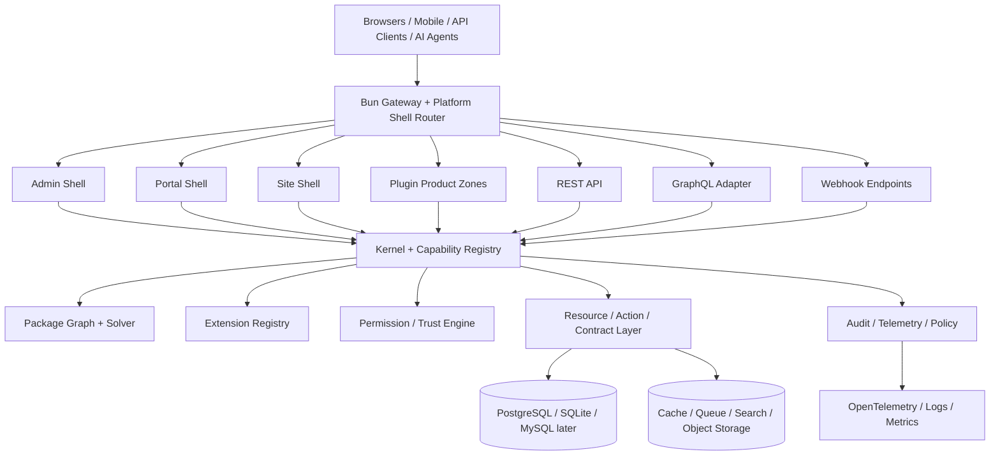

### 2.6 Product stance

The platform’s public position should be:

> A Bun-native, schema-driven, secure-by-default application platform for building composable business systems with minimal code and strong AI operability.

That positioning is more accurate than “advanced Django” and more durable than “plugin CMS”.

---

## 3. Core principles and non-goals

### 3.1 Core principles

| Principle                                     | Meaning                                        | Architectural consequence                      |
| --------------------------------------------- | ---------------------------------------------- | ---------------------------------------------- |
| Secure by default                             | default-deny for dangerous capabilities        | permissions, trust tiers, restricted mode      |
| Least privilege everywhere                    | every surface gets the minimum rights required | capabilities, DB roles, egress allowlists      |
| Minimal code, maximum leverage                | more metadata, fewer handwritten loops         | package manifests, resource/action contracts   |
| Strong defaults, optional complexity          | most teams stay on rails                       | shell-first UI, bundle-first installs          |
| Explicit metadata over hidden magic           | no reliance on accidental discovery            | manifests, graph solver, ownership registries  |
| Plugins are governed                          | installability is policy-controlled            | review tiers, signatures, compatibility checks |
| Stateless app servers                         | scale horizontally                             | shared DB/cache/files/jobs/telemetry           |
| Multi-tenant capable                          | tenant isolation is first-class                | tenant-aware routing, RLS, policy layers       |
| Drizzle-first                                 | data contracts stay typed and explicit         | migrations + typed query model                 |
| Postgres-first                                | reference production posture                   | strongest feature/security baseline            |
| SQLite local-first                            | low-friction local/dev mode                    | small installs, tests, examples                |
| MySQL later                                   | support only after clear matrix                | avoid false portability promises               |
| Same-process trusted code only when justified | trust boundaries matter                        | isolation tiers                                |
| Unknown plugins denied by default             | no privileged execution from strangers         | quarantine / restricted mode                   |
| Unified package taxonomy                      | one packaging system                           | different package kinds, same package format   |
| Separate DB security model                    | app perms are not enough                       | roles, schemas, RLS, curated access            |
| UI flexibility with discipline                | shells + zones, not frontend chaos             | route ownership, asset namespaces              |
| Every business feature is governable          | anything installable is representable          | plugin OS, manifests, bundles                  |
| Every subapp is its own plugin                | no hidden monoliths                            | atomic subapp packages                         |
| Verticals are composed from horizontals       | reuse wins                                     | ERP/CRM/Commerce/Content/Support bases         |

### 3.2 Non-goals

The platform is **not** trying to do the following in early phases:

1. build a new database engine,
2. replace PostgreSQL,
3. support all SQL databases equally from day one,
4. become a no-code visual builder first,
5. run unknown plugin code in-process with broad privileges,
6. support arbitrary live production installs from the dashboard,
7. hide business logic behind runtime reflection,
8. auto-generate safe systems from vague prompts without manifests, policies, or tests.

### 3.3 Narrow exceptions

The only acceptable exceptions to these principles are:

* low-risk local development shortcuts,
* private/internal deployments with explicit waiver,
* time-boxed experimental channels,
* controlled sandboxes for testing future features.

Each exception must be:

* explicit,
* auditable,
* reversible,
* not part of the default product path.

---

## 4. Terminology and taxonomy

### 4.1 Terms

| Term                   | Definition                                                                         |
| ---------------------- | ---------------------------------------------------------------------------------- |
| Package                | the universal unit of code and metadata distribution                               |
| Library                | a reusable code package that usually is not installable as a business feature      |
| Plugin                 | an installable package recognized and governed by the platform                     |
| App                    | a plugin kind that owns business/domain behavior                                   |
| Feature pack           | a plugin that extends an existing domain or capability                             |
| Connector              | a plugin that connects an external provider/platform                               |
| Migration pack         | a plugin that imports/exports or bridges data during migration                     |
| Bundle                 | a tested composition of packages/plugins                                           |
| Vertical pack          | an industry-specific composition layer built on horizontal bases                   |
| UI surface package     | a package that contributes widgets, pages, blocks, or zones                        |
| Policy/compliance pack | a package that adds region/legal/security/compliance rules                         |
| Runtime/ops pack       | a package for edge/gateway/backup/telemetry/deployment behavior                    |
| AI pack                | a package for copilots, RAG, model connectors, evaluation, guardrails              |
| Semantic parent        | the conceptual parent declared through `extends`                                   |
| Hard dependency        | a required dependency declared through `dependsOn`                                 |
| Slot                   | an exclusive or additive authority area, such as route ownership or backup control |
| Ownership              | the canonical right to define and mutate a given domain or object family           |

### 4.2 Canonical language

The specification uses the following rule consistently:

> Everything is a **package**.
> Installable business/runtime units are **plugins**.
> **Apps** are one kind of plugin.
> **Libraries** are not necessarily plugins.
> **Bundles** are tested compositions, not just tags.

### 4.3 Why this matters

This preserves:

* the ease of one packaging system,
* the clarity of different semantics,
* the safety of different governance levels.

It avoids the mistake of calling:

* a utility library,
* a billing domain,
* a marketplace connector,
* and a full industry solution

all the same kind of object.

---

## 5. Package model (library/app/plugin/feature-pack/connector/bundle)

### 5.1 Package model

The platform uses a **single package format** with a required `kind` field.

### 5.2 Package kinds

| Kind           | Installable? |                      Owns data? |                   Can have UI? |      Can request permissions? | Typical use                         |
| -------------- | -----------: | ------------------------------: | -----------------------------: | ----------------------------: | ----------------------------------- |
| library        |   usually no |                              no | sometimes shared UI components |                            no | code reuse                          |
| app            |          yes |                             yes |                            yes |                           yes | core business domain                |
| feature-pack   |          yes |      may extend existing domain |                            yes |                           yes | optional business capabilities      |
| connector      |          yes |     usually mapping/config only |              maybe settings UI |                           yes | external service/provider bridge    |
| migration-pack |          yes |   temporary migration data only |                maybe wizard UI |                           yes | import/export/cutover               |
| bundle         |          yes |                              no |   no direct runtime UI usually | no direct runtime permissions | tested compositions                 |
| vertical-pack  |          yes |       usually via child subapps |                            yes |                           yes | industry solution layer             |
| ui-surface     |          yes | no canonical business ownership |                            yes |                       limited | widgets/pages/zones/builders        |
| policy-pack    |          yes |     no primary domain ownership |                 maybe admin UI |                           yes | tax/privacy/compliance/permissions  |
| runtime-pack   |          yes |      no primary business domain |               sometimes ops UI |                           yes | gateway/CDN/backup/telemetry        |
| ai-pack        |          yes | no canonical business ownership |                            yes |                           yes | copilots, model bridges, evaluation |

### 5.3 Design rule

The platform should never force these into separate packaging technologies.
They should all share:

* the same manifest grammar,
* the same dependency semantics,
* the same solver,
* the same signing/review pipeline.

They differ in:

* permission rules,
* lifecycle behavior,
* UI contribution types,
* ownership rights.

### 5.4 Decision table

| If a package…                                  | It should usually be |
| ---------------------------------------------- | -------------------- |
| only provides utilities/components/helpers     | `library`            |
| owns domain resources/actions/workflows        | `app`                |
| extends an existing app/base with new behavior | `feature-pack`       |
| talks to an external service/platform          | `connector`          |
| moves data in/out/cutover                      | `migration-pack`     |
| only contributes pages/widgets/zones           | `ui-surface`         |
| only adds security/compliance/region rules     | `policy-pack`        |
| represents an industry composition             | `vertical-pack`      |
| is a tested install preset                     | `bundle`             |

### 5.5 Anti-pattern

Do **not** call everything just “an app”.
Do **not** call everything just “a plugin”.
Use one package format, but preserve semantic kinds.

---

## 6. Kernel and platform architecture

### 6.1 Kernel responsibilities

The kernel owns:

1. package loading,
2. manifest parsing,
3. capability registry,
4. extension-point registry,
5. plugin graph solving,
6. route/slot/data ownership validation,
7. activation and deactivation,
8. capability enforcement,
9. shell composition,
10. audit and policy hooks.

The kernel does **not** own:

* business domains,
* industry logic,
* provider-specific behavior,
* visual builder semantics,
* plugin-specific data models.

### 6.2 Layering

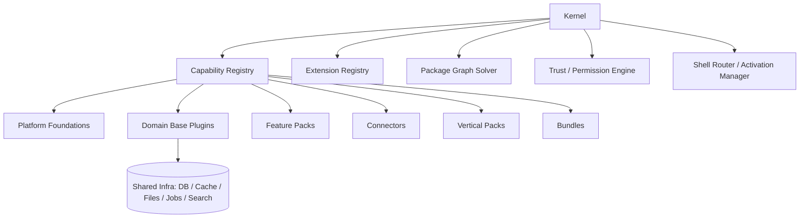

### 6.3 Capability registry

Every plugin declares what it **provides** and what it **requires**.

Capability examples:

* `auth.session`
* `ui.shell.admin`
* `crm.contacts`
* `finance.invoice.issue`
* `payments.capture`
* `media.stream.live`
* `ai.tool.execute`
* `jobs.schedule`
* `backup.snapshot`

The capability registry is the platform’s internal contract map for:

* graph solving,
* AI planning,
* runtime enforcement,
* store governance.

### 6.4 Extension-point registry

The platform must maintain named extension points for:

* resources,
* actions,
* policies,
* dashboards,
* widgets,
* page blocks,
* shell navigation,
* commands,
* search indexes,
* exports,
* reports,
* workflows,
* jobs,
* migrations,
* AI tools,
* webhooks.

A package may contribute only to declared extension points.

### 6.5 Ownership registries

The kernel must maintain three permanent ownership registries.

#### 6.5.1 Route ownership

Who owns:

* `/admin/*`
* `/portal/*`
* `/site/*`
* `/apps/<zone>/*`
* webhook endpoints
* public docs routes

#### 6.5.2 Slot ownership

Who owns exclusive authorities such as:

* primary ingress gateway
* primary page renderer per shell
* primary search backend
* primary backup control plane
* primary secret manager
* primary telemetry pipeline

#### 6.5.3 Data ownership

Who canonically owns:

* contacts
* orders
* invoices
* tickets
* articles
* reservations
* courses
* streams
* memberships
* payouts
* ledgers
* employees

### 6.6 Lifecycle hooks

Packages may participate in lifecycle hooks such as:

* `preInstall`
* `postInstall`
* `preActivate`
* `postActivate`
* `preUpgrade`
* `postUpgrade`
* `preDeactivate`
* `postDeactivate`
* `preUninstall`
* `postUninstall`

Defaults:

* hooks are optional,
* hooks are tightly sandboxed,
* high-risk hooks require elevated review,
* unknown plugins do not get arbitrary lifecycle execution.

### 6.7 Runtime boundaries

The platform must explicitly model execution boundaries:

| Boundary                          | Examples                                   | Default DB access      |
| --------------------------------- | ------------------------------------------ | ---------------------- |
| same-process trusted              | first-party app plugins                    | host repositories only |
| same-process low-risk declarative | themes, dashboards, templates              | none                   |
| sidecar service                   | privileged connector/worker/plugin backend | narrow role            |
| separate product zone backend     | large plugin-owned application             | narrow role            |
| remote external service           | vendor connector                           | no DB direct access    |

### 6.8 Bun-specific kernel posture

The kernel should assume:

* Bun for runtime/server/test/package install,
* Bun SQL as runtime DB driver substrate,
* Bun WebSockets for single-node/server-local real-time primitives,
* externalized queue/pubsub for durable multi-node workflows,
* no hard dependency on Bun Workers for critical durability because Workers remain experimental. ([Bun][2])

---

## 7. Package/plugin manifest design

### 7.1 Goals

The manifest must be:

* human-readable,
* machine-readable,
* AI-readable,
* versioned,
* explicit,
* enforceable.

### 7.2 Required top-level fields

| Field                   |                  Required | Purpose                               |
| ----------------------- | ------------------------: | ------------------------------------- |
| `id`                    |                       yes | unique package ID                     |
| `kind`                  |                       yes | package kind                          |
| `version`               |                       yes | semver                                |
| `displayName`           |                       yes | human name                            |
| `publisher`             |                       yes | provenance and governance             |
| `description`           |                       yes | store/AI metadata                     |
| `compatibility`         |                       yes | framework/runtime/db constraints      |
| `extends`               |                        no | semantic parent                       |
| `dependsOn`             |                        no | required dependencies                 |
| `optionalWith`          |                        no | compatible optional enhancements      |
| `conflictsWith`         |                        no | hard incompatibilities                |
| `providesCapabilities`  |                       yes | exported capabilities                 |
| `requestedCapabilities` |      yes for installables | capabilities requiring admin approval |
| `ownsData`              |                        no | canonical domain ownership            |
| `extendsData`           |                        no | declared data extensions              |
| `slotClaims`            |                        no | exclusive or additive authorities     |
| `ui`                    |                        no | shell/zone contributions              |
| `api`                   |                        no | resource/action/API contributions     |
| `jobs`                  |                        no | worker/schedule contributions         |
| `migrations`            |                        no | schema/data migration contributions   |
| `featureFlags`          |                        no | runtime flags                         |
| `reviewTier`            |      yes for installables | governance level                      |
| `trustTier`             |      yes for installables | trust class                           |
| `isolationProfile`      |      yes for installables | execution model                       |
| `signing`               | yes for registry packages | signature/provenance metadata         |

### 7.3 Example: app plugin

```ts
definePackage({
  id: "crm-core",
  kind: "app",
  version: "1.0.0",
  displayName: "CRM Core",
  compatibility: {
    framework: "^1.0.0",
    runtime: "bun>=1.3",
    db: ["postgres", "sqlite"]
  },
  providesCapabilities: [
    "crm.contacts",
    "crm.accounts",
    "crm.activities"
  ],
  ownsData: [
    "crm.contacts",
    "crm.accounts",
    "crm.activities"
  ],
  requestedCapabilities: [
    "ui.register.admin",
    "api.rest.mount"
  ],
  reviewTier: "first-party",
  trustTier: "trusted",
  isolationProfile: "same-process-trusted"
})
```

### 7.4 Example: connector

```ts
definePackage({
  id: "stripe-adapter",
  kind: "connector",
  version: "1.0.0",
  dependsOn: ["payments-core", "integration-hub"],
  providesCapabilities: [
    "payments.gateway.stripe"
  ],
  requestedCapabilities: [
    "network.egress",
    "secrets.read",
    "webhooks.receive",
    "data.write.payments"
  ],
  requestedHosts: [
    "api.stripe.com"
  ],
  reviewTier: "partner-reviewed",
  trustTier: "trusted",
  isolationProfile: "sidecar"
})
```

### 7.5 Example: bundle

```ts
definePackage({
  id: "school-suite",
  kind: "bundle",
  version: "1.0.0",
  includes: [
    "school-core",
    "school-admissions-pack",
    "student-records-pack",
    "fee-management-pack",
    "attendance-pack",
    "exam-management-pack",
    "parent-portal-pack"
  ],
  optionalIncludes: [
    "transport-pack",
    "hostel-pack",
    "whatsapp-adapter"
  ]
})
```

### 7.6 Example: UI zone

```ts
ui: {
  embedded: [
    { shell: "admin", page: "/admin/crm/accounts", component: "AccountsListPage" }
  ],
  widgets: [
    { shell: "admin", slot: "dashboard.sales", component: "PipelineWidget" }
  ],
  zones: [
    {
      id: "crm-studio",
      adapter: "next-zone",
      mountPath: "/apps/crm-studio",
      assetPrefix: "/_assets/plugins/crm-studio",
      authMode: "platform-session",
      designTokens: "platform",
      telemetryNamespace: "crm.studio"
    }
  ]
}
```

### 7.7 Manifest validation rules

The manifest validator must reject packages that:

* omit `kind`,
* declare undeclared capabilities,
* claim routes already owned by another package,
* claim slots without compatible tier,
* claim data ownership that collides with an existing canonical owner,
* request forbidden capability combinations,
* declare incompatible DB/runtime/framework requirements,
* request wildcard egress without privileged review.

---

## 8. Plugin graph and dependency semantics

### 8.1 Dependency fields

| Field           | Meaning                                   | Default enforcement            |
| --------------- | ----------------------------------------- | ------------------------------ |
| `extends`       | semantic parent lineage                   | optional, usually one          |
| `dependsOn`     | hard runtime dependency                   | mandatory install transitively |
| `optionalWith`  | compatible enhancement                    | never required                 |
| `conflictsWith` | incompatible package                      | hard block                     |
| `slotClaims`    | ownership of route/system slots           | conflict-checked               |
| `ownsData`      | canonical data authority                  | uniqueness required            |
| `extendsData`   | declared safe extension to foreign domain | only through extension points  |

### 8.2 Semantic parent vs hard dependency

This distinction is mandatory.

#### Example

`school-core`

* `extends: ["erp-core"]`
* `dependsOn: ["crm-core", "finance-core", "hr-core", "portal-core", "forms-core"]`

Meaning:

* ERP is its conceptual parent,
* but it also depends on several other bases.

This is the correct model.

### 8.3 Subapp-per-plugin rule

Every installable business subapp must be its own plugin.

Bad:

* one giant `hospital-plugin` with 50 hidden modules

Good:

* `hospital-core`
* `patient-registration-pack`
* `opd-pack`
* `ipd-pack`
* `bed-management-pack`
* `lab-pack`
* `pharmacy-pack`
* `insurance-claims-pack`
* `discharge-pack`
* `patient-portal-pack`

### 8.4 Dependency graph

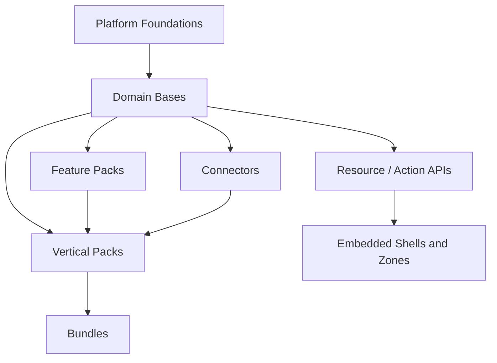

### 8.5 Solver algorithm

The solver must do all of the following before activation:

1. resolve transitive dependencies,
2. verify compatibility ranges,
3. check trust and review tier requirements,
4. validate slot claims,
5. validate route ownership,
6. validate data ownership,
7. validate permission/capability policy,
8. validate migration ordering,
9. produce an activation plan,
10. fail closed on ambiguity.

### 8.6 Solver output

The solver must emit:

* resolved package set,
* ordered activation graph,
* permission diff,
* route map,
* slot map,
* ownership map,
* migration plan,
* rollback checkpoints,
* warnings requiring admin acknowledgement.

### 8.7 Partial activation rule

Bundles must support **resolved partial installation** only if explicitly authored to allow it.

Default:

* a bundle is all-or-nothing,
* unless individual components are marked optional.

### 8.8 Anti-pattern

Never allow activation to “best effort continue” after:

* ownership collision,
* route collision,
* slot collision,
* incompatible permission diff,
* failed migration dry-run.

---

## 9. Security and trust model

### 9.1 Security posture

The platform is secure by default through:

* default-deny capabilities,
* reviewed install-time grants,
* unknown-plugin restricted mode,
* strong trust tiers,
* supply-chain controls,
* least-privilege database roles,
* restricted egress,
* audited privileged actions.

### 9.2 Why permission agreements should exist

Yes, plugins should have permission agreements analogous to Android apps and browser extensions. Android distinguishes install-time and runtime permissions and supports one-time permissions and automatic permission reset for unused apps; browser extensions distinguish install-time permissions, host permissions, optional permissions, and runtime permission requests. Atlassian Forge and Shopify both require apps to explicitly declare the access they need, including API scopes and, in Forge’s case, egress permissions. These are good precedents for the platform’s plugin capability model. ([Android Developers][3])

### 9.3 Trust tiers

| Trust tier           | Meaning                                  | Default isolation          |
| -------------------- | ---------------------------------------- | -------------------------- |
| `declarative-only`   | templates, themes, low-risk metadata     | no code execution          |
| `first-party`        | maintained by platform team              | same-process-trusted       |
| `partner-reviewed`   | reviewed and signed trusted partner code | sidecar by default         |
| `community-reviewed` | listed but not highly trusted            | restricted or sidecar      |
| `unknown`            | unsigned or unreviewed                   | quarantine / no activation |

### 9.4 Trust state flow

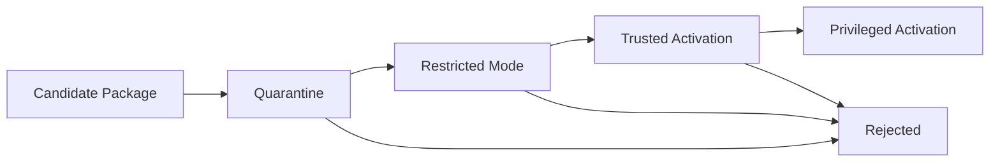

### 9.5 Install / approval / activation flow

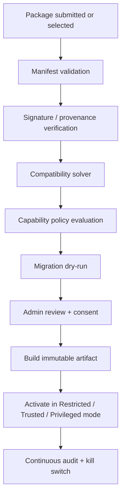

### 9.6 Unknown plugin quarantine flow

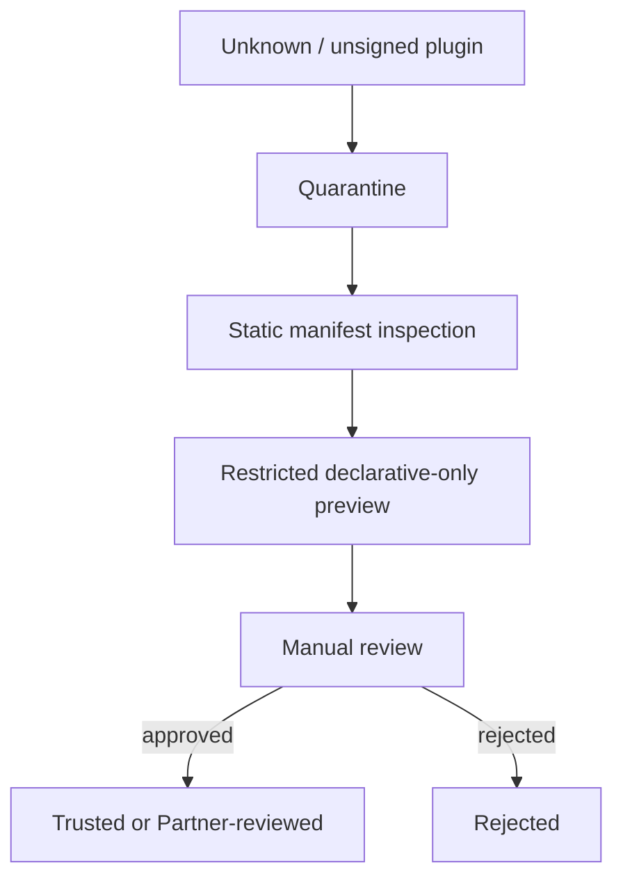

### 9.7 Restricted mode

Borrow the idea of VS Code’s Restricted Mode: untrusted workspaces lose access to automatic code execution, tasks, AI agents, and risky features until trust is granted. The platform should do the same for unknown plugins. In restricted mode, plugins may expose metadata or static/declarative assets, but not privileged code execution. ([Visual Studio Code][4])

### 9.8 Isolation profiles

| Profile                | Allowed for                                          | Notes                                        |
| ---------------------- | ---------------------------------------------------- | -------------------------------------------- |
| `declarative-only`     | themes, dashboards, templates                        | safest, zero arbitrary code                  |
| `same-process-trusted` | first-party foundations and low-risk trusted plugins | fastest, smallest operational cost           |
| `sidecar`              | partner connectors, medium-risk plugins, large zones | recommended default for non-first-party code |
| `containerized`        | high-risk compute or ingestion/transcoding           | stronger isolation                           |
| `remote-service`       | external vendor-style integrations                   | no in-process trust required                 |

### 9.9 High-risk actions requiring runtime grants

Examples:

* payout execution,
* impersonation,
* large PII export,
* backup restore,
* migration cutover,
* external identity provisioning,
* destructive bulk delete,
* cross-tenant data move.

These require:

* explicit runtime confirmation,
* audit event,
* often time-limited or one-time grants.

### 9.10 Security defaults

Default-deny on:

* network egress,
* secret access,
* route ownership,
* DB direct access,
* child process execution,
* arbitrary filesystem access,
* privileged identity operations,
* billing/payout execution.

---

## 10. Permission/capability model

### 10.1 Capability categories

| Category           | Examples                                                 |
| ------------------ | -------------------------------------------------------- |
| UI                 | `ui.register.admin`, `ui.widget.portal`, `ui.zone.mount` |
| Routing            | `route.claim:/apps/ott-studio/*`                         |
| Data read          | `data.read.crm.contacts`                                 |
| Data write         | `data.write.finance.invoices`                            |
| Data export/delete | `data.export.crm`, `data.delete.content`                 |
| Files              | `files.read`, `files.write`                              |
| Secrets            | `secrets.read`                                           |
| Network            | `network.egress.allowlist`                               |
| Webhooks           | `webhooks.receive`, `webhooks.send`                      |
| Automation         | `jobs.schedule`, `workflow.execute`                      |
| Identity           | `identity.provision`, `identity.impersonate`             |
| Billing            | `billing.charge`, `billing.payout`                       |
| AI                 | `ai.model.invoke`, `ai.tool.execute`                     |
| System             | `system.child_process`, `system.native_addon`            |

### 10.2 Permission classes

| Class             | Meaning                                    |
| ----------------- | ------------------------------------------ |
| required          | must be granted to install                 |
| optional          | can be enabled later                       |
| runtime-sensitive | only requested at time of dangerous action |
| host-scoped       | applies only to named egress domains/hosts |
| tenant-scoped     | enabled only for selected tenants          |
| role-scoped       | enabled only for certain actor roles       |

### 10.3 Capability matrix by package kind

| Package kind   | Typical permissions                                           |
| -------------- | ------------------------------------------------------------- |
| library        | none                                                          |
| app            | UI + data + workflow + maybe jobs                             |
| feature-pack   | narrower data/UI/workflow permissions                         |
| connector      | egress + secrets + webhook + mapped data scopes               |
| migration-pack | import/export + file + temporary elevated data scopes         |
| bundle         | no direct runtime permissions; inherits component permissions |
| ui-surface     | UI + maybe read-only domain scopes                            |
| policy-pack    | policy/config/admin scopes                                    |
| runtime-pack   | infra/ops scopes                                              |
| ai-pack        | model invoke + tool execute + scoped data access              |

### 10.4 Host permissions

Use browser-extension-style host permissions for plugin egress. Host permissions should be domain-specific and explicit, not wildcard by default. MDN’s host and optional permission model is a good template for declaring network destinations and optionally requesting them later. ([MDN Web Docs][5])

### 10.5 Admin install consent screen

The admin review screen must show:

* package name/version,
* publisher,
* trust tier,
* review tier,
* requested capabilities,
* requested hosts,
* secret references,
* route claims,
* slot claims,
* data domains touched,
* migration consequences,
* new permissions vs existing permissions on update.

### 10.6 Update permission diff

On update:

* capability changes must be diffed,
* new dangerous scopes must require re-approval,
* dangerous removed scopes should be revoked automatically,
* downgraded trust tiers must block auto-updates.

### 10.7 Dormant permission reset

Borrow Android’s unused-permission idea conceptually:

* if a plugin with dangerous optional scopes has not used them for a long time,
* the platform may downgrade or require reapproval for those scopes,
* but core required scopes remain intact unless the admin revokes them.

### 10.8 Permission anti-patterns

Never allow:

* blanket `network.egress:*`,
* blanket `data.read:*` for community plugins,
* blanket `data.write:*` except first-party privileged system components,
* secret write access for third-party plugins,
* direct billing/payout execution without runtime-sensitive approval,
* undeclared host access.

---

## 11. Database security model

### 11.1 Position

Database security is **not** covered by app/plugin permissions alone. It is a separate enforcement layer.

### 11.2 Recommended database strategy

* **PostgreSQL** is the reference production database.
* **SQLite** is allowed for local development, test environments, and small single-node deployments.
* **MySQL** may be supported later, but only after the support matrix explicitly defines which features are equivalent and which are degraded.

PostgreSQL is the reference database because it provides the exact primitives this platform needs for least-privilege design: roles, grants, schemas, row-level security, policy definitions, view/function security properties, and runtime/session parameters like `current_setting` / `set_config`. ([PostgreSQL][6])

### 11.3 Per-plugin DB users: the recommendation

#### Default recommendation

Do **not** create a distinct DB user for every plugin by default.

#### Why

For same-process trusted plugins:

* separate DB users often add complexity without materially improving safety,
* the better control is that plugins do not get raw SQL access and must go through host repositories/actions.

#### Use separate DB roles when:

* a plugin has its own process or service,
* a plugin is sidecar-isolated,
* a plugin is a privileged connector,
* a plugin is a reporting/export service,
* a plugin is a migration tool,
* a plugin is a backup/restore utility.

### 11.4 DB role/security model

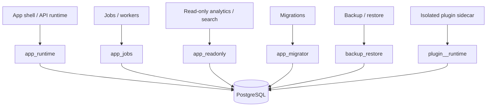

### 11.5 Core DB roles

| Role                  | Use                      | Rights                                      |
| --------------------- | ------------------------ | ------------------------------------------- |
| `db_admin`            | humans/ops only          | cluster admin; never app traffic            |
| `app_migrator`        | deploy pipeline          | DDL in approved schemas                     |
| `app_runtime`         | main app/API             | DML only; no DDL; no BYPASSRLS              |
| `app_jobs`            | async workers            | DML + job tables; no DDL                    |
| `app_readonly`        | BI/search/export readers | read-only                                   |
| `backup_restore`      | backup/restore           | explicit operational privileges             |
| `plugin_<id>_runtime` | isolated plugin runtime  | narrow schema/view/function privileges only |

### 11.6 Table ownership rule

Runtime roles must **not** own application tables. PostgreSQL’s RLS docs are explicit that table owners normally bypass row security unless `FORCE ROW LEVEL SECURITY` is used, and superusers or roles with `BYPASSRLS` bypass policies. The correct default is:

* table ownership by schema-owner/migrator roles,
* runtime roles with only granted DML,
* no `BYPASSRLS` for app traffic. ([PostgreSQL][7])

### 11.7 Schema organization

Use schemas aggressively.

| Schema               | Purpose                                       |
| -------------------- | --------------------------------------------- |
| `core`               | framework metadata and package state          |
| `identity`           | users, sessions, orgs, roles                  |
| `crm`                | customer/contact data                         |
| `finance`            | ledgers, invoices, payments metadata          |
| `inventory`          | stock, warehouses                             |
| `content`            | pages, posts, taxonomies                      |
| `support`            | tickets, SLA objects                          |
| `learning`           | courses, grades, cohorts                      |
| `streaming`          | assets, channels, entitlements                |
| `booking`            | reservations, resources, slots                |
| `audit`              | audit trails                                  |
| `api`                | curated views/functions for isolated runtimes |
| `plugin_<plugin_id>` | plugin-owned tables only                      |

### 11.8 Public schema hardening

PostgreSQL docs recommend a secure schema usage pattern and explicitly note that, in upgraded/older clusters, you should revoke `CREATE` on `public` from `PUBLIC` or otherwise keep writable schemas out of `search_path`. Newer PostgreSQL defaults already move in that direction for new clusters. The platform should therefore:

* revoke `CREATE` on `public`,
* keep untrusted writable schemas out of `search_path`,
* fully qualify security-sensitive objects. ([PostgreSQL][8])

### 11.9 Row-level security (RLS)

Apply PostgreSQL RLS to all tenant-shared business tables.

Rules:

1. enable RLS on tenant-scoped tables,
2. define explicit policies,
3. assume default-deny if no policy exists,
4. consider `FORCE ROW LEVEL SECURITY` for especially sensitive tables,
5. keep runtime roles non-owning and non-bypass.

### 11.10 Tenant context

Recommended pattern:

* set tenant/org/user context transaction-locally,
* read it from policies and curated functions/views.

PostgreSQL supports `current_setting(...)` and `set_config(...)`; `set_config(..., true)` applies only to the current transaction. ([PostgreSQL][9])

Example:

```sql
select set_config('app.tenant_id', 'tenant_123', true);
select set_config('app.actor_id', 'user_456', true);
```

Then RLS policies can use:

```sql
tenant_id = current_setting('app.tenant_id')
```

### 11.11 Views and functions

Use:

* `security_invoker` views for safe read delegation,
* `security_barrier` views for security-sensitive filtered surfaces,
* `SECURITY DEFINER` functions only for narrow, audited privileged entry points.

PostgreSQL documents `security_invoker` view behavior and explicitly recommends `security_barrier` when a view is intended to provide row-level security. It also warns that privileged functions must be written carefully and that `search_path` security matters. ([PostgreSQL][10])

### 11.12 Plugin DB access classes

| Class                       | DB access model                            |
| --------------------------- | ------------------------------------------ |
| same-process trusted plugin | no raw DB creds; host repositories only    |
| declarative plugin          | no DB access                               |
| isolated sidecar plugin     | narrow DB role + curated `api` schema only |
| migration pack              | dedicated time-limited role                |
| backup/restore utility      | dedicated operational role                 |
| unknown/community plugin    | no direct DB access                        |

### 11.13 Curated `api` schema

The `api` schema exists to expose:

* read-only views,
* stable projections,
* carefully audited procedures,
* reporting/materialization helpers.

This is the right place for isolated plugins to read shared data without direct table ownership or arbitrary joins across canonical schemas.

### 11.14 Reporting roles

Use `app_readonly` or purpose-specific reader roles for:

* search indexing,
* analytics materialization,
* export services,
* embedded BI.

Do not use broad predefined roles like “read everything” as the default runtime posture just because they exist. PostgreSQL’s predefined broad reader/writer roles still require careful evaluation and do not replace explicit least-privilege design. ([PostgreSQL][11])

### 11.15 Migration and backup roles

Migration and backup are special cases.

* `app_migrator` can do DDL but should not serve requests.
* `backup_restore` must be separate from normal runtime.

`pg_dump` and `pg_restore` default to `row_security = off` and can error if the dumping/restoring user cannot bypass RLS. PostgreSQL also warns that restoring a dump can execute arbitrary code chosen by source superusers. Therefore:

* logical dump/restore is a migration/export tool, not the only production backup strategy,
* restore privileges must be tightly controlled,
* dump restore from untrusted sources must be inspected. ([PostgreSQL][12])

### 11.16 COPY and RLS caution

PostgreSQL documents that `COPY FROM` is not supported for tables with RLS enabled. Migration packs must therefore avoid assuming raw server-side `COPY FROM` into RLS-protected tables and should use controlled insert pipelines instead. ([PostgreSQL][13])

### 11.17 DB anti-patterns

Never:

* run app traffic as superuser,
* give app runtime `BYPASSRLS`,
* let runtime roles own tables,
* let unknown plugins have raw DB credentials,
* use `public` as a shared writable dumping ground,
* rely on role switching as the primary security boundary,
* expose base tables directly to community plugins.

---

## 12. API and contract model

### 12.1 API posture

* **REST is first-class and default.**
* **GraphQL is optional.**
* **OpenAPI is required for REST surfaces.**
* **Every business action is explicit.**
* **AI tools call typed actions, not raw internals.**

### 12.2 Contract-first model

The primary contract object is **Resource + Action + Policy**.

#### Resource

Defines:

* fields,
* relationships,
* list/filter/sort/search metadata,
* validation contract,
* UI hints.

#### Action

Defines:

* explicit business transition,
* input/output schema,
* permission requirement,
* idempotency,
* audit behavior,
* side effects.

#### Policy

Defines:

* actor eligibility,
* tenant scoping,
* field visibility,
* data masks,
* runtime constraints.

### 12.3 Resource and action rules

Auto-generate:

* CRUD-ish resource surfaces,
* standard list/detail/create/edit APIs,
* admin forms/tables,
* default portal CRUD where appropriate.

Do **not** auto-generate:

* refunds,
* approval decisions,
* payout execution,
* entitlement grants,
* grade finalization,
* certificate issuance,
* schedule publication,
* restore/cutover actions.

Those must remain explicit actions.

### 12.4 API surfaces

| Surface  | Default  | Notes                            |
| -------- | -------- | -------------------------------- |
| REST     | yes      | versioned, OpenAPI, best default |
| GraphQL  | optional | adapter over same domain graph   |
| Webhooks | yes      | signed, replay-safe              |
| Events   | yes      | internal and external consumers  |
| AI tools | yes      | schema-driven action contracts   |

### 12.5 Versioning rules

* Major platform versions may change manifest semantics.
* APIs should use additive evolution where possible.
* Breaking changes require:

  * version bump,
  * migration notes,
  * permission diff,
  * bundle compatibility update.

### 12.6 Webhooks

Webhooks must support:

* signed payloads,
* replay protection,
* delivery attempts,
* idempotency keys,
* dead-letter handling,
* versioned event schemas.

### 12.7 OpenAPI

The platform must generate and expose OpenAPI from the same contracts that power:

* REST,
* admin CRUD metadata,
* AI tool definitions,
* migration/import schemas.

### 12.8 GraphQL

GraphQL is useful for:

* specialized consumer applications,
* highly tailored data graphs,
* plugin-owned product zones.

Default rule:

* GraphQL is an adapter,
* not the canonical business layer.

---

## 13. Frontend and UI surface model

### 13.1 Supported UI surface types

| Surface                     | Best for                                       |
| --------------------------- | ---------------------------------------------- |
| embedded widget             | dashboards, KPIs, summaries                    |
| embedded shell page         | CRUD, settings, workflows, reports             |
| builder/editor surface      | forms, page builders, visual studios           |
| product zone                | large app-like products                        |
| standalone external surface | rare, very large or externally hosted products |

### 13.2 Design rule

A plugin may:

* expose no UI,
* register widgets/pages in the default shells,
* mount its own product zone,
* do both embedded + zone.

### 13.3 Embedded vs zone

#### Embedded is correct when:

* the UI is mostly tables/forms/details,
* consistent shell navigation is desirable,
* the plugin is operational rather than product-shaped,
* bundle size should stay low.

#### Zone is correct when:

* the plugin has its own information architecture,
* it needs a full studio/canvas/workspace,
* it has a large isolated bundle,
* it benefits from independent UI release cadence.

### 13.4 Shell + zone routing model

```mermaid
flowchart TD
    U[Browser] --> G[Bun Gateway]

    G --> A[/admin/*]
    G --> P[/portal/*]
    G --> S[/site/*]
    G --> Z[/apps/<zone>/*]

    A --> API[Platform APIs]
    P --> API
    S --> API
    Z --> API
```

### 13.5 Recommended path conventions

| Purpose         | Path convention                    |
| --------------- | ---------------------------------- |
| admin shell     | `/admin/*`                         |
| customer portal | `/portal/*`                        |
| public site     | `/site/*` or root-routed site      |
| product zones   | `/apps/<plugin-zone>/*`            |
| internal assets | `/_assets/plugins/<plugin-zone>/*` |

### 13.6 Next.js zones

Next.js Multi-Zones are a useful precedent for product-shaped frontends: different Next.js apps can serve different path sets on one domain. `basePath` is a build-time configuration, and `standalone` output exists for lighter deployment packaging. Next.js docs also warn that custom servers disable important optimizations and cannot be combined with `standalone` output. The platform should therefore treat Next.js as an **adapter for zone UIs**, not the universal frontend law. ([Next.js][14])

### 13.7 UI surface contract

Each UI surface declaration must include:

* `shell` or `zone`,
* `mountPath`,
* `assetPrefix`,
* `routeOwnership`,
* `authMode`,
* `designTokenSource`,
* `telemetryNamespace`,
* `deepLinks`,
* `sizeBudget`,
* `featureFlags`,
* `capability requirements`.

### 13.8 Shared shell contracts

Every embedded page/widget/zone must share:

* session model,
* permission introspection,
* design tokens,
* navigation/deep-link contracts,
* audit hooks,
* telemetry hooks,
* command bus conventions,
* notification bus conventions.

### 13.9 Frontend anti-patterns

Never allow:

* arbitrary zone mounting,
* undeclared public routes,
* duplicate asset prefixes,
* shell pages with private logic outside platform contracts,
* plugin-owned UI that bypasses domain APIs.

---

## 14. Admin shell / portal shell / site shell / zone model

### 14.1 Shell responsibilities

#### Admin shell

For:

* staff operations,
* CRUD,
* approvals,
* reports,
* system configuration,
* dashboards,
* operator consoles.

#### Portal shell

For:

* customers,
* parents,
* students,
* patients,
* vendors,
* dealers,
* sellers,
* members.

#### Site shell

For:

* marketing/public pages,
* public content,
* SEO pages,
* landing experiences,
* documentation/public knowledge.

### 14.2 Surface model

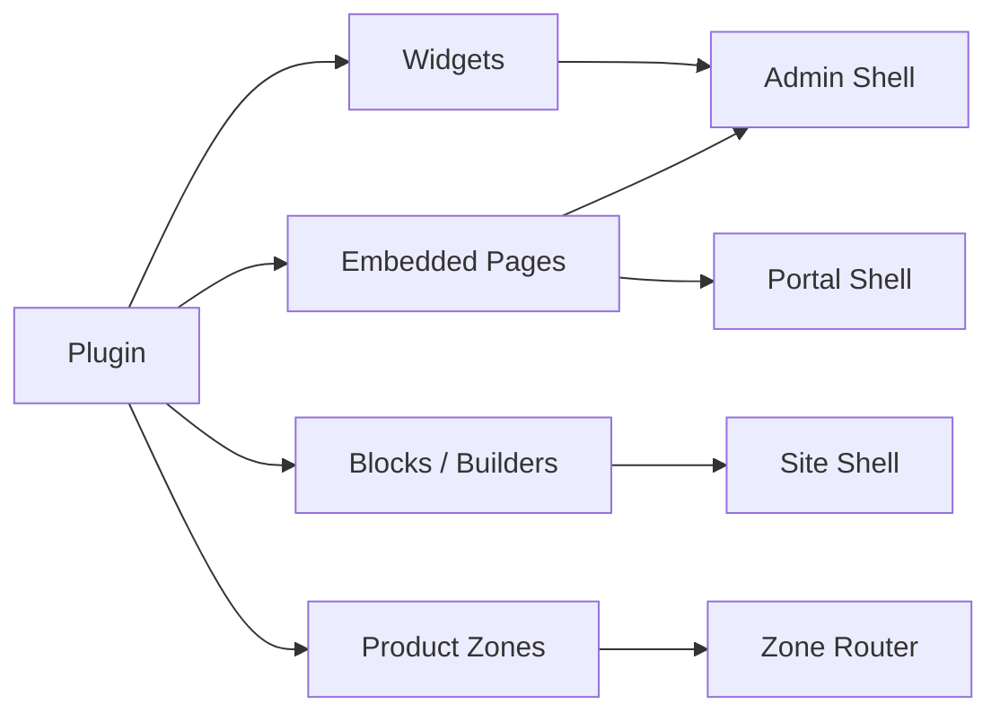

### 14.3 Admin shell rules

Admin shell is the default host for:

* most business CRUD,
* config pages,
* reports,
* operational views.

It should provide:

* consistent navigation,
* command palette,
* saved views,
* object actions,
* audit context.

### 14.4 Portal shell rules

Portal shell is the default host for:

* self-service tasks,
* case/ticket visibility,
* account data,
* enrollment/access,
* reservations,
* subscriptions,
* downloads,
* progress views.

### 14.5 Site shell rules

Site shell is the default host for:

* public content,
* public product pages,
* public docs,
* public forms,
* public search,
* public media landing pages.

### 14.6 Builder/editor interactions

Builders/editors such as:

* page builders,
* form builders,
* workflow designers,
* email template builders,
* OTT scheduling studios,
* LMS course editors

may live as:

* embedded shell pages if simple,
* or product zones if dense and app-like.

### 14.7 Cross-zone navigation

Rules:

* same-shell navigation: client-side standard behavior,
* cross-zone navigation: explicit boundary transition,
* preserve auth/session,
* preserve tenant context,
* preserve audit request correlation.

### 14.8 Theme and layout system

The platform must supply:

* design tokens,
* spacing/color/type scales,
* standardized shell chrome,
* plugin-contributed layout slots,
* white-label overlays where appropriate.

---

## 15. Plugin store and governance model

### 15.1 Store philosophy

The plugin store is an **operating surface for governed packages**, not an anarchic marketplace.

### 15.2 Registry tiers

| Registry             | Use                           |
| -------------------- | ----------------------------- |
| local workspace      | internal package development  |
| private org registry | enterprise/private packages   |
| partner registry     | approved third-party partners |
| public marketplace   | later, only after hardening   |

### 15.3 Listing states

| State       | Meaning                                      |
| ----------- | -------------------------------------------- |
| draft       | not installable                              |
| internal    | private only                                 |
| reviewed    | can be installed in trusted environments     |
| restricted  | installable only in restricted mode          |
| privileged  | requires extra approval                      |
| deprecated  | existing installs okay, new installs blocked |
| quarantined | blocked pending issue resolution             |
| revoked     | cannot be activated                          |

### 15.4 Governance sources of truth

A package may be installable only if:

* manifest is valid,
* signatures/provenance pass,
* review tier is acceptable,
* compatibility solver passes,
* requested capabilities are acceptable,
* no unresolved security issues are present.

### 15.5 Governance precedents

Atlassian’s Forge manifest makes modules and permissions explicit; Shopify requires apps to request scopes and supports requesting optional scopes later; Strapi supports both local plugins and marketplace plugins; WordPress’ plugin guidelines emphasize developer expectations and plugin security responsibilities; Google Workspace Marketplace uses listing and review processes for integrated apps. These patterns strongly support a governed store rather than an unrestricted code bazaar. ([Atlassian Developer][15])

### 15.6 Install review rules

#### Auto-approval candidate

* declarative-only,
* no egress,
* no secrets,
* no privileged data access,
* no route/slot claims.

#### Manual review required

* network egress,
* secrets,
* privileged data write,
* UI zones,
* jobs,
* webhook receive,
* migrations,
* identity provisioning,
* payouts,
* restore operations.

### 15.7 Update review rules

Any update that changes:

* trust tier,
* review tier,
* permissions,
* routes,
* slot claims,
* migrations,
* ownership declarations

must produce an explicit diff and may require re-approval.

### 15.8 Kill switch

The store/runtime must support:

* immediate package quarantine,
* remote disablement,
* rollback recommendation,
* tenant-by-tenant deactivation,
* route blocking,
* secret revocation.

---

## 16. Supply chain, signing, provenance, SBOM, review process

### 16.1 Baseline

Every registry-published installable package must have:

* signature,
* provenance,
* SBOM,
* vulnerability scan result,
* compatibility metadata,
* trust tier,
* review tier.

### 16.2 Supply-chain standards

npm trusted publishing uses OIDC instead of long-lived npm tokens, and npm provenance can be automatically generated in supported CI/CD systems. Sigstore provides artifact signing and verification with keyless options and a transparency log. SLSA provides build/provenance maturity levels. TUF provides protections for update systems even if a repository or some signing keys are compromised. OPA provides policy-as-code enforcement for CI/CD and runtime gates. OWASP’s software supply chain guidance and Top 10 2025 both emphasize continuous monitoring, SBOM/security-focused tooling, and policy conformance across the SDLC. ([npm Docs][16])

### 16.3 Required build artifacts

| Artifact               | Required? | Purpose                    |
| ---------------------- | --------: | -------------------------- |
| signed package         |       yes | authenticity               |
| provenance attestation |       yes | build origin and integrity |
| SBOM                   |       yes | dependency inventory       |
| test manifest          |       yes | confidence and gating      |
| compatibility matrix   |       yes | solver input               |
| security report        |       yes | review input               |

### 16.4 CI / build / sign / publish flow

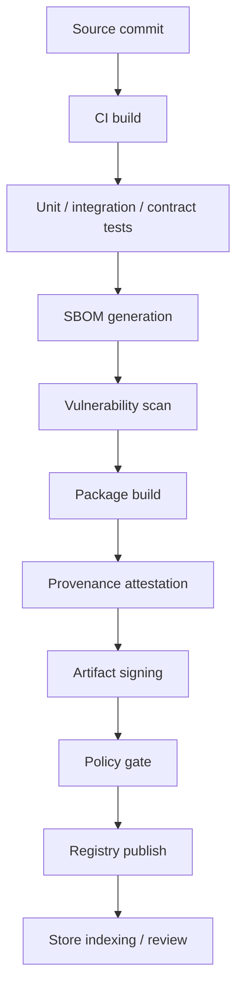

### 16.5 Review process

1. automated checks,
2. security policy checks,
3. compatibility solver checks,
4. reviewer acknowledgement for privileged scopes,
5. staged release channel,
6. promotion to stable after smoke validation.

### 16.6 Release channels

| Channel      | Purpose                         |
| ------------ | ------------------------------- |
| experimental | fast feedback, low trust        |
| beta         | limited trusted installs        |
| stable       | supported production use        |
| LTS          | conservative enterprise channel |

### 16.7 Review anti-patterns

Do not:

* trust only signatures without provenance,
* treat SBOM as optional,
* publish directly from developer laptops,
* permit unreviewed privileged plugins in public channels.

---

## 17. Bundle model and tested distributions

### 17.1 Bundle definition

A bundle is a versioned, tested composition of packages.

It is:

* installable,
* solver-resolved,
* compatibility-scoped,
* reviewable,
* reproducible.

### 17.2 Bundle types

| Type                       | Purpose                          |
| -------------------------- | -------------------------------- |
| starter bundle             | minimal dev/prototype baseline   |
| operational bundle         | horizontal business stack        |
| vertical bundle            | industry-specific stack          |
| regional/compliance bundle | locale/tax/legal overlays        |
| enterprise distribution    | hardened, long-lived composition |

### 17.3 Bundle rules

Bundles:

* do not own domain data directly,
* must not hide required permissions,
* must declare required and optional members,
* must be versioned independently from member packages,
* must state compatibility ranges explicitly.

### 17.4 Recommended tested bundles

| Bundle                    | Includes                                                                     |
| ------------------------- | ---------------------------------------------------------------------------- |
| `admin-foundation`        | auth, tenants, roles, audit, dashboard, admin shell                          |
| `crm-growth-suite`        | crm-core, sales-core, marketing-core, forms-core, analytics-core             |
| `headless-commerce-suite` | commerce-core, catalog-core, pricing-core, payments-core, site shell, portal |
| `service-desk-suite`      | service-desk-core, knowledge-core, portal, messaging, workflow               |
| `workspace-suite`         | workspace-core, files, docs, calendar, portal                                |
| `lms-suite`               | learning-core, portal, commerce, analytics                                   |
| `ott-streaming-suite`     | streaming-core, content-core, portal, payments, analytics                    |
| `booking-services-suite`  | booking-core, scheduling-core, portal, payments                              |
| `school-suite`            | school-core + atomic school subapps                                          |
| `hospital-suite`          | hospital-core + atomic hospital subapps                                      |
| `manufacturing-suite`     | manufacturing/quality/maintenance/inventory/procurement                      |
| `nonprofit-suite`         | nonprofit-core, crm, payments, programs, impact                              |

### 17.5 Bundle activation behavior

Default:

* required components must all activate successfully,
* optional components may fail independently,
* bundle activation fails closed if required components fail.

### 17.6 Bundle compatibility

Each bundle must declare:

* platform version,
* DB support level,
* trust tier minimums,
* required shells,
* required runtime packs,
* known exclusions.

---

## 18. Cross-cutting feature packs

### 18.1 Definition

Cross-cutting feature packs extend existing domain bases or platform foundations. They must not silently become canonical owners of other domains.

### 18.2 Categories

| Category        | Typical packs                                               |
| --------------- | ----------------------------------------------------------- |
| security        | MFA, passkeys, DLP, retention, impersonation                |
| observability   | logs, traces, metrics, SLOs, alerting                       |
| performance     | cache, CDN control, asset optimization                      |
| backup/DR       | snapshots, PITR orchestration, restore drills               |
| localization    | language packs, multi-currency, geo pricing, regional taxes |
| SEO             | sitemap, redirects, metadata, schema markup                 |
| content/media   | image/video processing, captions, moderation                |
| forms/documents | surveys, quizzes, e-sign, PDF generation                    |
| exports         | CSV/XLSX/PDF/export pipelines                               |
| data pipeline   | import studio, reverse ETL, dedupe, CDC                     |
| analytics       | funnels, cohorts, attribution, forecasting                  |
| AI              | RAG, guardrails, evaluations, recommendation engine         |
| workplace       | chat, docs, mail, whiteboard, desk booking                  |

### 18.3 Content / community / page-builder model

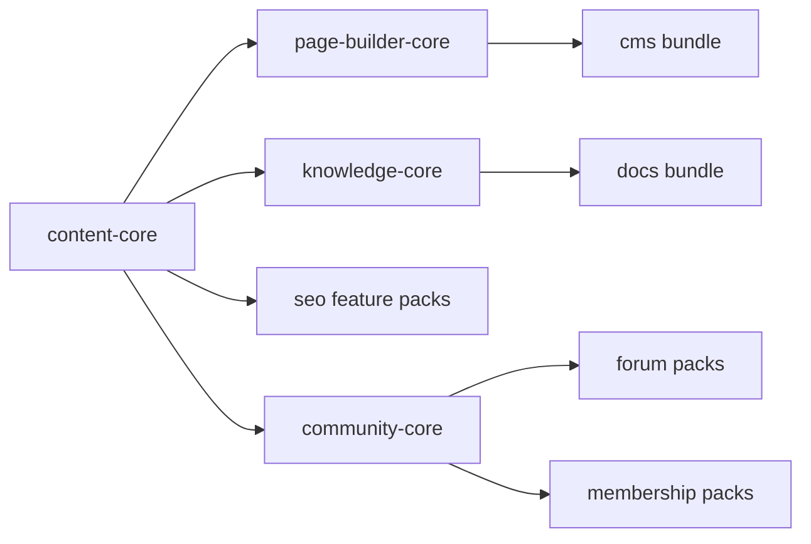

### 18.4 Rule

Feature packs:

* may extend UI,
* may add workflows,
* may add reports,
* may add provider adapters,
* may add optional data extension tables,

but must not:

* seize canonical ownership of unrelated domains,
* override core slot ownership silently,
* create hidden cross-domain coupling.

---

## 19. Domain base plugins

### 19.1 Purpose

Domain base plugins are the reusable horizontal spines on which vertical solutions are built.

### 19.2 Mandatory base plugins

| Base plugin          | Canonical ownership                     |
| -------------------- | --------------------------------------- |
| `auth-core`          | identities, sessions, service accounts  |
| `user-directory`     | people and internal identities          |
| `org-tenant-core`    | tenant and org graph                    |
| `role-policy-core`   | roles, grants, ABAC/RBAC                |
| `audit-core`         | audit trails                            |
| `workflow-core`      | state machines and approvals            |
| `jobs-core`          | background jobs and schedules           |
| `files-core`         | file references and storage abstraction |
| `notifications-core` | outbound/in-app notifications           |
| `search-core`        | search indexing/query abstraction       |
| `dashboard-core`     | dashboard/widget system                 |
| `portal-core`        | customer/member/vendor portal shell     |
| `content-core`       | pages, posts, content types             |
| `page-builder-core`  | layouts, blocks, themeable builders     |
| `knowledge-core`     | docs/KB/wiki/article trees              |
| `forms-core`         | dynamic forms and submissions           |
| `crm-core`           | contacts, accounts, activities          |
| `sales-core`         | opportunities, quotes, renewals         |
| `marketing-core`     | audiences, campaigns, journeys          |
| `commerce-core`      | carts, orders, checkout states          |
| `catalog-core`       | products/SKUs/services                  |
| `pricing-core`       | price books, promos, pricing rules      |
| `payments-core`      | payment intents/captures/refunds        |
| `finance-core`       | ledgers, invoices, journals             |
| `hr-core`            | employees, org structures, HR records   |
| `payroll-core`       | payroll artifacts                       |
| `procurement-core`   | suppliers, requisitions, POs            |
| `inventory-core`     | stock, warehouses, reservations         |
| `manufacturing-core` | BOM/MRP/work orders                     |
| `quality-core`       | inspections, CAPA                       |
| `maintenance-core`   | assets, PM/break-fix                    |
| `logistics-core`     | shipments, carriers, fleets             |
| `warehouse-core`     | bins, picks, packs, waves               |
| `project-core`       | tasks, projects, milestones             |
| `service-desk-core`  | tickets, SLAs, queues                   |
| `field-service-core` | dispatch and field work orders          |
| `analytics-core`     | KPIs, marts, metric surfaces            |
| `bi-core`            | BI models and semantic layers           |
| `ai-core`            | AI tools, guardrails, agent runtime     |
| `vector-core`        | embeddings and vector indexes           |
| `booking-core`       | reservations and booking flows          |
| `calendar-core`      | calendars and time blocks               |
| `scheduling-core`    | availability and allocations            |
| `learning-core`      | courses, lessons, progress              |
| `streaming-core`     | streams, assets, channels               |
| `workspace-core`     | docs/chat/drive/calendar collaboration  |
| `security-core`      | security controls                       |
| `compliance-core`    | privacy/retention/compliance rules      |
| `performance-core`   | caching/optimization                    |
| `backup-dr-core`     | backup control plane                    |
| `server-ops-core`    | ingress/TLS/environment ops             |
| `observability-core` | telemetry control plane                 |
| `localization-core`  | languages/locales/regions               |
| `geo-core`           | geospatial primitives                   |
| `real-estate-core`   | properties/units/leases                 |
| `hospitality-core`   | rooms/stays/guest requests              |
| `public-sector-core` | citizen/service/case base               |
| `nonprofit-core`     | donors/programs/grants                  |

### 19.3 Extension points each base must expose

Each base must expose:

* resource extension points,
* action hooks,
* policy hooks,
* report hooks,
* dashboard/widget slots,
* search indexing contributions,
* AI tool registrations where relevant,
* migration/import mappings where relevant.

### 19.4 Ownership rule

A base plugin’s canonical ownership cannot be overridden by a child plugin without:

* explicit platform-level migration,
* deprecation plan,
* ownership transfer policy,
* data migration bundle.

---

## 20. Vertical/industry plugin architecture

### 20.1 Rule

Verticals must be composed from reusable horizontal bases.
Verticals must not re-implement shared capabilities.

### 20.2 Vertical structure

A vertical consists of:

* one vertical base or semantic parent,
* multiple atomic subapp plugins,
* optional connectors,
* optional policy packs,
* one or more tested bundles.

### 20.3 Subapp-per-plugin rule

Every business subapp is its own plugin.
Examples:

* `school-admissions-pack`
* `school-attendance-pack`
* `hospital-bed-management-pack`
* `hotel-housekeeping-pack`
* `ott-subscriptions-pack`
* `lms-certificates-pack`
* `booking-waitlist-pack`

No hidden “module folders” inside a monolith should be treated as if they were not real packages.

### 20.4 ERP inheritance model

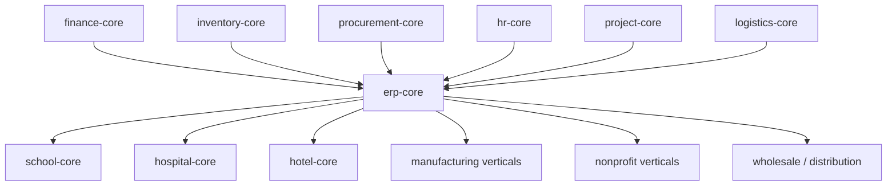

### 20.5 CRM / marketing / sales inheritance model

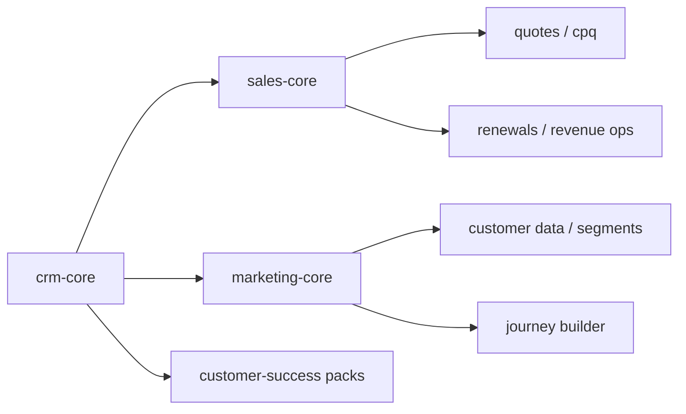

### 20.6 Commerce / logistics / shipping model

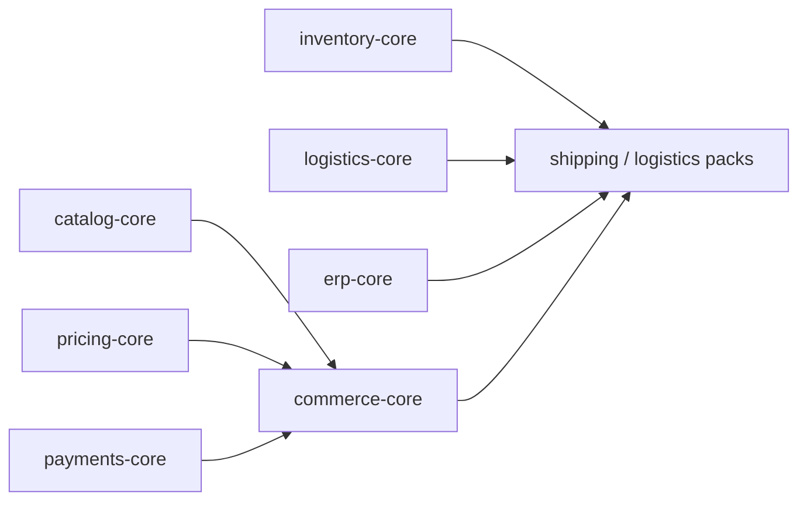

This is the correct model for the example:

* shipping plugin -> ERP <- ecommerce

Shipping should not be a hidden child of commerce.

### 20.7 Content / community / builder model

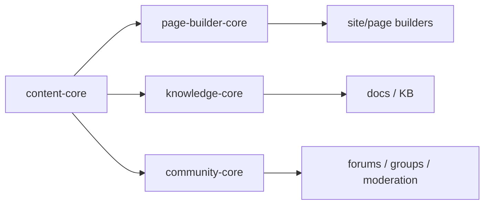

### 20.8 Representative industry families

| Industry family              | Base plugins                                                    |
| ---------------------------- | --------------------------------------------------------------- |
| School / K-12                | ERP + CRM + HR + portal + forms + learning                      |
| University / college         | ERP + CRM + HR + portal + learning + finance                    |
| Hospital                     | ERP + finance + inventory + scheduling + portal + documents     |
| Clinic / dental / veterinary | scheduling + finance + documents + portal                       |
| Hotel / resort               | hospitality + booking + pricing + POS + portal                  |
| Restaurant / QSR             | commerce + POS + inventory + booking + loyalty                  |
| Manufacturing                | manufacturing + inventory + procurement + quality + maintenance |
| 3PL / freight / courier      | logistics + warehouse + inventory + billing + portal            |
| Retail chain                 | commerce + POS + inventory + pricing + HR rosters               |
| Wholesale / dealer network   | ERP + CRM + pricing + portal + logistics                        |
| Marketplace                  | commerce + payouts + moderation + vendor portal                 |
| Real estate brokerage        | real-estate + CRM + documents + scheduling                      |
| Property management          | real-estate + finance + maintenance + portals                   |
| Legal practice               | project + documents + billing + calendars                       |
| Accounting firm              | project + documents + billing + secure exchange                 |
| Staffing agency              | HR + ATS + CRM + payroll + portals                              |
| Nonprofit / NGO              | nonprofit + CRM + finance + programs + impact                   |
| Public sector / municipality | public-sector + forms + payments + portal + service desk        |
| Utility / telecom            | ERP + billing + field service + portal + support                |
| Creator / membership         | content + community + commerce + streaming + portal             |
| Event platform               | ticketing + streaming + CRM + marketing + portal                |

### 20.9 Vertical anti-pattern

Do not create:

* `hospital-all-in-one-monolith`
* `school-all-in-one-monolith`
* `commerce-everything-plugin`
* `erp-mega-plugin`

Each may have a bundle, but not a single opaque installable blob.

---

## 21. Streaming / OTT / live media architecture

### 21.1 Position

Streaming is a first-class domain, not just “files with video”.

### 21.2 Benchmark interpretation

Vendors like Mux and Cloudflare Stream are useful benchmarks because they demonstrate the real surface area of a production video platform: ingest, live streaming, encoding/transcoding, storage, playback, analytics, captions, moderation, delivery, and APIs. Mux positions itself around streaming, moderation, search, analytics, and transform workflows; Cloudflare Stream positions itself as a VOD platform that encodes, stores, and delivers optimized video, and its live streaming docs explicitly expose HLS/DASH playback, live webhooks, DVR/live clipping, recording/replay, and custom ingest domains. These capabilities should inform the platform’s architecture, but most deployments should start connector-first for heavy media infrastructure rather than attempting to replace all media infrastructure on day one. ([Mux][17])

### 21.3 Streaming core

`streaming-core` owns:

* media asset registry,
* live inputs,
* channels,
* entitlement references,
* playback policies,
* playlists,
* seasons/episodes,
* stream state,
* video analytics references.

### 21.4 Atomic streaming subapps

Must be separable plugins:

* asset ingest
* live ingest
* live-to-VOD
* transcoding profiles
* packaging
* DRM/license policy
* subtitle/caption workflows
* localization/audio tracks
* content library
* season/episode manager
* playlists/rails
* OTT subscriptions
* entitlements/geo restrictions
* AVOD/FAST monetization
* ad insertion
* live channels
* EPG/schedule
* clip generation/highlights
* moderation/review
* media analytics
* creator upload portal
* webinar/live event mode

### 21.5 Streaming architecture

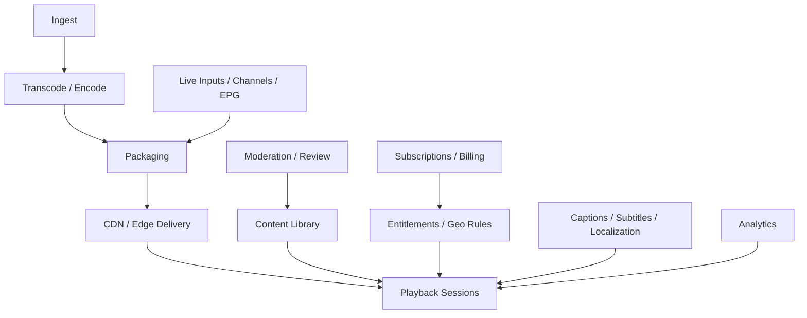

### 21.6 Recommended implementation default

#### Native

Build natively:

* media asset model,
* channel model,
* entitlement/geo model,
* OTT catalogs,
* subscription linkage,
* analytics/event layer,
* operator UI and studio.

#### Connector-first

Prefer adapters initially for:

* transcoding infrastructure,
* live media distribution,
* CDN edge delivery,
* DRM services,
* advanced media moderation.

### 21.7 OTT use cases

* SVOD
* TVOD
* AVOD
* FAST
* creator memberships
* paywalled courses
* hybrid live events
* newsroom publishing
* church/live service streaming
* sports streaming

### 21.8 Edge cases

Must handle:

* entitlement drift,
* geo restriction misconfiguration,
* stale playlists,
* live-to-VOD race conditions,
* subtitle mismatches,
* CDN cache purge lag,
* payment success but entitlement failure.

---

## 22. LMS / learning architecture

### 22.1 Position

Learning is a domain base, not just content pages.

### 22.2 Learning core

`learning-core` owns:

* courses,
* lessons,
* learning paths,
* cohorts,
* enrollments,
* progress,
* assignments,
* assessments,
* certificates.

### 22.3 Atomic learning subapps

* course authoring
* course delivery
* lesson sequencing
* assignments
* quizzes/tests
* grading
* cohorts
* live classroom
* instructor portal
* student portal
* certificates
* compliance training
* enterprise training
* academy marketplace
* communities/forums
* course commerce
* prerequisites
* rubrics
* proctoring hooks

### 22.4 LMS architecture

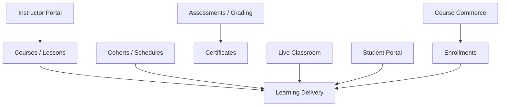

### 22.5 Deployment models

| Model                       | Typical plugin composition                                             |
| --------------------------- | ---------------------------------------------------------------------- |
| academy / consumer learning | learning-core + course commerce + portal + community                   |
| cohort-based bootcamp       | learning-core + live classroom + assignments + cohort scheduling       |
| enterprise L&D              | learning-core + HR + compliance packs + reporting                      |
| school/university           | learning-core + ERP/student records + grading + parent/student portals |

### 22.6 Rules

* grading finalization must be explicit,
* certificate issuance must be explicit and audited,
* enrollment changes must be versioned,
* instructor and student surfaces must be distinct.

### 22.7 Edge cases

Must handle:

* late grade changes,
* certificate revocation,
* cohort transfer,
* assignment deadline conflicts,
* enrollment/payment mismatch,
* live-classroom provider outage.

---

## 23. Booking architecture

### 23.1 Position

Bookings are first-class, not just calendar events.

### 23.2 Booking core

`booking-core` owns:

* reservations,
* booking holds,
* booking confirmation state,
* waitlists,
* check-in/out metadata,
* cancellation/no-show state,
* deposits/prepayment linkage.

### 23.3 Atomic booking subapps

* appointments
* service bookings
* room bookings
* desk bookings
* resource bookings
* rentals/leasing bookings
* ticketed bookings
* recurring bookings
* waitlists
* check-in/out
* deposits
* no-show rules
* calendar sync
* buffer/availability rules
* capacity quotas
* booking commerce
* booking analytics

### 23.4 Booking / scheduling architecture

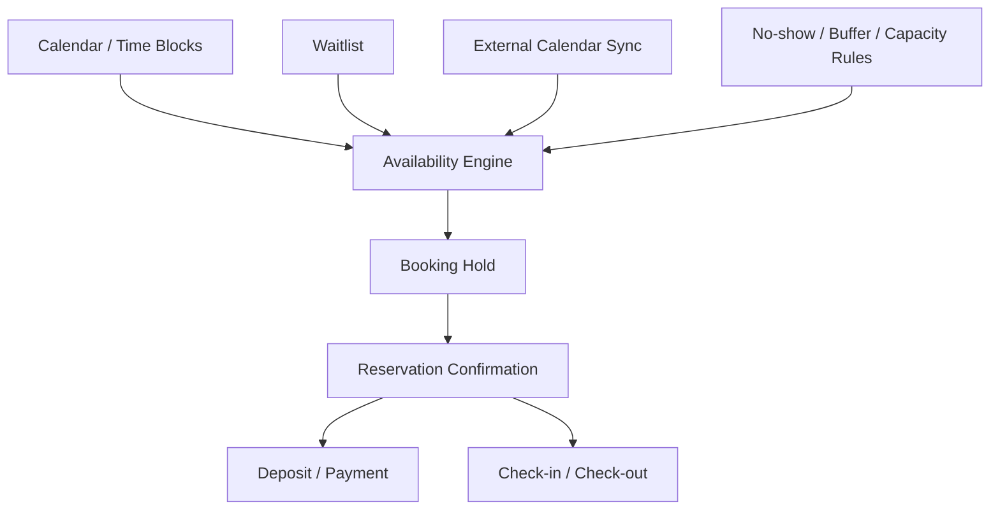

### 23.5 Concurrency rules

To avoid double allocation:

* one canonical booking writer per resource class,
* short-lived booking holds,
* transactional confirmation,
* resource/time uniqueness constraints or reservation ledgers,
* explicit expiry on abandoned holds.

### 23.6 Booking verticals

| Vertical             | Typical composition                                    |
| -------------------- | ------------------------------------------------------ |
| hospitality          | rooms + rates + check-in/out + housekeeping            |
| healthcare           | appointments + practitioner schedules + patient portal |
| salon/fitness        | appointments + packages + staff rosters                |
| coworking/facilities | desk/room booking + access rules                       |
| rentals              | resource booking + deposits + maintenance linkage      |
| events               | ticketing + check-in + agenda                          |

### 23.7 Edge cases

Must handle:

* overbooking,
* concurrent holds,
* calendar sync drift,
* no-show penalties,
* late cancellations,
* deposit refund rules,
* resource maintenance blackout windows.

---

## 24. Vendor benchmark mapping

### 24.1 Method

Benchmark vendors should be translated into:

* base plugins,
* subapp plugins,
* connectors,
* migration packs,
* bundles.

They should **not** be cloned as giant monoliths.

### 24.2 Suite vendor mapping

Official vendor portfolios reinforce the need for modularity. Zoho’s public catalog spans sales, marketing, commerce, service, finance, productivity, HR, legal, security/IT, BI, project management, developer tools, and IoT, and Zoho One presents itself as a unified suite of 45+ apps. Atlassian publicly groups its offerings into Teamwork, Strategy, Service, and Software collections, while still exposing distinct products like Jira, Confluence, Trello, Loom, Jira Service Management, Customer Service Management, Assets, Bitbucket, Pipelines, Compass, and Rovo. Salesforce’s portfolio similarly spans Sales, Service, Marketing, Commerce, Analytics/Tableau, Data 360, Slack, MuleSoft, Heroku, AI/Agentforce, and industry clouds. Odoo and ERPNext reinforce the same modular suite pattern in the ERP space. ([Zoho][18])

### 24.3 Mapping rules

| Vendor pattern                          | Platform translation                    |
| --------------------------------------- | --------------------------------------- |
| large suite with many apps              | bundle family over base plugins         |
| one product with multiple feature areas | vertical base + atomic subapps          |
| platform/API provider                   | connector or runtime pack               |
| incumbent system to leave               | migration pack                          |
| partner ecosystem                       | connector + plugin-store governance     |
| operational moat service                | connector-first, maybe never full clone |

### 24.4 What to build natively vs connector-first

| Category                                      | Default                                                       |
| --------------------------------------------- | ------------------------------------------------------------- |
| CRM / ERP / Commerce / LMS / Bookings domains | build natively as base + subapps                              |
| OTT control plane and catalog/entitlements    | build natively                                                |
| heavy video encoding/CDN/DRM                  | connector-first                                               |
| email/SMS/chat providers                      | connector-first                                               |
| merchant-of-record platforms                  | connector-first or selective clone                            |
| generic project/task/knowledge tools          | build natively if strategic                                   |
| identity provider sync                        | connector-first                                               |
| analytics warehouse exports                   | connector-first                                               |
| rich AI model access                          | connector-first behind `ai-core`                              |
| security scanners / endpoint agents           | connector-first or do not clone                               |
| broad iPaaS                                   | selective native automation + connector-first integration hub |

### 24.5 Illustrative mappings

#### Zoho-like business OS

Map into:

* CRM
* sales
* marketing
* finance
* HR
* docs/workspace
* analytics
* automation
* commerce
* service desk
* bookings
* low-code app builder
* suite bundles

#### Atlassian-like work OS

Map into:

* project/work management
* knowledge/docs
* service desk / ITSM
* asset/CMDB
* dev platform / catalog
* async video
* AI search/chat/agents
* strategy/planning bundles

#### Salesforce-like customer 360

Map into:

* CRM
* sales performance
* service and field service
* marketing automation/CDP
* commerce
* revenue lifecycle / CPQ
* analytics/BI
* data platform / integration hub
* AI agent platform
* industry clouds as vertical packs

### 24.6 Suite connectors

Use a suite-connector pattern for products like:

* Google Workspace-like suites,
* Microsoft 365-like suites.

Google Workspace Marketplace supports multiple integration types in one listing, including combinations such as a Sheets add-on and a web app. This is a useful precedent for suite connectors: one suite connector may expose mail/calendar/files/chat/docs integrations under one installable surface while still decomposing internally into sub-connectors. ([Google for Developers][19])

### 24.7 Streaming vendor mapping

Use Mux/Cloudflare-like offerings as reference for:

* ingest,
* streaming APIs,
* live/VOD packaging,
* analytics,
* captions,
* global delivery.

Build:

* control plane natively,
* heavy media infra connector-first. ([Mux][17])

### 24.8 “Not worth cloning” examples

Usually not worth full native cloning early:

* merchant-of-record services,
* low-level browser security vendors,
* endpoint MDM/EDR engines,
* global telecom infrastructure,
* generic cloud CI/CD hosts,
* full video CDN/encoder stacks.

Expose:

* integration adapters,
* management views,
* migration packs,
* analytics overlays.

---

## 25. Migration/import strategy

### 25.1 Rule

Migration packs are separate from runtime connectors.

### 25.2 Migration pack types

| Type                | Purpose                              |
| ------------------- | ------------------------------------ |
| one-time import     | initial data lift                    |
| delta sync          | temporary coexistence bridge         |
| verification pack   | reconciliation and quality checks    |
| cutover pack        | final activation step                |
| archive/export pack | historical retention and offboarding |

### 25.3 Typical sources

* WooCommerce
* Shopify
* Magento
* WordPress
* Salesforce
* HubSpot
* Zoho
* Dynamics
* Odoo
* ERPNext
* SAP Business One
* NetSuite
* Jira / Confluence
* Notion
* Gmail / Workspace
* M365 / Outlook / SharePoint
* Slack
* Discourse / forums
* LMS vendors
* OTT/content platforms

### 25.4 Migration flow

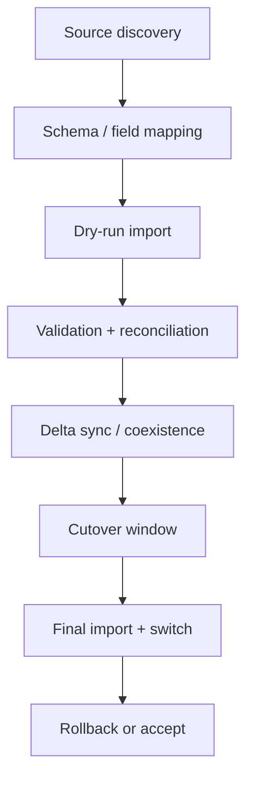

### 25.5 Migration rules

* every migration pack must be reversible where possible,
* every pack must produce import reports,
* every cutover must support dry-run,
* every high-risk migration must support reconciliation,
* every pack must specify exactly which domains it migrates.

### 25.6 Migration safety

Never:

* mount migration code as a permanent operational dependency,
* let migration packs retain privileged scopes after cutover,
* merge migration logic silently into core domain packages.

### 25.7 Backup and restore warning

Because PostgreSQL dump/restore can execute arbitrary code chosen by source superusers, imported archives must be treated as untrusted unless the source is trusted and verified. This is especially important for marketplace-distributed migration packs or customer-supplied dumps. ([PostgreSQL][20])

---

## 26. Multiserver/deployment/runtime topology

### 26.1 Deployment posture

* stateless application nodes,
* shared databases and infra,
* immutable build artifacts,
* externalized sessions/queues/files,
* blue/green or canary rollout,
* preview environments for branches/plugins.

### 26.2 Topology

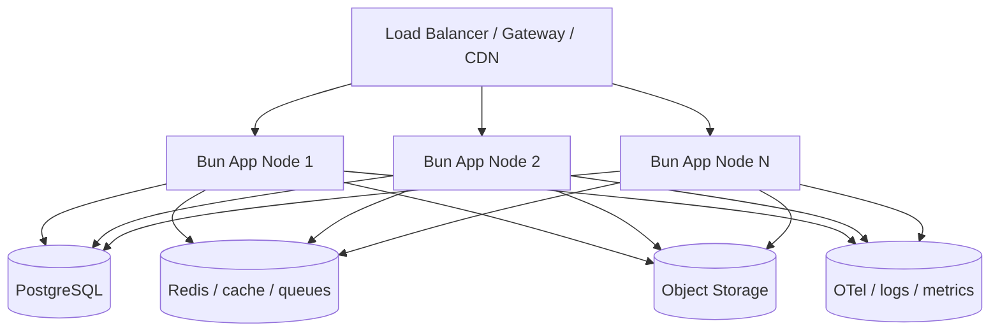

### 26.3 Runtime rules

* no local filesystem assumptions for durable state,
* no in-memory-only session assumptions for correctness,
* no in-process scheduler as the only scheduler,
* no node affinity for tenant correctness,
* no plugin activation by mutating live production nodes in place.

### 26.4 Update / rollback flow

```mermaid
flowchart TD
    A[Desired package state] --> B[Resolve + build artifact]
    B --> C[Run tests + policy gates]
    C --> D[Deploy to preview/staging]
    D --> E[Blue/green or canary rollout]
    E --> F[Health / audit / metrics check]
    F -->|healthy| G[Promote]
    F -->|unhealthy| H[Rollback to prior artifact]
```

### 26.5 Bun deployment notes

Bun provides a built-in test runner and official GitHub Actions setup flow, which should be the default CI path. Bun’s Node compatibility and support for major HTTP libraries reduce lock-in for ecosystem integration, but the platform should still keep Bun-native HTTP and SQL as first-class where possible. ([Bun][21])

### 26.6 Long-lived connections and real-time

Bun’s server-side WebSockets are appropriate for real-time features, but multi-node deployments should not rely solely on node-local pub/sub semantics for correctness. Use externalized pub/sub or queue-backed fanout for multi-node state propagation. Bun Workers are still experimental, so separate worker processes or sidecars are preferred for critical background execution. ([Bun][22])

### 26.7 Next zone deployment notes

For Next.js zones:

* reserve mount paths at build time,
* keep asset namespaces distinct,
* prefer standalone outputs or clear app-zone boundaries,
* avoid custom servers unless absolutely necessary, because they disable important optimizations and conflict with standalone deployment patterns. ([Next.js][23])

### 26.8 Preview environments

Preview environments should support:

* branch/PR preview,
* plugin/bundle preview,
* isolated DB clones or ephemeral DBs,
* limited data snapshots,
* ephemeral domain bindings,
* time-limited secrets.

---

## 27. Observability, audit, and operations

### 27.1 Observability standard

Use OpenTelemetry as the standard telemetry model. OpenTelemetry is vendor-neutral and explicitly treats traces, metrics, and logs as first-class signals, with a collector layer capable of enriching, processing, and exporting telemetry. ([OpenTelemetry][24])

### 27.2 Required telemetry dimensions

Every request/job/action should carry:

* request ID,
* plugin ID,
* tenant ID,
* actor ID,
* bundle ID (if relevant),
* zone/shell ID,
* environment,
* build/release ID.

### 27.3 Audit model

The audit model must record:

* plugin install/enable/disable/update/remove,
* runtime capability grants,
* impersonation,
* destructive data actions,
* migrations,
* restore operations,
* secret rotations,
* policy changes,
* permission diffs,
* AI tool execution for sensitive actions.

### 27.4 DB observability

At minimum:

* PostgreSQL logging,
* `pg_stat_statements` for SQL planning/execution visibility,
* explicit audit tables at the application layer.

`pg_stat_statements` is useful because it tracks planning and execution statistics of SQL statements at the server level. ([PostgreSQL][25])

### 27.5 Operational control plane

The platform should expose operator controls for:

* quarantine package,
* disable route zone,
* revoke secrets,
* rotate hosts/egress credentials,
* pause jobs,
* drain queues,
* replay events,
* rebuild indexes,
* invalidate entitlements,
* initiate restore drills.

### 27.6 Error budgets and SLOs

Recommended SLO families:

* shell route availability,
* API latency,
* plugin zone availability,
* webhook success rate,
* job latency,
* migration success rate,
* booking conflict rate,
* entitlement consistency,
* streaming playback failure rate.

### 27.7 Status surfaces

Provide:

* internal status dashboards,
* tenant-facing incident/status pages where appropriate,
* operator incident console,
* bundle/plugin health surfaces.

---

## 28. Edge cases and anti-patterns

### 28.1 Failure-mode matrix

| Failure mode                         | Risk                              | Mitigation                                            |
| ------------------------------------ | --------------------------------- | ----------------------------------------------------- |
| conflicting plugins                  | activation chaos                  | solver blocks activation                              |
| conflicting routes                   | broken UI                         | route ownership registry                              |
| conflicting slot claims              | undefined ops behavior            | slot solver + exclusive/additive classification       |
| conflicting data ownership           | inconsistent truth                | canonical ownership registry                          |
| conflicting frontend zones           | shell fragmentation               | mount-path reservation + asset namespace              |
| plugin upgrade adds permissions      | privilege creep                   | permission diff + re-approval                         |
| data migration failure               | corrupted cutover                 | dry-run + reconciliation + rollback point             |
| rollback after schema change         | incompatible data state           | reversible migrations + expand/contract strategy      |
| malicious plugin                     | lateral compromise                | quarantine + restricted mode + isolation              |
| mis-scoped permissions               | overreach                         | policy-as-code + admin review                         |
| excessive DB privileges              | data loss/leakage                 | role matrix + RLS + no raw access for unknown plugins |
| high-risk connector failure          | billing/identity outage           | circuit breakers + provider isolation                 |
| partial bundle activation            | inconsistent UX                   | default fail-closed, optional components explicit     |
| cross-tenant leakage                 | catastrophic                      | tenant context + RLS + test suites                    |
| rogue background jobs                | queue storms                      | quotas + worker budgets + kill switch                 |
| secrets misuse                       | credential leak                   | secret references + rotation + audit                  |
| AI action abuse                      | unsafe automations                | tool allowlists + human review + audit                |
| public-site SEO builder issues       | broken indexing                   | SEO validation + preview + publish workflow           |
| streaming outage / entitlement drift | content access errors             | event-driven entitlement reconciliation               |
| booking double allocation            | overbooking                       | single reservation writer + holds + constraints       |
| LMS grading/cert errors              | credential trust loss             | explicit finalization and certificate audit           |
| marketplace payout fraud             | financial loss                    | fraud review + delayed settlement + maker/checker     |
| backup/restore misuse                | catastrophic restore or data leak | privileged restore role + approval gates              |

### 28.2 Anti-patterns — do not do this

| Anti-pattern                                                  | Why it is wrong                           |
| ------------------------------------------------------------- | ----------------------------------------- |
| giant monolithic plugins                                      | hides subapps, prevents safe composition  |
| runtime installs on production nodes                          | unreproducible, unauditable, unsafe       |
| same-process untrusted code with privileged DB/network access | breaks trust boundaries                   |
| wildcard egress                                               | impossible to review safely               |
| raw DB access for unknown plugins                             | defeats platform permissions              |
| arbitrary frontend zones                                      | route and asset chaos                     |
| route collisions tolerated at runtime                         | nondeterministic behavior                 |
| asset collisions between zones                                | broken UI/runtime                         |
| runtime table ownership by app roles                          | weakens RLS posture                       |
| superuser DB role for app traffic                             | catastrophic blast radius                 |
| hiding everything behind “magic”                              | AI and humans cannot reason about it      |
| pretending Postgres/SQLite/MySQL are fully equivalent         | misleading and unsafe                     |
| calling everything an app                                     | loses semantic clarity                    |
| calling everything a plugin with no governance                | ecosystem collapse                        |
| permanent migration code inside live business plugins         | long-term instability                     |
| building media infra from scratch too early                   | huge cost/risk for low leverage           |
| treating permission dialogs as sufficient trust               | permissions are necessary, not sufficient |
| using same-process JS “sandboxing” as real isolation          | security theater                          |

### 28.3 Additional cautions

* Do not rely on logical dumps as your only production backup plan.
* Do not use role switching as the main security model for plugins.
* Do not let bundle metadata hide dangerous child permissions.
* Do not let public site builders bypass content publication workflows.
* Do not let booking or streaming subapps create their own silent canonical stores.

---

## 29. Phased roadmap

### 29.1 Phase 0 — RFC and contracts

Build first:

* package taxonomy,
* manifest schema,
* capability catalog,
* ownership registries,
* slot registry,
* plugin graph semantics,
* resource/action contract model.

### 29.2 Phase 1 — secure kernel MVP

Must include:

* Bun-native kernel,
* package loader,
* graph solver,
* trust tiers,
* capability model,
* Postgres-first DB model,
* Drizzle integration,
* auth/tenant/role/audit foundations,
* REST + OpenAPI,
* admin shell,
* basic portal shell.

Do **not** include yet:

* public marketplace,
* same-process community plugins,
* complex zone frontends as default,
* MySQL parity,
* full OTT/LMS/media stack.

### 29.3 Phase 2 — domain bases and private plugin ecosystem

Build:

* CRM, Commerce, Content, Support, ERP bases,
* bundle model,
* private registry,
* signed package flow,
* preview environments,
* plugin-specific UI surfaces,
* basic migration packs,
* observability core.

### 29.4 Phase 3 — vertical solutions and AI contracts

Build:

* school, clinic, hotel, headless commerce, helpdesk, nonprofit bundles,
* AI-readable manifests and recipes,
* action-safe AI tools,
* permission diffs on update,
* restricted mode for unknown plugins,
* sidecar isolation model.

### 29.5 Phase 4 — advanced domains

Build:

* streaming-core and OTT bundles,
* learning-core and LMS bundles,
* advanced bookings/facilities,
* advanced BI,
* richer builder zones,
* partner registry and formal review.

### 29.6 Phase 5 — marketplace maturity

Only after:

* signatures + provenance + SBOM are required,
* restricted mode is implemented,
* policy-as-code gates are mature,
* kill switch / quarantine / rollback are proven,
* privileged scopes have clear governance,
* bundle compatibility is reliable.

### 29.7 Delay until later

Delay:

* full public marketplace,
* untrusted same-process runtime,
* broad MySQL parity promises,
* visual builder-first product direction,
* own global video infrastructure,
* arbitrary cross-DB portability guarantees.

### 29.8 MVP definition

MVP requires:

* secure kernel,
* manifests,
* solver,
* Postgres + SQLite support,
* admin shell,
* portal shell,
* REST/OpenAPI,
* private registry,
* trust/capability model,
* CRM/Commerce/Support/Content foundations,
* at least a small set of tested bundles.

---

## 30. Final implementation checklist

### 30.1 Architecture

* [ ] Package taxonomy finalized
* [ ] Manifest schema versioned
* [ ] Capability registry implemented
* [ ] Extension-point registry implemented
* [ ] Ownership registries implemented
* [ ] Graph solver implemented
* [ ] Bundle model implemented

### 30.2 Data and database

* [ ] Drizzle-first data layer implemented
* [ ] PostgreSQL reference schema map defined
* [ ] SQLite dev mode supported
* [ ] MySQL support explicitly marked experimental or deferred
* [ ] Runtime roles separated from migrator roles
* [ ] `public` schema hardened
* [ ] RLS policy conventions defined
* [ ] `api` schema conventions defined
* [ ] backup/restore role defined
* [ ] unknown plugin DB policy enforced

### 30.3 Security

* [ ] Trust tiers defined
* [ ] Review tiers defined
* [ ] Install-time capability model implemented
* [ ] Runtime-sensitive grants implemented
* [ ] Restricted mode implemented
* [ ] Quarantine flow implemented
* [ ] Network egress allowlists enforced
* [ ] Secret references and rotation implemented
* [ ] Kill switch and package revocation implemented

### 30.4 Supply chain

* [ ] Signed packages required
* [ ] npm trusted publishing/provenance integrated
* [ ] SBOM required
* [ ] vulnerability scanning required
* [ ] policy-as-code gate implemented
* [ ] registry review workflow implemented
* [ ] release channels defined

### 30.5 UI and shells

* [ ] admin shell implemented
* [ ] portal shell implemented
* [ ] site shell implemented
* [ ] embedded widget/page contracts implemented
* [ ] zone mounting contracts implemented
* [ ] route ownership enforcement implemented
* [ ] asset namespace enforcement implemented
* [ ] shared auth/session/deep-link contracts implemented

### 30.6 APIs

* [ ] REST is first-class
* [ ] OpenAPI generation works from contracts
* [ ] GraphQL adapter optional and isolated
* [ ] webhook signing and replay protection implemented
* [ ] AI tool contracts generated from the same action model

### 30.7 Domain bases

* [ ] CRM base
* [ ] Commerce base
* [ ] Content base
* [ ] Support base
* [ ] ERP/finance/inventory/procurement base
* [ ] booking base
* [ ] learning base
* [ ] streaming base
* [ ] analytics/AI base

### 30.8 Verticals

* [ ] each subapp is a separate plugin
* [ ] verticals extend horizontal bases
* [ ] no vertical duplicates canonical ownership
* [ ] tested bundles exist for first target industries

### 30.9 Operations

* [ ] preview environments
* [ ] blue/green or canary rollout
* [ ] immutable artifact deployment
* [ ] observability with traces/metrics/logs
* [ ] plugin and bundle audit events
* [ ] rollback playbooks documented
* [ ] restore drills defined

### 30.10 Launch readiness

* [ ] no unknown plugin gets privileged execution by default
* [ ] no app traffic uses superuser DB credentials
* [ ] no public marketplace before supply-chain maturity
* [ ] no live code install on production nodes
* [ ] no giant monolithic vertical plugins
* [ ] no false equal-support claim across DB backends

---

## Closing position

The correct way to build this platform is:

* **Bun-native at the kernel**
* **Drizzle-first for data access**
* **Postgres-first for production**
* **one package system, many package kinds**
* **plugin OS instead of plugin chaos**
* **subapp-per-plugin instead of hidden monoliths**
* **horizontal base plugins feeding vertical bundles**
* **embedded shells plus governed product zones**
* **install-time capabilities + trust tiers + restricted mode**
* **separate database security model, not just app-level permissions**
* **AI-readable manifests, recipes, bundles, and action contracts**

That combination gives you what the product vision demands:

* minimal code,
* high leverage,
* strong defaults,
* enterprise safety,
* AI operability,
* plugin composability,
* and enough escape hatches to build serious, differentiated systems without tearing the platform apart.

[1]: https://bun.sh/ "https://bun.sh/"
[2]: https://bun.sh/docs/runtime/sql?utm_source=chatgpt.com "SQL"
[3]: https://developer.android.com/guide/topics/permissions/overview?utm_source=chatgpt.com "Permissions on Android | Privacy - Android Developers"
[4]: https://code.visualstudio.com/docs/editing/workspaces/workspace-trust "https://code.visualstudio.com/docs/editing/workspaces/workspace-trust"
[5]: https://developer.mozilla.org/en-US/docs/Mozilla/Add-ons/WebExtensions/manifest.json/host_permissions "https://developer.mozilla.org/en-US/docs/Mozilla/Add-ons/WebExtensions/manifest.json/host_permissions"
[6]: https://www.postgresql.org/docs/current/user-manag.html "https://www.postgresql.org/docs/current/user-manag.html"
[7]: https://www.postgresql.org/docs/current/ddl-rowsecurity.html "https://www.postgresql.org/docs/current/ddl-rowsecurity.html"
[8]: https://www.postgresql.org/docs/current/ddl-schemas.html "https://www.postgresql.org/docs/current/ddl-schemas.html"
[9]: https://www.postgresql.org/docs/current/functions-admin.html "https://www.postgresql.org/docs/current/functions-admin.html"
[10]: https://www.postgresql.org/docs/current/sql-createview.html "https://www.postgresql.org/docs/current/sql-createview.html"
[11]: https://www.postgresql.org/docs/current/predefined-roles.html "https://www.postgresql.org/docs/current/predefined-roles.html"
[12]: https://www.postgresql.org/docs/current/app-pgdump.html "https://www.postgresql.org/docs/current/app-pgdump.html"
[13]: https://www.postgresql.org/docs/current/sql-copy.html "https://www.postgresql.org/docs/current/sql-copy.html"
[14]: https://nextjs.org/docs/pages/guides/multi-zones "https://nextjs.org/docs/pages/guides/multi-zones"
[15]: https://developer.atlassian.com/platform/forge/manifest/?utm_source=chatgpt.com "Forge manifest"
[16]: https://docs.npmjs.com/trusted-publishers/?utm_source=chatgpt.com "Trusted publishing for npm packages"
[17]: https://www.mux.com/ "https://www.mux.com/"
[18]: https://www.zoho.com/all-products.html "https://www.zoho.com/all-products.html"
[19]: https://developers.google.com/workspace/marketplace/overview "https://developers.google.com/workspace/marketplace/overview"
[20]: https://www.postgresql.org/docs/current/app-pgrestore.html "https://www.postgresql.org/docs/current/app-pgrestore.html"
[21]: https://bun.sh/docs/test "https://bun.sh/docs/test"
[22]: https://bun.sh/docs/runtime/http/websockets "https://bun.sh/docs/runtime/http/websockets"
[23]: https://nextjs.org/docs/pages/guides/custom-server?utm_source=chatgpt.com "Guides: Custom Server"
[24]: https://opentelemetry.io/docs/ "https://opentelemetry.io/docs/"
[25]: https://www.postgresql.org/docs/current/pgstatstatements.html "https://www.postgresql.org/docs/current/pgstatstatements.html"
