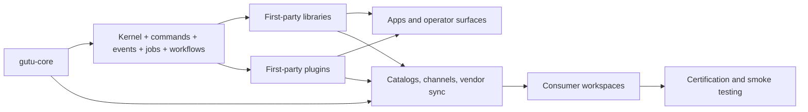

# Gutu Workspace

<p align="center">
  
</p>

Gutu is a contract-first application framework ecosystem for teams that want plugin independence, strong runtime boundaries, and production-grade orchestration without falling back to a monolith or a hook jungle.

## What Gutu Does

| Concern | Gutu Response | Why It Matters |
| --- | --- | --- |
| Domain modularity | Splits business capabilities into standalone plugin repos with explicit manifests | Teams can evolve booking, auth, notifications, AI, and search independently without losing governance |
| Shared foundations | Publishes reusable libraries for UI, contracts, data, communication, AI, and admin surfaces | Shared code stays typed, documented, and versioned instead of becoming copy-pasted glue |
| Runtime orchestration | Uses commands, durable events, jobs, and workflows instead of generic hook chains | Cross-plugin automation becomes observable, testable, and replayable |
| Ecosystem safety | Adds lockfiles, vendor sync, certification, provenance, and release checks | Consumers get a predictable install and upgrade story instead of dependency roulette |

## What Problems It Solves

| Common Team Pain | Typical Result In Other Stacks | How Gutu Handles It |
| --- | --- | --- |
| Business logic gets trapped inside one app repo | Reuse is expensive and plugin ownership stays fuzzy | Gutu separates `gutu-core`, plugins, libraries, apps, and catalogs by repo boundary |
| Extension models depend on undocumented side effects | A small change can silently break downstream consumers | Gutu pushes teams toward manifest contracts, typed resources/actions, and explicit orchestration |
| Internal platforms drift away from docs and release truth | READMEs say one thing while CI ships something else | Gutu treats docs, maturity, certification, and package metadata as first-class deliverables |
| AI, admin, and product surfaces are hard to verify together | Operators only discover breakage late in integration | Gutu includes a certification workspace and consumer smoke path that exercises the split ecosystem end to end |

## Why Gutu Feels Different

| Approach | Weakness | Gutu Advantage |
| --- | --- | --- |
| Monolithic framework repo | Fast to start, hard to scale ownership cleanly | Repo-level boundaries let teams ship libraries and plugins independently |
| Hook-heavy plugin system | Flexible at first, brittle under load and change | Commands, events, jobs, and workflows keep integration explicit |
| “Just ship packages” internal platform | Reuse exists, but compatibility and docs drift quickly | Catalogs, maturity tiers, certification, and vendor sync keep the ecosystem honest |
| Service sprawl for every capability | Operationally heavy for problems that do not need network boundaries | Gutu keeps many integrations in-process and governed until real distribution is justified |

## Ecosystem Shape



## Repo Layout

| Path | Role |
| --- | --- |
| `gutu-core/` | Canonical plugin-free foundation repo |
| `plugins/gutu-plugin-*/` | First-party domain plugins |
| `libraries/gutu-lib-*/` | First-party shared libraries |
| `apps/gutu-app-*/` | Example, docs, playground, and operator app repos |
| `catalogs/gutu-plugins/` | Plugin ecosystem index and maturity map |
| `catalogs/gutu-libraries/` | Library ecosystem index and maturity map |
| `integrations/gutu-ecosystem-integration/` | Cross-repo certification harness |

## Documentation

Complete end-to-end documentation lives in `docs/`:

| Doc | What's in it |
| --- | --- |
| [docs/ARCHITECTURE.md](./docs/ARCHITECTURE.md) | System overview, repo layout, shell vs plugin boundary, lifecycle, middleware stack, ACL/event-bus/storage layers, observability surfaces |
| [docs/PLUGIN-DEVELOPMENT.md](./docs/PLUGIN-DEVELOPMENT.md) | End-to-end plugin walkthrough: scaffold, backend, schema, frontend, UI/UX, registry pattern, workers, permissions, testing, distribution, common pitfalls, author checklist |
| [docs/HOST-SDK-REFERENCE.md](./docs/HOST-SDK-REFERENCE.md) | Every export from `@gutu-host` and sub-paths documented with type signatures and usage notes |
| [docs/UI-UX-GUIDELINES.md](./docs/UI-UX-GUIDELINES.md) | Design principles, layout, typography, color tokens, density, motion, components, forms, empty/loading/error states, accessibility, the polish checklist |
| [docs/PAGE-DESIGN-SYSTEM.md](./docs/PAGE-DESIGN-SYSTEM.md) | The 12 page archetypes, slot grid, widget catalog, tokens, performance contract, archetype wireframes, polish checklist |
| [docs/page-design/](./docs/page-design/README.md) | Per-plugin page design briefs (75 plugins) — 8 flagship full-depth + 67 short-form |
| [docs/SECURITY.md](./docs/SECURITY.md) | Threat model, auth flow, RBAC, ACL, GDPR, audit hash chain, secrets, headers, rate limiting, tenancy isolation, plugin permissions, defense-in-depth checklist |
| [docs/OBSERVABILITY.md](./docs/OBSERVABILITY.md) | Liveness/readiness probes, structured logs, metrics, plugin status, leases, audit verification, alert recipes, troubleshooting flow |
| [docs/TESTING.md](./docs/TESTING.md) | Four shell suites (149 probes), plugin-author harness patterns, CI integration, debugging tips, the test pyramid |
| [docs/CONTRIBUTING.md](./docs/CONTRIBUTING.md) | Commit format, code style, PR template, defensive-coding rules, review process, releasing |
| [DEPLOYMENT.md](./DEPLOYMENT.md) | Production deploy guide: env, k8s probes, scaling, graceful shutdown, backup/restore, security checklist |
| [RUNBOOK.md](./RUNBOOK.md) | Day-to-day operations: triaging plugin/worker/audit/rate-limit, GDPR fulfilment, plugin enablement, deploying new plugins |
| [PLUGIN_AUTHORING.md](./PLUGIN_AUTHORING.md) | Plugin author quickstart (legacy — see `docs/PLUGIN-DEVELOPMENT.md` for the deeper version) |

## Best Starting Points

- Read [gutu-core/README.md](./gutu-core/README.md) for the foundation runtime and CLI.
- Read [gutu-core/docs/framework-overview.md](./gutu-core/docs/framework-overview.md) for the deeper framework story, operating model, and comparison charts.
- Read [Business Plugin Goal.md](./Business%20Plugin%20Goal.md) and [Business Plugin TODO.md](./Business%20Plugin%20TODO.md) for the staged Gutu Business OS rollout contract and workspace-level truth board.
- Use [catalogs/gutu-plugins/README.md](./catalogs/gutu-plugins/README.md) and [catalogs/gutu-libraries/README.md](./catalogs/gutu-libraries/README.md) to navigate the extracted ecosystem.
- Use [integrations/gutu-ecosystem-integration/README.md](./integrations/gutu-ecosystem-integration/README.md) to understand how the whole system is certified from a consumer point of view.

## Verify Core

Run from `gutu-core/`:

```bash
bun install
bun run ci
bun run doctor
```

## Notes

- The workspace root is a coordination repo, not the canonical publish root of `gutu-core`.
- Standalone repos under `apps/`, `plugins/`, `libraries/`, `catalogs/`, `gutu-core/`, and `integrations/` are published from their own git roots and are intentionally ignored by the umbrella repo.
- Mascot assets are synced into every repo root under `docs/assets/gutu-mascot.png` so each extracted repo stays self-contained.
- The certification workspace under `integrations/gutu-ecosystem-integration/.tmp/` is generated evidence, not a canonical source repo.
