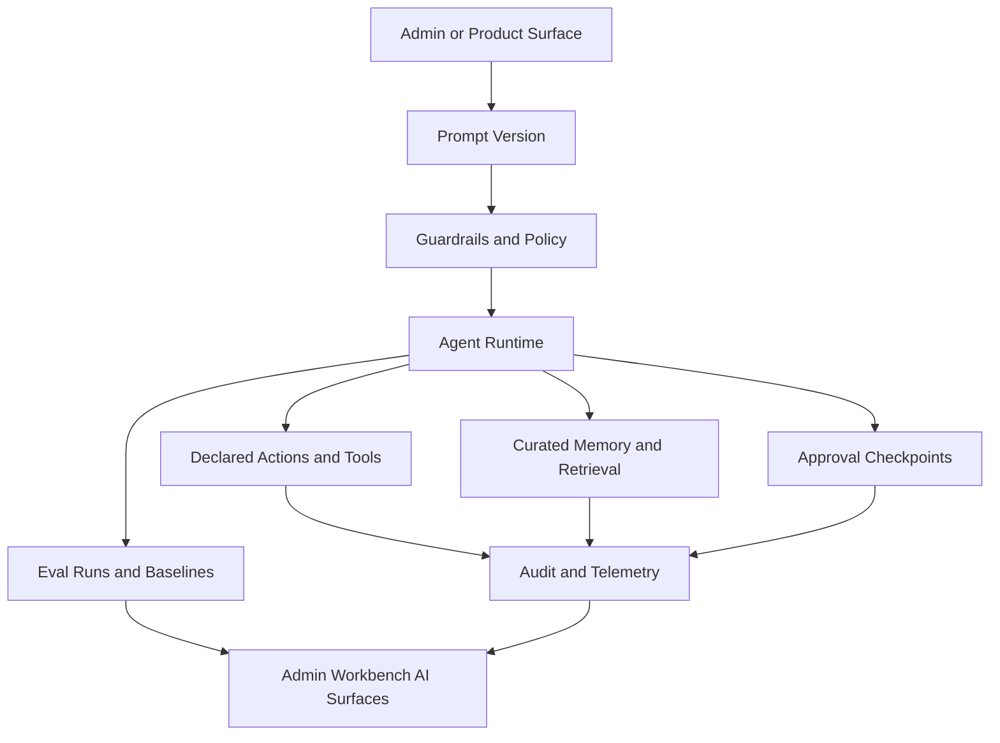
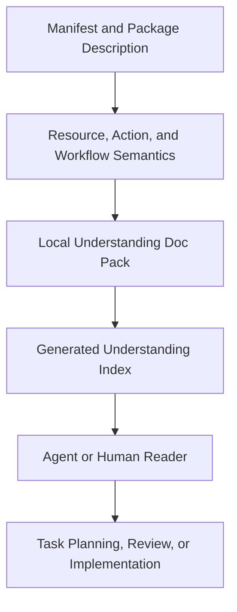
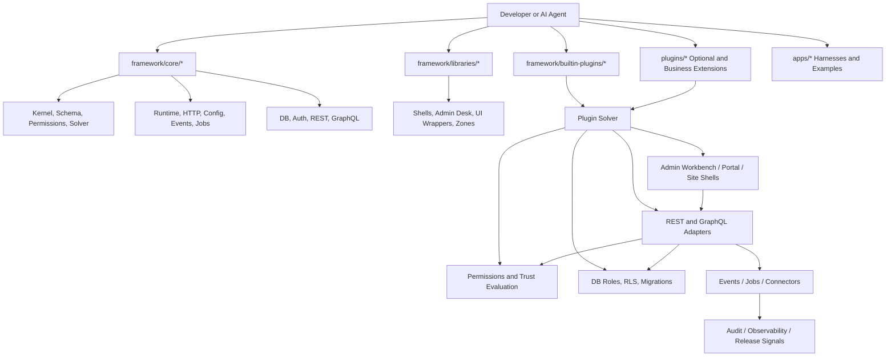
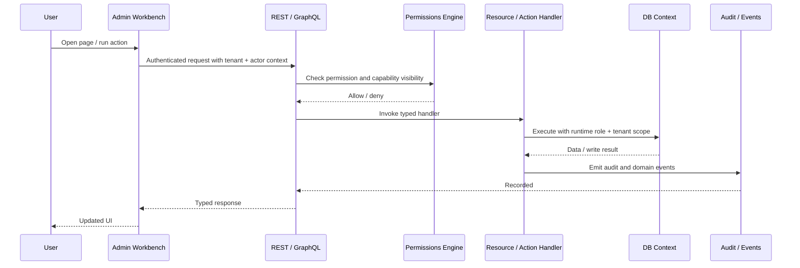

# Moki

> Moki is a Bun-native, AI-first application platform for building secure, multi-tenant, plugin-driven products with a governed admin workbench, explicit contracts, and production-grade delivery gates.

This repository is the implementation baseline for the platform described in:

- [Goal.md](./Goal.md)
- [Developer_DeepDive.md](./Developer_DeepDive.md)

It is designed for teams that want more than a web framework:

- a framework runtime,
- a plugin operating system,
- a governed admin desk,
- a secure extension model,
- a low-code authoring experience for humans and AI agents,
- and a predictable release pipeline.

The checked-in repository now ships only:

- framework core packages,
- framework libraries,
- built-in plugins that are part of the batteries-included distribution,
- apps and tooling used to verify the framework itself.

Optional domain plugins, connectors, migration packs, verticals, and tested distributions are still supported by the platform model, but they are no longer checked into this Git repository. Those belong in the future plugin store or in separately vendored installs.

---

## Table of Contents

- [What This Is](#what-this-is)
- [Why This Exists](#why-this-exists)
- [Core Principles](#core-principles)
- [How This Differs From Other Approaches](#how-this-differs-from-other-approaches)
- [AI-First Developer Experience](#ai-first-developer-experience)
- [Agent Understanding Layer](#agent-understanding-layer)
- [Platform Architecture](#platform-architecture)
- [Repository Structure](#repository-structure)
- [Core Concepts](#core-concepts)
- [How The Platform Works](#how-the-platform-works)
- [Admin Workbench](#admin-workbench)
- [Canonical Frontend Stack For Admin Plugins](#canonical-frontend-stack-for-admin-plugins)
- [Getting Started](#getting-started)
- [Common Commands](#common-commands)
- [How To Build With The Framework](#how-to-build-with-the-framework)
- [How To Create A Plugin](#how-to-create-a-plugin)
- [How To Create A Framework Package](#how-to-create-a-framework-package)
- [How To Create A Runnable App](#how-to-create-a-runnable-app)
- [How To Create Connectors Migration Packs And Bundles](#how-to-create-connectors-migration-packs-and-bundles)
- [Security And Governance Model](#security-and-governance-model)
- [Testing Strategy](#testing-strategy)
- [CI Release And Supply Chain](#ci-release-and-supply-chain)
- [Operational Flows And Edge Cases](#operational-flows-and-edge-cases)
- [When To Use This Framework](#when-to-use-this-framework)
- [Further Reading](#further-reading)

---

## What This Is

This repository is a **full-stack platform baseline** for building applications out of explicit packages and installable plugins.

It combines:

- a **kernel** for manifests, registries, ownership, and package taxonomy,
- a **schema layer** for typed resources and actions,
- a **permission and trust system** for safe plugin installation and execution,
- a **database layer** with runtime-role separation and tenant-aware enforcement,
- **REST-first APIs** with optional GraphQL,
- **admin, portal, and site shell infrastructure**,
- a **universal admin workbench** for desk-style operator experiences,
- a **canonical frontend wrapper stack** for admin-registered plugins,
- and a **release pipeline** with coverage, SBOM, provenance, signing, and verification.

This is not a thin starter kit. It is a structured platform intended to support:

- foundation services,
- built-in platform modules,
- external optional plugin packages,
- provider adapters,
- migration/import packs,
- installable distributions,
- and product zones.

---

## Why This Exists

Most teams end up re-building the same missing platform layers:

- auth/session conventions,
- plugin loading and dependency checks,
- multi-tenant permission enforcement,
- admin navigation and CRUD shells,
- provider wrappers,
- background job contracts,
- migration tooling,
- release signing,
- and extension governance.

Traditional frameworks are strong at request/response and ORM basics, but they usually leave the product-platform model to the application team. Low-code tools often move fast at first, but they can become hard to govern, hard to version, and hard to extend safely.

This platform exists to give you:

- the speed of metadata-driven product development,
- the safety of explicit manifests and permissions,
- the extensibility of plugins and bundles,
- the consistency of a governed admin desk,
- and the predictability that AI agents need to generate useful code with minimal ambiguity.

---

## Core Principles

### 1. Explicit metadata over hidden magic

The platform prefers declared manifests, contracts, and ownership rules over invisible conventions.

Why:

- better safety,
- easier review,
- deterministic solver behavior,
- better AI generation,
- fewer accidental side effects.

### 2. Plugin operating system first

Applications are assembled from installable units, not from a single monolith with ad hoc modules.

That means:

- dependency graphs are resolved explicitly,
- capabilities are requested explicitly,
- data ownership is declared,
- route ownership is validated,
- shell surfaces are registered through contracts,
- and bundles can be validated before installation.

### 3. AI-first authoring, not AI-only authoring

The platform is optimized for coding agents and human engineers working together.

That means:

- stable package taxonomy,
- wrapper-first APIs,
- explicit manifests,
- predictable folder layout,
- typed Zod contracts,
- generated or derivable admin surfaces,
- narrow adapter seams,
- and conventional test entrypoints.

### 4. Secure by default

Unknown or risky packages do not get privileged execution by default.

The platform includes:

- trust tiers,
- review tiers,
- capability requests,
- host allowlists,
- secret reference models,
- restricted preview paths,
- DB role separation,
- and install/update diffing.

### 5. Universal shell, replaceable implementation

The admin experience is a governed shell system, not a hardcoded app.

The default implementation in this repository is the **admin workbench**, but the platform contract is designed so future shell implementations can replace it without breaking plugin contracts.

### 6. Wrappers first

Business plugins should not pick arbitrary infra or UI libraries.

Instead, they build on:

- `@platform/ui`
- `@platform/router`
- `@platform/query`
- `@platform/data-table`
- `@platform/form`
- `@platform/chart`
- `@platform/editor`
- `@platform/layout`
- `@platform/contracts`
- `@platform/telemetry-ui`
- `@platform/command-palette`

This keeps the platform coherent and dramatically reduces AI/tooling confusion.

---

## How This Differs From Other Approaches

### Comparison by category

| Category | This platform | Traditional monolith frameworks | Low-code internal tool platforms | Headless backend kits |
| --- | --- | --- | --- | --- |
| Primary unit of composition | explicit packages and plugins | project modules/apps | screens and queries | services and endpoints |
| Extension governance | manifest, solver, capabilities, trust tiers | usually custom | limited or vendor-defined | partial |
| Multi-tenant policy model | first-class | often app-specific | often shallow | varies |
| Admin UX | governed universal workbench | usually custom-built | built-in but restrictive | usually absent |
| AI authoring friendliness | high due to explicit contracts | medium | low-to-medium | medium |
| Release hardening | coverage, SBOM, provenance, signing | usually custom | vendor-managed | custom |
| Installable bundles | first-class | uncommon | uncommon | uncommon |
| Provider wrappers | first-class | app-specific | vendor-defined | app-specific |

### Where this platform has strong advantages

| Need | Why this platform helps |
| --- | --- |
| Many domains under one admin shell | workspaces, pages, widgets, reports, builders, zones |
| Safe plugin ecosystems | capability requests, trust tiers, slot claims, route ownership validation |
| AI-assisted development | explicit manifests, stable wrappers, typed schemas, predictable file layout |
| Multi-tenant enterprise platforms | policy, audit, tenancy context, DB role separation |
| Product suites and installable distributions | bundles, connectors, migration packs |
| Long-term maintainability | wrapper-first architecture and formal package taxonomy |

### Honest tradeoffs

This framework is **not** the fastest choice if you only need:

- one small CRUD app,
- no plugin ecosystem,
- no multi-tenant policy model,
- no governed admin shell,
- and no extension or release hardening.

If you just want a simple internal app quickly, a lighter framework can be more direct.

This framework wins when you need:

- controlled extensibility,
- product families,
- installable modules,
- consistent operator tooling,
- security posture,
- and long-lived platform evolution.

---

## AI-First Developer Experience

This repository is intentionally structured so AI agents can build on top of it with minimal code and low ambiguity.

### What makes it AI-friendly

- **Stable taxonomy**
  - `framework/core/*` for kernel/runtime/infrastructure packages
  - `framework/libraries/*` for shared developer-facing libraries and admin/UI wrappers
  - `framework/builtin-plugins/*` for batteries-included shipped plugins
  - `plugins/*` for installable product units
  - `apps/*` for runnable harnesses and examples
- **Typed manifests**
  - package shape is explicit
  - connector shape is explicit
  - migration-pack shape is explicit
  - bundle shape is explicit
- **Schema-first resources and actions**
  - Zod contracts drive validation
  - admin list/form/report metadata can be derived from resources
- **Wrapper-first frontend**
  - admin plugins are guided into one sanctioned stack
  - fewer UI permutations
  - less surface area for codegen errors
- **Deterministic validation**
  - duplicate routes fail
  - duplicate ids fail
  - permissionless admin contributions fail
  - conflicting builder routes fail
- **Conventional test topology**
  - `tests/unit`
  - `tests/integration`
  - `tests/contracts`
  - `tests/migrations`
  - `tests/e2e`

### What “low code” means here

Low code in this framework does **not** mean “hide everything behind runtime magic.”

It means:

- declare manifests once,
- derive as much as possible from resource/action metadata,
- reuse framework wrappers,
- let the shell and admin contracts carry common UX behaviors,
- and write only the domain-specific code that matters.

### The practical effect

An AI agent that has:

- this README,
- [Goal.md](./Goal.md),
- [Developer_DeepDive.md](./Developer_DeepDive.md),
- and the relevant package contracts

can usually create:

- a new plugin manifest,
- its resources and actions,
- admin list/detail/form surfaces,
- reports and widgets,
- and tests

without inventing its own architecture.

### Understanding is separate from orchestration

This repository now treats **system understanding** as a first-class framework concern.

That means the framework helps an agent answer:

- what this package is for,
- what a model means,
- why an action exists,
- which workflow steps are mandatory,
- and which business invariants must not be violated.

It does **not** mean the framework decides what the agent should do next.

That boundary is intentional:

- the **understanding layer** explains the system,
- the **orchestrator or human** decides which task to run against it.

## Native AI-Agent Platform

The framework is now AI-friendly at two different layers:

- **authoring layer**
  - humans and AI agents can scaffold packages, plugins, admin surfaces, and tests with low ambiguity
- **runtime layer**
  - products built on the framework can host governed agents, prompts, approvals, retrieval, evals, and operator tooling

### AI package family

| Package | Purpose |
| --- | --- |
| `@platform/ai` | provider-neutral model and tool contract surface |
| `@platform/ai-runtime` | agent definitions, runs, steps, budgets, approvals, replay fingerprints |
| `@platform/ai-memory` | tenant-safe memory collections, documents, chunks, retrieval plans, citations |
| `@platform/ai-guardrails` | prompt sanitization, risk assessment, redaction, moderation hooks |
| `@platform/ai-evals` | datasets, judge contracts, baselines, regression gates |
| `@platform/ai-mcp` | governed MCP-safe descriptors for tools, resources, and prompts |

### Built-in AI batteries

| Built-in plugin | Responsibility |
| --- | --- |
| `ai-core` | agent runs, prompt versions, approvals, replay, operator flows |
| `ai-rag` | memory collections, ingestion, retrieval diagnostics, citations |
| `ai-evals` | datasets, eval runs, regression views, release-quality comparisons |

### AI runtime flow



### Important AI rules

- AI is **opt-in by default**.
- Agents can call **declared actions and curated read models only**.
- Agents do **not** get raw repository access, broad DB helpers, or undeclared connector clients.
- Provider SDKs stay behind connectors and framework wrappers.
- Prompt versions, approval decisions, retrieval context, and replay metadata are framework-owned artifacts.

### AI-native CLI commands

The repository now ships the first `platform` CLI surface through `@platform/cli`.

Inside this monorepo, use the repo-native runner:

```bash
bun run platform -- agent run --tenant tenant-platform --actor actor-admin --agent ops-triage-agent --goal "Summarize open escalations with grounded next steps."
bun run platform -- prompt diff --left prompt-version:ops-triage:v3 --right prompt-version:ops-triage:v4
bun run platform -- memory ingest --collection memory-collection:ops --title "Shift handoff"
bun run platform -- eval run --dataset eval-dataset:ops-safety --label candidate
bun run platform -- mcp inspect --tool ai.memory.retrieve
bun run platform -- make ai-pack --id assistant-pack
```

Current note:

- the repo-local developer entrypoint is `bun run platform -- ...`
- once `@platform/cli` is published/installed as a package, the direct `platform ...` binary is the intended experience
- `platform mcp serve` currently emits governed MCP server descriptors in a stdio-shaped format.
- A full long-running transport server is a follow-on milestone.

## Agent Understanding Layer

The framework now includes a dedicated understanding layer for AI agents and human engineers.

This layer exists so the repository can explain:

- what each package does,
- what each model means,
- what each field represents,
- what each action changes,
- which workflows and approvals matter,
- and which edge cases or mandatory steps cannot be inferred safely from code shape alone.

### What is now supported

| Level | Support |
| --- | --- |
| package/app/plugin | package descriptions plus required local understanding docs |
| resource/model | resource descriptions, business purpose, invariants, lifecycle notes, actors |
| field | label, description, business meaning, examples, sensitivity, source-of-truth hints, flow dependencies |
| action | description, business purpose, preconditions, mandatory steps, side effects, postconditions, failure modes, forbidden shortcuts |
| workflow | description, business purpose, actors, invariants, mandatory steps, state meaning, transition meaning |
| repository | machine-readable understanding index for tooling and agents |

### Required doc pack

Each app, framework package, library, and plugin can ship a standard understanding pack under its local `docs/` folder:

- `AGENT_CONTEXT.md`
- `BUSINESS_RULES.md`
- `FLOWS.md`
- `GLOSSARY.md`
- `EDGE_CASES.md`
- `MANDATORY_STEPS.md`

### Generated understanding index

The repository can generate a machine-readable understanding map at:

- [docs/agent-understanding.index.json](./docs/agent-understanding.index.json)

That file is intended for:

- AI preflight context loading
- repo-wide business graph generation
- drift checks
- internal search and summarization
- tooling that needs more than free-form Markdown

### Understanding flow



### CLI commands

```bash
bun run platform -- docs scaffold --all
bun run platform -- docs index --all --out docs/agent-understanding.index.json
bun run platform -- docs validate --all
```

The root workspace also exposes:

- `bun run docs:scaffold`
- `bun run docs:index`
- `bun run docs:validate`

### Enforcement posture

- missing required understanding docs fail validation
- thin semantic coverage is surfaced as warnings so the repo stays usable while legacy packages are enriched
- `bun run ci:check` now includes `bun run docs:validate`

See [docs/agent-understanding.md](./docs/agent-understanding.md) for the full guide.

---

## Platform Architecture

### High-level view



### Installation and activation flow

```mermaid
flowchart LR
  Manifest["Plugin Manifest"] --> Validate["Manifest Validation"]
  Validate --> Resolve["Dependency and Conflict Resolution"]
  Resolve --> Diff["Capability / Host / Permission Diff"]
  Diff --> Trust["Trust Tier and Review Checks"]
  Trust --> Plan["Activation Plan and Rollback Checkpoints"]
  Plan --> Mount["Routes, Slots, Data Ownership, Shell Surfaces"]
  Mount --> Active["Active Package Graph"]
```



### Request execution flow



---

## Repository Structure

### Top-level layout

```text
.
├── apps/
│   ├── docs/
│   ├── examples/
│   ├── playground/
│   └── platform-dev-console/
├── framework/
│   ├── core/
│   │   ├── kernel/
│   │   ├── runtime-bun/
│   │   ├── http/
│   │   ├── config/
│   │   ├── schema/
│   │   ├── permissions/
│   │   ├── plugin-solver/
│   │   ├── db-drizzle/
│   │   ├── migrate/
│   │   ├── auth/
│   │   ├── auth-admin/
│   │   ├── api-rest/
│   │   ├── api-graphql/
│   │   └── ...
│   ├── libraries/
│   │   ├── ui/
│   │   ├── router/
│   │   ├── query/
│   │   ├── data-table/
│   │   ├── form/
│   │   ├── chart/
│   │   ├── editor/
│   │   ├── layout/
│   │   ├── command-palette/
│   │   ├── telemetry-ui/
│   │   ├── admin-contracts/
│   │   ├── admin-shell-workbench/
│   │   └── ...
│   └── builtin-plugins/
│       ├── auth-core/
│       ├── dashboard-core/
│       ├── admin-shell-workbench/
│       ├── portal-core/
│       └── ...
├── plugins/
│   ├── README.md
│   └── .gitkeep
├── tooling/
├── docs/
├── ops/
├── artifacts/
└── ref/
```

### Directory responsibilities

| Directory | Purpose |
| --- | --- |
| `apps/` | runnable harnesses, docs apps, examples, verification consoles |
| `framework/core/` | kernel, runtime, DB, auth, API, permissions, and execution infrastructure |
| `framework/libraries/` | shared libraries, admin desk packages, UI wrappers, and compatibility layers |
| `framework/builtin-plugins/` | default shipped plugins such as auth, dashboard, portal, AI, and other batteries-included platform modules |
| `plugins/` | reserved landing area for future vendored or store-installed plugins; not part of the shipped framework source tree |
| `tooling/` | scaffolders, task runners, artifact generation |
| `docs/` | spec mirrors and supporting docs |
| `ops/` | operational assets such as Postgres bootstrap and compose files |
| `artifacts/` | generated release bundles, SBOMs, provenance, signatures |
| `ref/` | local research/reference material only, not runtime dependencies |

---

## Core Concepts

| Concept | Meaning |
| --- | --- |
| package | any typed manifest unit in the graph |
| framework package | code in `framework/core/*` or `framework/libraries/*` that other packages or plugins build on |
| plugin | an installable product/platform unit; built-ins ship in `framework/builtin-plugins/*`, optional ones are expected from the plugin store |
| app | a runnable harness, demo, or developer console in `apps/*` |
| resource | typed data contract plus field metadata and admin affordances |
| action | typed command contract plus permission and audit semantics |
| capability | declared power such as API mount, UI registration, network egress |
| slot claim | declared ownership of a shell host or extension point |
| trust tier | risk and provenance posture for a package |
| review tier | required scrutiny before enablement |
| isolation profile | same-process, sidecar, declarative-only, or other runtime boundary |
| connector | a provider adapter with declared hosts, secrets, and webhooks, typically distributed outside the framework repo |
| migration pack | a controlled import pipeline with phases like discover, map, dry-run, reconcile |
| bundle | a tested install distribution of packages and optional includes |
| zone | a dense product UI mounted under a governed path like `/apps/<zone>/*` |
| admin workbench | the default universal admin desk implementation |

### Package kinds in practice

| Kind | Typical location | Purpose |
| --- | --- | --- |
| `app` | `framework/builtin-plugins/*` or an external plugin-store package | installable business or platform logic |
| `feature-pack` | external plugin-store package | optional enhancements or vertical slices |
| `connector` | external plugin-store package | external provider integration |
| `migration-pack` | external plugin-store package | import and reconciliation flows |
| `bundle` | external plugin-store package | tested distributions |
| `ui-surface` | shell plugins such as `admin-shell-workbench` | shell implementations and surface owners |
| `library` | framework or shared installable helpers | reusable code without install-time power |

---

## How The Platform Works

### 1. Kernel and manifests

`@platform/kernel` owns the package manifest DSL and validation rules.

Key responsibilities:

- package taxonomy,
- defaults for review tier, trust tier, and isolation profile,
- manifest validation,
- connector/migration/bundle specialization,
- compatibility metadata.

Representative helpers:

- `definePackage`
- `defineConnector`
- `defineMigrationPack`
- `defineBundle`

### 2. Schema-first domain contracts

`@platform/schema` provides the typed domain surface.

That includes:

- resources via `defineResource`
- actions via `defineAction`
- field metadata for search/filter/sort/admin usage
- contract-level validation with Zod

This is where low-code behavior begins:

- list views can derive from resource fields
- forms can derive from resource contracts
- APIs can derive from resource/action metadata
- permission-aware UIs can derive from action/resource semantics

### 3. Solver, permissions, and governance

`@platform/plugin-solver` and `@platform/permissions` are the core of safe composition.

They handle:

- dependency resolution,
- conflict detection,
- route ownership,
- slot ownership,
- data ownership,
- capability diffing on update,
- restricted preview for unknown plugins,
- dangerous capability acknowledgement,
- rollback checkpoint planning.

### 4. Runtime, config, events, and jobs

Core runtime packages include:

- `@platform/runtime-bun`
- `@platform/http`
- `@platform/config`
- `@platform/events`
- `@platform/jobs`
- `@platform/jobs-bullmq`
- `@platform/logger`
- `@platform/observability`

Together they provide:

- Bun-native runtime helpers,
- request context and error mapping,
- typed config loading,
- event envelopes and outbox patterns,
- queue-agnostic job contracts,
- BullMQ adapter support,
- structured logging,
- telemetry correlation.

### 5. Data layer and security

`@platform/db-drizzle` and `@platform/migrate` implement the data plane.

Highlights:

- Postgres-first,
- SQLite support for dev/test paths where appropriate,
- runtime role separation,
- no runtime superuser behavior,
- tenant-aware RLS conventions,
- curated `api` views,
- migration planning and execution,
- live Postgres verification assets in [`ops/postgres`](./ops/postgres).

### 6. Auth and policy

`@platform/auth` and `@platform/auth-admin` wrap the auth/session and sensitive-admin flows.

Highlights:

- Better Auth behind a platform boundary,
- session and tenant propagation,
- impersonation controls,
- admin audit linkage,
- safe refresh and invalidation behavior.

### 7. API layer

The platform is **REST-first** via `@platform/api-rest`, with optional GraphQL through `@platform/api-graphql`.

The default stance is:

- use REST as the shared contract for admin, portal, and operational app flows,
- use GraphQL only where it is actually helpful,
- keep provider SDKs behind backend wrappers,
- keep webhooks signed and verified.

### 8. UI shells and workbench

The low-level UI substrate lives in:

- `@platform/ui-shell`
- `@platform/ui-router`
- `@platform/ui-query`
- `@platform/ui-form`
- `@platform/ui-table`
- `@platform/ui-kit`
- `@platform/ui-editor`
- `@platform/ui-zone-next`
- `@platform/ui-zone-static`

The admin desk sits above that in:

- `@platform/admin-contracts`
- `@platform/admin-listview`
- `@platform/admin-formview`
- `@platform/admin-widgets`
- `@platform/admin-reporting`
- `@platform/admin-builders`
- `@platform/admin-shell-workbench`

### 9. Connectors, migrations, bundles

The platform treats provider adapters, imports, and install distributions as first-class citizens.

That means:

- connectors declare hosts and secrets,
- migration packs declare phases and targets,
- bundles are validated and smoke-tested,
- and none of those shapes are “just docs”; they are code and tests.

---

## Admin Workbench

The default admin desk implementation is the **admin workbench**.

It is meant to feel like a universal operator desk:

- one shell,
- many domains,
- consistent CRUD/report/dashboard/builder flows,
- governed plugin contributions,
- swappable later if needed.

### The workbench owns

- workspace navigation,
- dashboard home,
- list/form/detail pages,
- report pages,
- builder pages,
- notifications and inbox surfaces,
- global search,
- command palette,
- favorites and recents,
- theme and appearance presets,
- tenant switching,
- impersonation visibility,
- governed zone launches.

### Route model

| Route type | Pattern |
| --- | --- |
| shell home | `/admin` |
| workspace home | `/admin/workspace/:workspace` |
| list page | `/admin/:domain/:resource` |
| detail page | `/admin/:domain/:resource/:id` |
| form page | `/admin/:domain/:resource/:id/edit` |
| report page | `/admin/reports/:reportId` |
| builder page | `/admin/tools/:builderId` |
| product zone | `/apps/:zone/*` |

### Admin contribution model

Admin-registered plugins contribute explicitly through:

- workspaces,
- navigation groups,
- pages,
- widgets,
- reports,
- commands,
- search providers,
- builders,
- zone launchers.

Those contributions are validated deterministically. Missing permissions or conflicting routes are rejected.

---

## Canonical Frontend Stack For Admin Plugins

The framework ships with a canonical frontend contract for any plugin that registers into the admin workbench.

### Approved defaults

| Concern | Default |
| --- | --- |
| UI runtime | React |
| router | TanStack Router via `@platform/router` |
| server state | TanStack Query via `@platform/query` |
| data table | TanStack Table + TanStack Virtual via `@platform/data-table` |
| forms | React Hook Form via `@platform/form` |
| validation | Zod via `@platform/contracts` |
| primitives | Radix + shadcn-style wrappers via `@platform/ui` |
| icons | Lucide via `@platform/ui` |
| command palette | cmdk via `@platform/command-palette` |
| toasts | Sonner via `@platform/ui` |
| dates | date-fns via `@platform/ui` |
| charts | ECharts via `@platform/chart` |
| rich text | Tiptap via `@platform/editor` |
| email templates | React Email via `@platform/email-templates` |

### Canonical wrapper taxonomy

- `@platform/ui`
- `@platform/router`
- `@platform/query`
- `@platform/data-table`
- `@platform/form`
- `@platform/chart`
- `@platform/editor`
- `@platform/layout`
- `@platform/contracts`
- `@platform/telemetry-ui`
- `@platform/command-palette`

### Important rule

Admin-registered plugins should not import raw TanStack, Radix, Lucide, Sonner, cmdk, date-fns, ECharts, or Tiptap packages directly.

Use the wrappers first.

Exception:

- isolated zones,
- heavy builders,
- dense studios

may declare additional libraries through governed manifests when the product shape genuinely requires them.

See [docs/admin-ui-stack.md](./docs/admin-ui-stack.md) for the policy details.

---

## Getting Started

### Prerequisites

- Bun `1.3.12` or later
- Node-compatible local environment
- PostgreSQL for live DB verification
- optional Docker for local Postgres bootstrap

If Bun is installed only in your user directory:

```bash
export PATH="$HOME/.bun/bin:$PATH"
```

### Install dependencies

```bash
bun install
```

### Run the baseline verification suite

```bash
bun run ci:check
bun run security:audit
bun run coverage:report
```

### Generate release/security artifacts

```bash
bun run package:release
bun run sbom:generate
bun run provenance:generate
bun run sign:artifacts
bun run verify:artifacts-signature
```

### Run the live Postgres verification path

Render the bootstrap assets:

```bash
bun run db:render:postgres
```

Start Postgres with Docker if needed:

```bash
docker compose -f ops/postgres/compose.yaml up -d
```

Or use a local server:

```bash
dropdb --if-exists framework_platform_test
createdb framework_platform_test
TEST_POSTGRES_URL=postgresql:///framework_platform_test bun test framework/core/db-drizzle/tests/integration/postgres.test.ts
```

---

## Common Commands

| Command | Purpose |
| --- | --- |
| `bun run scaffold` | regenerate the baseline workspace structure |
| `bun run build` | build all workspaces |
| `bun run typecheck` | typecheck all workspaces |
| `bun run lint` | lint all workspaces |
| `bun run test` | run default tests across workspaces |
| `bun run test:unit` | run unit suites |
| `bun run test:integration` | run integration suites |
| `bun run test:e2e` | run browser/end-to-end suites |
| `bun run test:contracts` | run contract conformance suites |
| `bun run test:migrations` | run migration suites |
| `bun run docs:scaffold` | scaffold the required understanding doc pack across workspaces |
| `bun run docs:index` | generate the machine-readable repository understanding index |
| `bun run docs:validate` | validate package, app, plugin, and semantic understanding coverage |
| `bun run db:render:postgres` | generate Postgres bootstrap assets |
| `bun run coverage:report` | generate workspace coverage report |
| `bun run security:audit` | run vulnerability audit against the reachable release graph |
| `bun run package:release` | create release archive |
| `bun run sbom:generate` | generate SBOM |
| `bun run provenance:generate` | generate provenance metadata |
| `bun run sign:artifacts` | sign release artifacts |
| `bun run verify:artifacts-signature` | verify generated signature |
| `bun run ci:check` | full local CI gate |
| `bun run platform -- agent run ...` | run a governed AI agent scenario through the workspace CLI |
| `bun run platform -- prompt diff ...` | diff prompt versions |
| `bun run platform -- memory ingest ...` | ingest knowledge into an AI collection |
| `bun run platform -- eval run ...` | execute an eval dataset candidate run |
| `bun run platform -- mcp inspect ...` | inspect derived MCP-safe descriptors |
| `bun run platform -- make ai-pack --id <slug>` | scaffold a new AI pack |

### Verification harnesses

Representative runnable harnesses live in `apps/*`, especially:

- [`apps/platform-dev-console`](./apps/platform-dev-console)

Use it when you want to verify:

- admin workbench composition,
- plugin contribution mounting,
- search and command flows,
- report and builder flows,
- zone launch behavior,
- permission-aware rendering.

---

## How To Build With The Framework

### Decide which unit you are creating

Use this rule-of-thumb:

| You are building... | Put it in... | Typical result |
| --- | --- | --- |
| a reusable framework library | `framework/core/*` or `framework/libraries/*` | `@platform/<name>` |
| a shipped built-in plugin | `framework/builtin-plugins/*` | plugin manifest + resources/actions/UI |
| an optional store plugin | separate repo or vendored install under `plugins/*` | plugin manifest + resources/actions/UI |
| a provider adapter | store plugin or vendored install | connector manifest |
| an import pipeline | store plugin or vendored install | migration pack |
| a tested install distribution | store plugin or vendored install | bundle manifest |
| a runnable harness/demo/docs app | `apps/*` | Bun/React app package |

### Preferred authoring order

1. Define the manifest.
2. Add the package description and understanding doc pack.
3. Define resources.
4. Define actions.
5. Define workflows if the package owns process state.
6. Add service logic.
7. Add admin contributions if relevant.
8. Add tests.
9. Run the narrow test set.
10. Run the root gate before finishing a milestone.

### Strong authoring rules

- Do not bypass manifests.
- Do not leave model, field, action, or workflow meaning implicit when the contract can describe it.
- Do not bypass wrapper packages.
- Do not let plugin UI choose arbitrary libraries.
- Do not give unknown plugins privileged access.
- Do not skip tests for resources, actions, or admin contributions.
- Do not put provider SDKs directly into business/domain plugins.

---

## How To Create A Plugin

### Step 1: create the manifest

Plugins use the manifest DSL from `@platform/kernel`.

Example:

```ts
import { definePackage } from "@platform/kernel";

export default definePackage({
  id: "dashboard-core",
  kind: "app",
  version: "0.1.0",
  displayName: "Dashboard Core",
  description: "Dashboard, widget, and saved view backbone.",
  dependsOn: ["auth-core", "org-tenant-core", "role-policy-core", "audit-core"],
  providesCapabilities: ["dashboard.views"],
  requestedCapabilities: ["ui.register.admin", "api.rest.mount", "data.write.dashboard"],
  ownsData: ["dashboard.views"],
  trustTier: "first-party",
  reviewTier: "R1",
  isolationProfile: "same-process-trusted",
  compatibility: {
    framework: "^0.1.0",
    runtime: "bun>=1.3.12",
    db: ["postgres", "sqlite"]
  }
});
```

### Step 2: scaffold the understanding pack

```bash
bun run platform -- docs scaffold --target framework/builtin-plugins/dashboard-core
```

At minimum, fill in:

- `docs/AGENT_CONTEXT.md`
- `docs/BUSINESS_RULES.md`
- `docs/FLOWS.md`
- `docs/GLOSSARY.md`
- `docs/EDGE_CASES.md`
- `docs/MANDATORY_STEPS.md`

### Step 3: define resources

Resources describe typed data, field metadata, and admin affordances.

```ts
import { defineResource } from "@platform/schema";
import { z } from "zod";

export const ContactResource = defineResource({
  id: "crm.contacts",
  description: "A tenant-scoped person record used for lead, customer, and relationship workflows.",
  businessPurpose: "Acts as the canonical person-level CRM record that sales, marketing, support, and account teams reference.",
  invariants: [
    "A contact always belongs to exactly one tenant.",
    "A contact can be archived without losing audit history."
  ],
  contract: z.object({
    id: z.string().uuid(),
    tenantId: z.string().uuid(),
    fullName: z.string().min(2),
    email: z.string().email().optional(),
    lifecycleStatus: z.enum(["lead", "active", "customer", "inactive"]),
    createdAt: z.string()
  }),
  fields: {
    fullName: {
      searchable: true,
      sortable: true,
      label: "Name",
      description: "Operator-facing display name for the person.",
      businessMeaning: "The canonical display value used in CRM, activity, and approval surfaces.",
      sourceOfTruth: true
    },
    email: {
      searchable: true,
      sortable: true,
      label: "Email",
      description: "Primary email used for contact, deduplication, and communication routing."
    },
    lifecycleStatus: {
      filter: "select",
      label: "Lifecycle",
      description: "Commercial relationship stage used by segmentation and pipeline flows.",
      requiredForFlows: ["lead-conversion", "campaign-targeting"]
    }
  },
  admin: {
    autoCrud: true,
    defaultColumns: ["fullName", "email", "lifecycleStatus"]
  }
});
```

### Step 4: define actions

Actions are typed commands with permission and audit semantics.

```ts
import { defineAction } from "@platform/schema";
import { z } from "zod";

export const archiveContactAction = defineAction({
  id: "crm.contacts.archive",
  description: "Archives a contact for active operations while keeping historical references intact.",
  businessPurpose: "Removes stale contacts from active pipelines without destroying audit or reporting history.",
  input: z.object({
    contactId: z.string().uuid(),
    tenantId: z.string().uuid(),
    currentStatus: z.enum(["lead", "active", "customer", "inactive"]),
    reason: z.string().min(3).optional()
  }),
  output: z.object({
    ok: z.literal(true),
    nextStatus: z.literal("inactive")
  }),
  permission: "crm.contacts.archive",
  idempotent: true,
  audit: true,
  preconditions: [
    "The caller must have archive permission for the current tenant.",
    "The contact must already exist."
  ],
  mandatorySteps: [
    "Record why the contact is being archived.",
    "Emit an audit event for the status change."
  ],
  sideEffects: [
    "The contact leaves active operational default views.",
    "Downstream workflows may stop offering this contact for new outreach."
  ],
  postconditions: [
    "Historical references to the contact remain valid."
  ],
  failureModes: [
    "Permission denied.",
    "Unknown contact."
  ],
  forbiddenShortcuts: [
    "Do not delete the record instead of archiving it."
  ],
  handler: async ({ input }) => {
    return {
      ok: true,
      nextStatus: "inactive"
    };
  }
});
```

### Step 5: register admin surfaces if the plugin belongs in the admin workbench

```ts
import {
  defineAdminNav,
  defineCommand,
  definePage,
  defineReport,
  defineSearchProvider,
  defineWidget,
  defineWorkspace
} from "@platform/admin-contracts";

export const adminContributions = {
  workspaces: [
    defineWorkspace({
      id: "crm",
      label: "CRM",
      permission: "crm.contacts.read",
      homePath: "/admin/workspace/crm"
    })
  ],
  nav: [
    defineAdminNav({
      workspace: "crm",
      group: "customers",
      items: [
        {
          id: "crm.contacts",
          label: "Contacts",
          to: "/admin/crm/contacts",
          permission: "crm.contacts.read"
        }
      ]
    })
  ],
  pages: [
    definePage({
      id: "crm.contacts.list",
      kind: "list",
      route: "/admin/crm/contacts",
      label: "Contacts",
      workspace: "crm",
      permission: "crm.contacts.read"
    })
  ],
  widgets: [
    defineWidget({
      id: "crm.pipeline-summary",
      kind: "kpi",
      shell: "admin",
      slot: "dashboard.crm",
      permission: "crm.contacts.read"
    })
  ],
  reports: [
    defineReport({
      id: "crm.pipeline.report",
      kind: "tabular",
      route: "/admin/reports/crm-pipeline",
      label: "CRM Pipeline",
      permission: "crm.contacts.read",
      query: "crm.pipeline.summary",
      filters: [{ key: "ownerUserId", type: "user-select" }],
      export: ["csv", "xlsx"]
    })
  ],
  commands: [
    defineCommand({
      id: "crm.contacts.open",
      label: "Open CRM Contacts",
      permission: "crm.contacts.read",
      href: "/admin/crm/contacts"
    })
  ],
  searchProviders: [
    defineSearchProvider({
      id: "crm.contacts.search",
      scopes: ["contacts"],
      permission: "crm.contacts.read",
      search(query) {
        return [
          {
            id: `crm.contacts:${query}`,
            label: `Contact ${query}`,
            href: "/admin/crm/contacts",
            kind: "resource"
          }
        ];
      }
    })
  ]
};
```

### Step 6: add tests

A real plugin normally needs:

- unit tests for services and helpers,
- contract tests for manifests/resources/actions/admin contributions,
- integration tests where DB/API/workflows matter,
- UI/browser tests when the plugin contributes critical shell surfaces.

---

## How To Create A Framework Package

Framework packages live in `framework/core/*` and `framework/libraries/*`.

Use them for:

- runtime wrappers,
- shell wrappers,
- contract DSLs,
- platform-wide services,
- low-level adapters,
- reusable framework logic.

### Good candidates for `framework/core/*` or `framework/libraries/*`

- routing wrappers
- query/cache helpers
- data-table wrappers
- form wrappers
- chart wrappers
- editor wrappers
- config/runtime helpers
- auth or DB adapters
- telemetry utilities

### Package design rules

- keep the public API narrow and typed,
- hide raw vendor details where possible,
- export stable helpers,
- keep tests close,
- prefer deterministic defaults over flexible but ambiguous behavior.

### Example package responsibilities

| Package | Responsibility |
| --- | --- |
| `@platform/ui` | shared primitives, icons, toasts, empty/loading states |
| `@platform/data-table` | saved views, virtualization, bulk actions, selection |
| `@platform/form` | RHF + Zod integration, field registry, dirty guards |
| `@platform/chart` | ECharts presets and typed chart builders |
| `@platform/router` | typed routes, auth guards, safe deep links |
| `@platform/query` | query keys, invalidation, optimistic mutation helpers |

### When not to create a framework package

Do not add a new framework library just because one plugin needs a tiny helper.

Create a framework package when:

- multiple plugins need it,
- it defines a platform contract,
- it standardizes a stack choice,
- or it protects the rest of the repo from vendor sprawl.

---

## How To Create A Runnable App

Apps live in `apps/*`.

They are useful for:

- documentation surfaces,
- examples,
- playgrounds,
- shell verification harnesses,
- local developer consoles.

### Use an app when

- you need something directly runnable,
- you want to verify composition of multiple packages/plugins,
- you want a stable QA or browser test target,
- or you need a reference application for developers and AI agents.

### Use a plugin instead when

- you are adding installable business logic,
- you want the solver to manage activation,
- the unit owns data/routes/capabilities,
- or it should participate in bundles.

### Practical example

[`apps/platform-dev-console`](./apps/platform-dev-console) is not a business plugin. It is a verification app that proves:

- admin shell composition,
- plugin contribution mounting,
- workspaces,
- reports,
- builders,
- command palette,
- zone launch and degraded behavior,
- permission-aware rendering.

---

## How To Create Connectors Migration Packs And Bundles

### Connectors

Connectors wrap external providers.

They must declare:

- requested capabilities,
- allowed hosts,
- secrets,
- webhook routes,
- isolation profile.

Example:

```ts
import { defineConnector } from "@platform/kernel";

export default defineConnector({
  id: "s3-storage-adapter",
  kind: "connector",
  version: "0.1.0",
  displayName: "S3 Storage Adapter",
  description: "Object storage adapter for assets and exports.",
  dependsOn: ["files-core"],
  requestedCapabilities: ["network.egress", "secrets.read", "webhooks.receive", "storage.s3"],
  requestedHosts: ["s3.amazonaws.com"],
  connector: {
    provider: "s3-storage",
    secrets: ["S3_ACCESS_KEY_ID", "S3_SECRET_ACCESS_KEY", "S3_BUCKET"],
    webhooks: [{ event: "default.event", route: "/webhooks/s3-storage-adapter/default-event" }]
  },
  trustTier: "partner-reviewed",
  reviewTier: "R2",
  isolationProfile: "sidecar",
  compatibility: {
    framework: "^0.1.0",
    runtime: "bun>=1.3.12",
    db: ["postgres", "sqlite"]
  }
});
```

### Migration packs

Migration packs model structured imports.

The framework repo does not ship migration packs directly anymore. Use this pattern in plugin-store packages or vendored installs.

They must declare:

- `sourceSystem`
- `targetDomains`
- `phases`

Example:

```ts
import { defineMigrationPack } from "@platform/kernel";

export default defineMigrationPack({
  id: "commerce-bootstrap-import",
  kind: "migration-pack",
  version: "0.1.0",
  displayName: "Commerce Bootstrap Import",
  description: "Migration pack for commerce bootstrap data.",
  dependsOn: ["content-core", "dashboard-core", "knowledge-core"],
  sourceSystem: "bootstrap-export",
  targetDomains: ["content.entries", "dashboard.views", "knowledge.articles"],
  phases: ["discover", "map", "dry-run", "delta-sync", "cutover", "reconcile"],
  trustTier: "first-party",
  reviewTier: "R2",
  isolationProfile: "sidecar",
  compatibility: {
    framework: "^0.1.0",
    runtime: "bun>=1.3.12",
    db: ["postgres", "sqlite"]
  }
});
```

### Bundles

Bundles are tested install distributions.

The framework repo does not ship external bundles directly anymore. Publish them through the plugin store or install them as vendored extensions.

Example:

```ts
import { defineBundle } from "@platform/kernel";

export default defineBundle({
  id: "operations-starter",
  kind: "bundle",
  version: "0.1.0",
  displayName: "Operations Starter",
  includes: [
    "auth-core",
    "user-directory",
    "org-tenant-core",
    "role-policy-core",
    "audit-core",
    "dashboard-core",
    "portal-core",
    "admin-shell-workbench"
  ],
  optionalIncludes: [],
  compatibility: {
    framework: "^0.1.0",
    runtime: "bun>=1.3.12",
    db: ["postgres", "sqlite"]
  }
});
```

---

## Security And Governance Model

Security is one of the core reasons this framework exists.

### Package-level controls

Every package can declare:

- `trustTier`
- `reviewTier`
- `isolationProfile`
- `requestedCapabilities`
- `requestedHosts`
- `slotClaims`
- `ownsData`
- `extendsData`

### What the framework enforces

| Concern | Enforcement |
| --- | --- |
| duplicate routes | rejected during validation/solver resolution |
| duplicate admin ids | rejected |
| permissionless admin contributions | rejected |
| dangerous capability escalation | diffed and surfaced during update planning |
| unknown plugin safety | restricted preview path |
| DB access | role-separated, no raw superuser runtime path |
| connector egress | host allowlist model |
| secrets | declared secret references and wrappers |
| admin authorization | UI reflects policy, does not invent it |
| impersonation | explicit controls and audit linkage |

### Plugin trust posture

The platform distinguishes between:

- trusted first-party packages,
- reviewed partner packages,
- declarative-only units,
- restricted or unknown packages.

Unknown packages do not get “full power because they installed successfully.”

### Database posture

The platform is intentionally strict:

- same-process trusted plugins do not get raw DB credentials by default,
- isolated packages can be mapped to narrower roles where justified,
- unknown plugins do not get direct DB access,
- runtime roles are not table owners,
- RLS and curated `api` views are part of the design, not afterthoughts.

### Admin UI posture

The admin workbench is not an authorization source of truth.

It only reflects platform policy:

- page visibility,
- widget visibility,
- field visibility,
- builder access,
- report access,
- zone launch visibility,
- command/search visibility

are all bound to explicit permissions.

---

## Testing Strategy

This repository does not treat tests as optional polish.

### Test layers

| Layer | What it covers |
| --- | --- |
| unit | pure helpers, services, resource/action logic, wrappers |
| integration | DB, auth, HTTP, plugin activation, jobs, reports |
| contracts | manifest validation, admin contribution validation, OpenAPI/GraphQL/schema surfaces |
| migrations | migration planning and execution behavior |
| e2e | browser/admin workbench flows and critical operator paths |

### Directory convention

```text
tests/
├── unit/
├── integration/
├── contracts/
├── migrations/
└── e2e/
```

### What “done” looks like

A feature is not meaningfully complete until:

- the code exists,
- the tests exist,
- the relevant narrow suite passes,
- and the root quality gate still passes.

### Tracking docs

Repository-wide progress and gaps are tracked in:

- [TASKS.md](./TASKS.md)
- [STATUS.md](./STATUS.md)
- [TEST_MATRIX.md](./TEST_MATRIX.md)
- [ARCHITECTURE_DECISIONS.md](./ARCHITECTURE_DECISIONS.md)
- [RISK_REGISTER.md](./RISK_REGISTER.md)
- [IMPLEMENTATION_LEDGER.md](./IMPLEMENTATION_LEDGER.md)

---

## CI Release And Supply Chain

The platform includes a real release path, not just a test script.

### Quality and release flow

```mermaid
flowchart LR
  Build["build"] --> Typecheck["typecheck"]
  Typecheck --> Lint["lint"]
  Lint --> Tests["test suites"]
  Tests --> Coverage["coverage report"]
  Coverage --> Audit["security audit"]
  Audit --> Package["release bundle"]
  Package --> Sbom["SBOM"]
  Sbom --> Provenance["provenance"]
  Provenance --> Sign["artifact signing"]
  Sign --> Verify["signature verification"]
```



### Important scripts

| Script | Output |
| --- | --- |
| `bun run coverage:report` | workspace coverage output |
| `bun run package:release` | release archive |
| `bun run sbom:generate` | SBOM under `artifacts/sbom/` |
| `bun run provenance:generate` | provenance data under `artifacts/provenance/` |
| `bun run sign:artifacts` | signed release artifacts |
| `bun run verify:artifacts-signature` | verification of generated signature |

### CI

GitHub Actions workflows live in:

- [`.github/workflows/ci.yml`](./.github/workflows/ci.yml)
- [`.github/workflows/release-readiness.yml`](./.github/workflows/release-readiness.yml)

### Postgres bootstrap assets

Operational DB assets live in:

- [`ops/postgres/README.md`](./ops/postgres/README.md)
- [`ops/postgres/platform-bootstrap.sql`](./ops/postgres/platform-bootstrap.sql)
- [`ops/postgres/transaction-context.sql`](./ops/postgres/transaction-context.sql)
- [`ops/postgres/compose.yaml`](./ops/postgres/compose.yaml)

### Release signing

The repository supports:

- local development signing with the repository dev test key,
- environment-backed signing in CI for release readiness,
- explicit signature verification as a separate step.

---

## Operational Flows And Edge Cases

### Edge cases the platform handles explicitly

| Edge case | Expected behavior |
| --- | --- |
| plugin declares a duplicate route | validation fails |
| admin contribution missing permission | registration fails closed |
| unknown plugin requests risky capability | restricted preview / review path |
| connector requests undeclared host | denied by host allowlist model |
| stale favorite points to removed plugin page | shell invalidates stale reference safely |
| zone is installed but degraded | governed degraded state, not silent blank page |
| permission changes mid-session | shell refreshes visibility and clears stale actions |
| concurrent permission updates | fail-closed update protection |
| duplicate activation attempts | solver and tests guard against invalid activation state |
| raw DB access by untrusted plugin | denied |
| webhook without valid signature | rejected |
| artifact signature mismatch | verification fails |

### Operational guidance

- treat manifests as source of truth,
- treat wrappers as the public API,
- treat admin contributions as governed registration, not arbitrary JSX injection,
- treat tests and release scripts as part of the feature,
- and treat tracking docs as part of the system, not project-management decoration.

---

## When To Use This Framework

### Strong fit

- multi-tenant SaaS platforms,
- plugin marketplaces or product suites,
- ERP/CRM/ops platforms,
- enterprise operator consoles,
- internal and external products sharing one governed core,
- products that need bundles, connectors, migrations, and release hardening,
- teams using AI agents to accelerate implementation without surrendering structure.

### Weaker fit

- one-off microsites,
- tiny apps with no plugin model,
- throwaway experiments,
- apps with no security/governance needs,
- projects where a simple monolith is enough and long-term platform reuse is not a goal.

---

## Further Reading

### Core specs

- [Goal.md](./Goal.md)
- [Developer_DeepDive.md](./Developer_DeepDive.md)

### Supporting docs

- [docs/README.md](./docs/README.md)
- [docs/admin-ui-stack.md](./docs/admin-ui-stack.md)
- [docs/agent-understanding.md](./docs/agent-understanding.md)
- [docs/ecosystem-cli-and-registries.md](./docs/ecosystem-cli-and-registries.md)
- [docs/release-pipeline.md](./docs/release-pipeline.md)

### Operational and tracking docs

- [TASKS.md](./TASKS.md)
- [STATUS.md](./STATUS.md)
- [TEST_MATRIX.md](./TEST_MATRIX.md)
- [ARCHITECTURE_DECISIONS.md](./ARCHITECTURE_DECISIONS.md)
- [RISK_REGISTER.md](./RISK_REGISTER.md)
- [IMPLEMENTATION_LEDGER.md](./IMPLEMENTATION_LEDGER.md)

---

## Final Notes

If you are building on this repository, the most important working rules are:

1. Start from manifests and contracts, not from arbitrary code.
2. Use platform wrappers before adding new dependencies.
3. Prefer resource/action metadata over duplicating the same intent in multiple layers.
4. Treat the admin workbench as a governed shell system, not a pile of pages.
5. Keep packages composable, explicit, and testable.
6. Let AI generate code on top of the framework, not around it.

That is how you get:

- minimal handwritten code where it matters,
- strong platform coherence,
- safe extension,
- consistent UI,
- and a codebase that both humans and AI agents can continue confidently.
