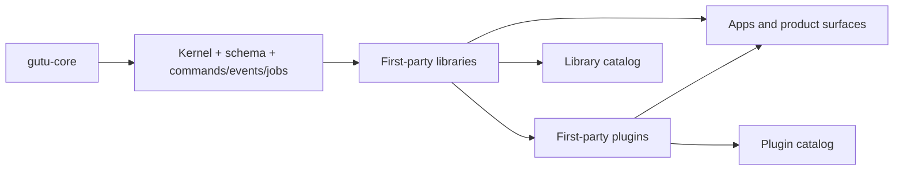

# gutu-libraries

  

Catalog repository for first-party Gutu libraries.

This catalog is a **truth-first index** for the extracted library ecosystem. The badges and maturity labels referenced here are local-status documentation badges backed by repo facts, not live npm or GitHub Actions badges.

## Live Catalog Surface

- `catalog/index.json` tracks the full first-party library inventory.
- `channels/stable.json` and `channels/next.json` are the installable release channels used by `gutu vendor sync`.
- Promoted channel entries point at signed GitHub Release assets and are validated in CI before merge.

## What Gutu Solves

| Platform Problem | Typical Failure Mode | Gutu Response |
| --- | --- | --- |
| Shared code turns into undocumented internal glue | Teams copy utilities across apps and silently fork behavior. | Gutu libraries keep reusable behavior versioned, typed, and documented as standalone repos. |
| UI primitives drift from domain/runtime contracts | Frontend work becomes coupled to product-specific assumptions. | Libraries separate UI foundations, data helpers, and runtime packages from plugin-level business ownership. |
| Repo extraction breaks consumption ergonomics | Independent packages become painful to install and verify together. | Gutu uses workspace-aware docs, vendor sync, and certification to keep multi-repo consumption honest. |

## Ecosystem Shape

## Library Maturity Matrix

| Library | Domain | Maturity | Verification | UI | Consumption | Docs |
| --- | --- | --- | --- | --- | --- | --- |
| [Admin Builders](https://github.com/gutula/gutu-lib-admin-builders#readme) | Admin Experience | Hardened | Build+Typecheck+Lint+Test | Mixed runtime helpers | Imports + typed UI primitives | [Developer](https://github.com/gutula/gutu-lib-admin-builders/blob/main/DEVELOPER.md) |
| [Admin Contracts](https://github.com/gutula/gutu-lib-admin-contracts#readme) | Admin Experience | Hardened | Build+Typecheck+Lint+Test | Mixed runtime helpers | Imports + typed UI primitives | [Developer](https://github.com/gutula/gutu-lib-admin-contracts/blob/main/DEVELOPER.md) |
| [Admin Form View](https://github.com/gutula/gutu-lib-admin-formview#readme) | Admin Experience | Hardened | Build+Typecheck+Lint+Test | Headless typed exports | Imports + typed helpers | [Developer](https://github.com/gutula/gutu-lib-admin-formview/blob/main/DEVELOPER.md) |
| [Admin List View](https://github.com/gutula/gutu-lib-admin-listview#readme) | Admin Experience | Hardened | Build+Typecheck+Lint+Test | Headless typed exports | Imports + typed helpers | [Developer](https://github.com/gutula/gutu-lib-admin-listview/blob/main/DEVELOPER.md) |
| [Admin Reporting](https://github.com/gutula/gutu-lib-admin-reporting#readme) | Admin Experience | Baseline | Build+Typecheck+Lint+Test | Headless typed exports | Imports + typed helpers | [Developer](https://github.com/gutula/gutu-lib-admin-reporting/blob/main/DEVELOPER.md) |
| [Admin Shell Workbench](https://github.com/gutula/gutu-lib-admin-shell-workbench#readme) | Admin Experience | Hardened | Build+Typecheck+Lint+Test | React UI + typed helpers | Imports + typed UI primitives | [Developer](https://github.com/gutula/gutu-lib-admin-shell-workbench/blob/main/DEVELOPER.md) |
| [Admin Widgets](https://github.com/gutula/gutu-lib-admin-widgets#readme) | Admin Experience | Hardened | Build+Typecheck+Lint+Test | Mixed runtime helpers | Imports + typed UI primitives | [Developer](https://github.com/gutula/gutu-lib-admin-widgets/blob/main/DEVELOPER.md) |
| [AI](https://github.com/gutula/gutu-lib-ai#readme) | AI Foundation | Hardened | Build+Typecheck+Lint+Test | Headless typed exports | Imports + typed helpers | [Developer](https://github.com/gutula/gutu-lib-ai/blob/main/DEVELOPER.md) |
| [AI Evals](https://github.com/gutula/gutu-lib-ai-evals#readme) | AI Foundation | Hardened | Build+Typecheck+Lint+Test | Headless typed exports | Imports + typed helpers | [Developer](https://github.com/gutula/gutu-lib-ai-evals/blob/main/DEVELOPER.md) |
| [AI Guardrails](https://github.com/gutula/gutu-lib-ai-guardrails#readme) | AI Foundation | Hardened | Build+Typecheck+Lint+Test | Headless typed exports | Imports + typed helpers | [Developer](https://github.com/gutula/gutu-lib-ai-guardrails/blob/main/DEVELOPER.md) |
| [AI MCP](https://github.com/gutula/gutu-lib-ai-mcp#readme) | AI Foundation | Hardened | Build+Typecheck+Lint+Test | Headless typed exports | Imports + typed helpers | [Developer](https://github.com/gutula/gutu-lib-ai-mcp/blob/main/DEVELOPER.md) |
| [AI Memory](https://github.com/gutula/gutu-lib-ai-memory#readme) | AI Foundation | Hardened | Build+Typecheck+Lint+Test | Headless typed exports | Imports + typed helpers | [Developer](https://github.com/gutula/gutu-lib-ai-memory/blob/main/DEVELOPER.md) |
| [AI Runtime](https://github.com/gutula/gutu-lib-ai-runtime#readme) | AI Foundation | Hardened | Build+Typecheck+Lint+Test | Headless typed exports | Imports + typed helpers | [Developer](https://github.com/gutula/gutu-lib-ai-runtime/blob/main/DEVELOPER.md) |
| [Analytics](https://github.com/gutula/gutu-lib-analytics#readme) | Core Data And Query | Hardened | Build+Typecheck+Lint+Test | Headless typed exports | Imports + typed helpers | [Developer](https://github.com/gutula/gutu-lib-analytics/blob/main/DEVELOPER.md) |
| [Communication](https://github.com/gutula/gutu-lib-communication#readme) | Core Data And Query | Hardened | Build+Typecheck+Lint+Test | Headless typed exports | Imports + typed helpers | [Developer](https://github.com/gutula/gutu-lib-communication/blob/main/DEVELOPER.md) |
| [Contracts](https://github.com/gutula/gutu-lib-contracts#readme) | Core Data And Query | Hardened | Build+Typecheck+Lint+Test+Contracts | Headless typed exports | Imports + typed helpers | [Developer](https://github.com/gutula/gutu-lib-contracts/blob/main/DEVELOPER.md) |
| [Data Table](https://github.com/gutula/gutu-lib-data-table#readme) | Core Data And Query | Hardened | Build+Typecheck+Lint+Test | Headless typed exports | Imports + typed helpers | [Developer](https://github.com/gutula/gutu-lib-data-table/blob/main/DEVELOPER.md) |
| [Email Templates](https://github.com/gutula/gutu-lib-email-templates#readme) | Core Data And Query | Baseline | Build+Typecheck+Lint+Test | Headless typed exports | Imports + typed helpers | [Developer](https://github.com/gutula/gutu-lib-email-templates/blob/main/DEVELOPER.md) |
| [Form](https://github.com/gutula/gutu-lib-form#readme) | Core Data And Query | Baseline | Build+Typecheck+Lint+Test | Headless typed exports | Imports + typed helpers | [Developer](https://github.com/gutula/gutu-lib-form/blob/main/DEVELOPER.md) |
| [Geo](https://github.com/gutula/gutu-lib-geo#readme) | Core Data And Query | Hardened | Build+Typecheck+Lint+Test | Headless typed exports | Imports + typed helpers | [Developer](https://github.com/gutula/gutu-lib-geo/blob/main/DEVELOPER.md) |
| [Query](https://github.com/gutula/gutu-lib-query#readme) | Core Data And Query | Baseline | Build+Typecheck+Lint+Test | Headless typed exports | Imports + typed helpers | [Developer](https://github.com/gutula/gutu-lib-query/blob/main/DEVELOPER.md) |
| [Router](https://github.com/gutula/gutu-lib-router#readme) | Core Data And Query | Baseline | Build+Typecheck+Lint+Test | Headless typed exports | Imports + typed helpers | [Developer](https://github.com/gutula/gutu-lib-router/blob/main/DEVELOPER.md) |
| [Search](https://github.com/gutula/gutu-lib-search#readme) | Core Data And Query | Hardened | Build+Typecheck+Lint+Test | Headless typed exports | Imports + typed helpers | [Developer](https://github.com/gutula/gutu-lib-search/blob/main/DEVELOPER.md) |
| [Telemetry UI](https://github.com/gutula/gutu-lib-telemetry-ui#readme) | Core Data And Query | Baseline | Build+Typecheck+Lint+Test | Headless typed exports | Imports + typed helpers | [Developer](https://github.com/gutula/gutu-lib-telemetry-ui/blob/main/DEVELOPER.md) |
| [Chart](https://github.com/gutula/gutu-lib-chart#readme) | UI Foundation | Hardened | Build+Typecheck+Lint+Test | Mixed runtime helpers | Imports + typed UI primitives | [Developer](https://github.com/gutula/gutu-lib-chart/blob/main/DEVELOPER.md) |
| [Command Palette](https://github.com/gutula/gutu-lib-command-palette#readme) | UI Foundation | Baseline | Build+Typecheck+Lint+Test | Mixed runtime helpers | Imports + typed UI primitives | [Developer](https://github.com/gutula/gutu-lib-command-palette/blob/main/DEVELOPER.md) |
| [Editor](https://github.com/gutula/gutu-lib-editor#readme) | UI Foundation | Baseline | Build+Typecheck+Lint+Test | React UI + typed helpers | Imports + typed UI primitives | [Developer](https://github.com/gutula/gutu-lib-editor/blob/main/DEVELOPER.md) |
| [Layout](https://github.com/gutula/gutu-lib-layout#readme) | UI Foundation | Baseline | Build+Typecheck+Lint+Test | Mixed runtime helpers | Imports + typed UI primitives | [Developer](https://github.com/gutula/gutu-lib-layout/blob/main/DEVELOPER.md) |
| [UI](https://github.com/gutula/gutu-lib-ui#readme) | UI Foundation | Hardened | Build+Typecheck+Lint+Test | Mixed runtime helpers | Imports + typed UI primitives | [Developer](https://github.com/gutula/gutu-lib-ui/blob/main/DEVELOPER.md) |
| [UI Editor](https://github.com/gutula/gutu-lib-ui-editor#readme) | UI Foundation | Baseline | Build+Typecheck+Lint+Test | Headless typed exports | Imports + typed helpers | [Developer](https://github.com/gutula/gutu-lib-ui-editor/blob/main/DEVELOPER.md) |
| [UI Form](https://github.com/gutula/gutu-lib-ui-form#readme) | UI Foundation | Hardened | Build+Typecheck+Lint+Test | Headless typed exports | Imports + typed helpers | [Developer](https://github.com/gutula/gutu-lib-ui-form/blob/main/DEVELOPER.md) |
| [UI Kit](https://github.com/gutula/gutu-lib-ui-kit#readme) | UI Foundation | Hardened | Build+Typecheck+Lint+Test | Mixed runtime helpers | Imports + typed UI primitives | [Developer](https://github.com/gutula/gutu-lib-ui-kit/blob/main/DEVELOPER.md) |
| [UI Query](https://github.com/gutula/gutu-lib-ui-query#readme) | UI Foundation | Hardened | Build+Typecheck+Lint+Test | Headless typed exports | Imports + typed helpers | [Developer](https://github.com/gutula/gutu-lib-ui-query/blob/main/DEVELOPER.md) |
| [UI Router](https://github.com/gutula/gutu-lib-ui-router#readme) | UI Foundation | Hardened | Build+Typecheck+Lint+Test | Mixed runtime helpers | Imports + typed UI primitives | [Developer](https://github.com/gutula/gutu-lib-ui-router/blob/main/DEVELOPER.md) |
| [UI Shell](https://github.com/gutula/gutu-lib-ui-shell#readme) | UI Foundation | Hardened | Build+Typecheck+Lint+Test | React UI + typed helpers | Imports + providers + callbacks | [Developer](https://github.com/gutula/gutu-lib-ui-shell/blob/main/DEVELOPER.md) |
| [UI Table](https://github.com/gutula/gutu-lib-ui-table#readme) | UI Foundation | Hardened | Build+Typecheck+Lint+Test | Headless typed exports | Imports + typed helpers | [Developer](https://github.com/gutula/gutu-lib-ui-table/blob/main/DEVELOPER.md) |
| [UI Zone Next](https://github.com/gutula/gutu-lib-ui-zone-next#readme) | UI Foundation | Baseline | Build+Typecheck+Lint+Test | Headless typed exports | Imports + typed helpers | [Developer](https://github.com/gutula/gutu-lib-ui-zone-next/blob/main/DEVELOPER.md) |
| [UI Zone Static](https://github.com/gutula/gutu-lib-ui-zone-static#readme) | UI Foundation | Baseline | Build+Typecheck+Lint+Test | Headless typed exports | Imports + typed helpers | [Developer](https://github.com/gutula/gutu-lib-ui-zone-static/blob/main/DEVELOPER.md) |

## Admin Experience

| Library | Maturity | Verification | UI | Consumption | Highlights |
| --- | --- | --- | --- | --- | --- |
| [Admin Builders](https://github.com/gutula/gutu-lib-admin-builders#readme) | Hardened | Build+Typecheck+Lint+Test | Mixed runtime helpers | Imports + typed UI primitives | admin composition, layout builders, operator scaffolding |
| [Admin Contracts](https://github.com/gutula/gutu-lib-admin-contracts#readme) | Hardened | Build+Typecheck+Lint+Test | Mixed runtime helpers | Imports + typed UI primitives | registry contracts, admin access, legacy adapters |
| [Admin Form View](https://github.com/gutula/gutu-lib-admin-formview#readme) | Hardened | Build+Typecheck+Lint+Test | Headless typed exports | Imports + typed helpers | form views, admin editors, resource-driven forms |
| [Admin List View](https://github.com/gutula/gutu-lib-admin-listview#readme) | Hardened | Build+Typecheck+Lint+Test | Headless typed exports | Imports + typed helpers | list views, admin indexes, resource tables |
| [Admin Reporting](https://github.com/gutula/gutu-lib-admin-reporting#readme) | Baseline | Build+Typecheck+Lint+Test | Headless typed exports | Imports + typed helpers | reporting helpers, operator summaries, admin analytics |
| [Admin Shell Workbench](https://github.com/gutula/gutu-lib-admin-shell-workbench#readme) | Hardened | Build+Typecheck+Lint+Test | React UI + typed helpers | Imports + typed UI primitives | workspace shell, admin navigation, operator workbench |
| [Admin Widgets](https://github.com/gutula/gutu-lib-admin-widgets#readme) | Hardened | Build+Typecheck+Lint+Test | Mixed runtime helpers | Imports + typed UI primitives | widgets, summary cards, admin composition |

## AI Foundation

| Library | Maturity | Verification | UI | Consumption | Highlights |
| --- | --- | --- | --- | --- | --- |
| [AI](https://github.com/gutula/gutu-lib-ai#readme) | Hardened | Build+Typecheck+Lint+Test | Headless typed exports | Imports + typed helpers | typed AI helpers, prompt composition, model-facing contracts |
| [AI Evals](https://github.com/gutula/gutu-lib-ai-evals#readme) | Hardened | Build+Typecheck+Lint+Test | Headless typed exports | Imports + typed helpers | evaluation helpers, baseline comparisons, AI verification |
| [AI Guardrails](https://github.com/gutula/gutu-lib-ai-guardrails#readme) | Hardened | Build+Typecheck+Lint+Test | Headless typed exports | Imports + typed helpers | guardrails, validation, policy enforcement |
| [AI MCP](https://github.com/gutula/gutu-lib-ai-mcp#readme) | Hardened | Build+Typecheck+Lint+Test | Headless typed exports | Imports + typed helpers | MCP helpers, tool contracts, transport composition |
| [AI Memory](https://github.com/gutula/gutu-lib-ai-memory#readme) | Hardened | Build+Typecheck+Lint+Test | Headless typed exports | Imports + typed helpers | memory helpers, retrieval state, AI persistence seams |
| [AI Runtime](https://github.com/gutula/gutu-lib-ai-runtime#readme) | Hardened | Build+Typecheck+Lint+Test | Headless typed exports | Imports + typed helpers | runtime state, execution helpers, AI orchestration primitives |

## Core Data And Query

| Library | Maturity | Verification | UI | Consumption | Highlights |
| --- | --- | --- | --- | --- | --- |
| [Analytics](https://github.com/gutula/gutu-lib-analytics#readme) | Hardened | Build+Typecheck+Lint+Test | Headless typed exports | Imports + typed helpers | analytics helpers, typed metrics, telemetry composition |
| [Communication](https://github.com/gutula/gutu-lib-communication#readme) | Hardened | Build+Typecheck+Lint+Test | Headless typed exports | Imports + typed helpers | communication helpers, delivery compilers, deterministic providers |
| [Contracts](https://github.com/gutula/gutu-lib-contracts#readme) | Hardened | Build+Typecheck+Lint+Test+Contracts | Headless typed exports | Imports + typed helpers | shared contracts, type utilities, cross-package consistency |
| [Data Table](https://github.com/gutula/gutu-lib-data-table#readme) | Hardened | Build+Typecheck+Lint+Test | Headless typed exports | Imports + typed helpers | data tables, table state, list helpers |
| [Email Templates](https://github.com/gutula/gutu-lib-email-templates#readme) | Baseline | Build+Typecheck+Lint+Test | Headless typed exports | Imports + typed helpers | email templates, rendering helpers, transactional messaging |
| [Form](https://github.com/gutula/gutu-lib-form#readme) | Baseline | Build+Typecheck+Lint+Test | Headless typed exports | Imports + typed helpers | form helpers, schema state, input composition |
| [Geo](https://github.com/gutula/gutu-lib-geo#readme) | Hardened | Build+Typecheck+Lint+Test | Headless typed exports | Imports + typed helpers | geographic helpers, location utilities, typed coordinates |
| [Query](https://github.com/gutula/gutu-lib-query#readme) | Baseline | Build+Typecheck+Lint+Test | Headless typed exports | Imports + typed helpers | query helpers, typed data access, shared request patterns |
| [Router](https://github.com/gutula/gutu-lib-router#readme) | Baseline | Build+Typecheck+Lint+Test | Headless typed exports | Imports + typed helpers | routing contracts, navigation helpers, URL semantics |
| [Search](https://github.com/gutula/gutu-lib-search#readme) | Hardened | Build+Typecheck+Lint+Test | Headless typed exports | Imports + typed helpers | search helpers, result contracts, query composition |
| [Telemetry UI](https://github.com/gutula/gutu-lib-telemetry-ui#readme) | Baseline | Build+Typecheck+Lint+Test | Headless typed exports | Imports + typed helpers | telemetry helpers, UI metrics, front-end observability |

## UI Foundation

| Library | Maturity | Verification | UI | Consumption | Highlights |
| --- | --- | --- | --- | --- | --- |
| [Chart](https://github.com/gutula/gutu-lib-chart#readme) | Hardened | Build+Typecheck+Lint+Test | Mixed runtime helpers | Imports + typed UI primitives | charts, visual analytics, dashboard primitives |
| [Command Palette](https://github.com/gutula/gutu-lib-command-palette#readme) | Baseline | Build+Typecheck+Lint+Test | Mixed runtime helpers | Imports + typed UI primitives | command palette, keyboard actions, shared interactions |
| [Editor](https://github.com/gutula/gutu-lib-editor#readme) | Baseline | Build+Typecheck+Lint+Test | React UI + typed helpers | Imports + typed UI primitives | editor primitives, rich editing, shared authoring UI |
| [Layout](https://github.com/gutula/gutu-lib-layout#readme) | Baseline | Build+Typecheck+Lint+Test | Mixed runtime helpers | Imports + typed UI primitives | layout primitives, responsive structure, shared composition |
| [UI](https://github.com/gutula/gutu-lib-ui#readme) | Hardened | Build+Typecheck+Lint+Test | Mixed runtime helpers | Imports + typed UI primitives | UI primitives, shared components, front-end foundations |
| [UI Editor](https://github.com/gutula/gutu-lib-ui-editor#readme) | Baseline | Build+Typecheck+Lint+Test | Headless typed exports | Imports + typed helpers | editor UI, authoring helpers, component composition |
| [UI Form](https://github.com/gutula/gutu-lib-ui-form#readme) | Hardened | Build+Typecheck+Lint+Test | Headless typed exports | Imports + typed helpers | form components, interaction primitives, shared inputs |
| [UI Kit](https://github.com/gutula/gutu-lib-ui-kit#readme) | Hardened | Build+Typecheck+Lint+Test | Mixed runtime helpers | Imports + typed UI primitives | presentational components, visual system, shared styling |
| [UI Query](https://github.com/gutula/gutu-lib-ui-query#readme) | Hardened | Build+Typecheck+Lint+Test | Headless typed exports | Imports + typed helpers | query UI, view state, data-driven front-end helpers |
| [UI Router](https://github.com/gutula/gutu-lib-ui-router#readme) | Hardened | Build+Typecheck+Lint+Test | Mixed runtime helpers | Imports + typed UI primitives | router-aware UI, navigation components, front-end composition |
| [UI Shell](https://github.com/gutula/gutu-lib-ui-shell#readme) | Hardened | Build+Typecheck+Lint+Test | React UI + typed helpers | Imports + providers + callbacks | shell registry, providers, navigation and telemetry |
| [UI Table](https://github.com/gutula/gutu-lib-ui-table#readme) | Hardened | Build+Typecheck+Lint+Test | Headless typed exports | Imports + typed helpers | table UI, data-heavy views, shared interactions |
| [UI Zone Next](https://github.com/gutula/gutu-lib-ui-zone-next#readme) | Baseline | Build+Typecheck+Lint+Test | Headless typed exports | Imports + typed helpers | zone composition, pluggable regions, next-generation UI assembly |
| [UI Zone Static](https://github.com/gutula/gutu-lib-ui-zone-static#readme) | Baseline | Build+Typecheck+Lint+Test | Headless typed exports | Imports + typed helpers | static zones, pluggable regions, bounded composition |

## Catalog Notes

- Every library repo is expected to publish a public `README.md`, a deep `DEVELOPER.md`, and a repo-local `TODO.md`.
- Libraries should describe imports, providers, callbacks, and typed helpers honestly rather than implying undocumented global hooks.
- Split-repo consumption still relies on the Gutu workspace/vendor model when `workspace:*` dependencies are present.
