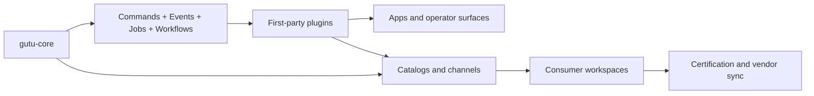

# gutu-plugins

  

Catalog repository for first-party Gutu plugins.

This catalog is a **truth-first index** for the extracted plugin ecosystem. The badges and maturity labels referenced here are local-status documentation badges backed by repo facts, not live npm or GitHub Actions badges.

## Live Catalog Surface

- `catalog/index.json` tracks the full first-party plugin inventory.
- `channels/stable.json` and `channels/next.json` are the installable release channels used by `gutu vendor sync`.
- Promoted channel entries point at signed GitHub Release assets and are validated in CI before merge.

## What Gutu Solves

| Platform Problem | Typical Failure Mode | Gutu Response |
| --- | --- | --- |
| Plugin sprawl without governance | Teams ship hidden dependencies, magical integration points, and stale docs. | Each plugin carries a manifest, explicit capability requests, and repo-local verification. |
| Hook-heavy extension models | Side effects become hard to trace, test, or replay safely. | Gutu prefers commands, resources, durable events, jobs, and workflows over generic hook buses. |
| Monorepo-only internal platforms | Independent release cadence and ownership boundaries stay fuzzy. | Plugins are shaped as standalone repos with focused docs, CI surfaces, and compatibility metadata. |

## Ecosystem Shape

## Maturity Matrix

| Plugin | Domain | Maturity | Verification | DB | Integration | Docs |
| --- | --- | --- | --- | --- | --- | --- |
| [Admin Shell Workbench](https://github.com/gutula/gutu-plugin-admin-shell-workbench) | Platform Backbone | `Baseline` | Build+Typecheck+Lint+Test+Contracts | postgres + sqlite | Actions+Resources+UI | [README](https://github.com/gutula/gutu-plugin-admin-shell-workbench#readme) · [DEVELOPER](https://github.com/gutula/gutu-plugin-admin-shell-workbench/blob/main/DEVELOPER.md) |
| [Audit Core](https://github.com/gutula/gutu-plugin-audit-core) | Platform Backbone | `Baseline` | Build+Typecheck+Lint+Test+Contracts | postgres + sqlite | Actions+Resources+UI | [README](https://github.com/gutula/gutu-plugin-audit-core#readme) · [DEVELOPER](https://github.com/gutula/gutu-plugin-audit-core/blob/main/DEVELOPER.md) |
| [Auth Core](https://github.com/gutula/gutu-plugin-auth-core) | Platform Backbone | `Baseline` | Build+Typecheck+Lint+Test+Contracts | postgres + sqlite | Actions+Resources+UI | [README](https://github.com/gutula/gutu-plugin-auth-core#readme) · [DEVELOPER](https://github.com/gutula/gutu-plugin-auth-core/blob/main/DEVELOPER.md) |
| [Jobs Core](https://github.com/gutula/gutu-plugin-jobs-core) | Platform Backbone | `Hardened` | Build+Typecheck+Lint+Test+Contracts | postgres + sqlite | Actions+Resources+Jobs+UI | [README](https://github.com/gutula/gutu-plugin-jobs-core#readme) · [DEVELOPER](https://github.com/gutula/gutu-plugin-jobs-core/blob/main/DEVELOPER.md) |
| [Org Tenant Core](https://github.com/gutula/gutu-plugin-org-tenant-core) | Platform Backbone | `Baseline` | Build+Typecheck+Lint+Test+Contracts | postgres + sqlite | Actions+Resources+UI | [README](https://github.com/gutula/gutu-plugin-org-tenant-core#readme) · [DEVELOPER](https://github.com/gutula/gutu-plugin-org-tenant-core/blob/main/DEVELOPER.md) |
| [Role Policy Core](https://github.com/gutula/gutu-plugin-role-policy-core) | Platform Backbone | `Baseline` | Build+Typecheck+Lint+Test+Contracts | postgres + sqlite | Actions+Resources+UI | [README](https://github.com/gutula/gutu-plugin-role-policy-core#readme) · [DEVELOPER](https://github.com/gutula/gutu-plugin-role-policy-core/blob/main/DEVELOPER.md) |
| [Workflow Core](https://github.com/gutula/gutu-plugin-workflow-core) | Platform Backbone | `Hardened` | Build+Typecheck+Lint+Test+Contracts | postgres + sqlite | Actions+Resources+Workflows+UI | [README](https://github.com/gutula/gutu-plugin-workflow-core#readme) · [DEVELOPER](https://github.com/gutula/gutu-plugin-workflow-core/blob/main/DEVELOPER.md) |
| [Booking Core](https://github.com/gutula/gutu-plugin-booking-core) | Operational Data | `Hardened` | Build+Typecheck+Lint+Test+Contracts+Migrations | postgres + sqlite | Actions+Resources+UI | [README](https://github.com/gutula/gutu-plugin-booking-core#readme) · [DEVELOPER](https://github.com/gutula/gutu-plugin-booking-core/blob/main/DEVELOPER.md) |
| [Dashboard Core](https://github.com/gutula/gutu-plugin-dashboard-core) | Operational Data | `Baseline` | Build+Typecheck+Lint+Test+Contracts | postgres + sqlite | Actions+Resources+UI | [README](https://github.com/gutula/gutu-plugin-dashboard-core#readme) · [DEVELOPER](https://github.com/gutula/gutu-plugin-dashboard-core/blob/main/DEVELOPER.md) |
| [Notifications Core](https://github.com/gutula/gutu-plugin-notifications-core) | Operational Data | `Production Candidate` | Build+Typecheck+Lint+Test+Contracts+Migrations+Integration | postgres + sqlite | Actions+Resources+Events+Jobs+UI | [README](https://github.com/gutula/gutu-plugin-notifications-core#readme) · [DEVELOPER](https://github.com/gutula/gutu-plugin-notifications-core/blob/main/DEVELOPER.md) |
| [Page Builder Core](https://github.com/gutula/gutu-plugin-page-builder-core) | Operational Data | `Baseline` | Build+Typecheck+Lint+Test+Contracts | postgres + sqlite | Actions+Resources+UI | [README](https://github.com/gutula/gutu-plugin-page-builder-core#readme) · [DEVELOPER](https://github.com/gutula/gutu-plugin-page-builder-core/blob/main/DEVELOPER.md) |
| [Portal Core](https://github.com/gutula/gutu-plugin-portal-core) | Operational Data | `Baseline` | Build+Typecheck+Lint+Test+Contracts | postgres + sqlite | Actions+Resources+UI | [README](https://github.com/gutula/gutu-plugin-portal-core#readme) · [DEVELOPER](https://github.com/gutula/gutu-plugin-portal-core/blob/main/DEVELOPER.md) |
| [Search Core](https://github.com/gutula/gutu-plugin-search-core) | Operational Data | `Baseline` | Build+Typecheck+Lint+Test+Contracts | postgres + sqlite | Actions+Resources+UI | [README](https://github.com/gutula/gutu-plugin-search-core#readme) · [DEVELOPER](https://github.com/gutula/gutu-plugin-search-core/blob/main/DEVELOPER.md) |
| [User Directory](https://github.com/gutula/gutu-plugin-user-directory) | Operational Data | `Baseline` | Build+Typecheck+Lint+Test+Contracts | postgres + sqlite | Actions+Resources+UI | [README](https://github.com/gutula/gutu-plugin-user-directory#readme) · [DEVELOPER](https://github.com/gutula/gutu-plugin-user-directory/blob/main/DEVELOPER.md) |
| [AI Core](https://github.com/gutula/gutu-plugin-ai-core) | AI Systems | `Baseline` | Build+Typecheck+Lint+Test+Contracts | postgres + sqlite | Actions+Resources+Jobs+UI | [README](https://github.com/gutula/gutu-plugin-ai-core#readme) · [DEVELOPER](https://github.com/gutula/gutu-plugin-ai-core/blob/main/DEVELOPER.md) |
| [AI Evals](https://github.com/gutula/gutu-plugin-ai-evals) | AI Systems | `Baseline` | Build+Typecheck+Lint+Test+Contracts | postgres + sqlite | Actions+Resources+Jobs+UI | [README](https://github.com/gutula/gutu-plugin-ai-evals#readme) · [DEVELOPER](https://github.com/gutula/gutu-plugin-ai-evals/blob/main/DEVELOPER.md) |
| [AI RAG](https://github.com/gutula/gutu-plugin-ai-rag) | AI Systems | `Baseline` | Build+Typecheck+Lint+Test+Contracts | postgres + sqlite | Actions+Resources+Jobs+UI | [README](https://github.com/gutula/gutu-plugin-ai-rag#readme) · [DEVELOPER](https://github.com/gutula/gutu-plugin-ai-rag/blob/main/DEVELOPER.md) |
| [Community Core](https://github.com/gutula/gutu-plugin-community-core) | Content and Experience | `Baseline` | Build+Typecheck+Lint+Test+Contracts | postgres + sqlite | Actions+Resources+UI | [README](https://github.com/gutula/gutu-plugin-community-core#readme) · [DEVELOPER](https://github.com/gutula/gutu-plugin-community-core/blob/main/DEVELOPER.md) |
| [Content Core](https://github.com/gutula/gutu-plugin-content-core) | Content and Experience | `Baseline` | Build+Typecheck+Lint+Test+Contracts | postgres + sqlite | Actions+Resources+UI | [README](https://github.com/gutula/gutu-plugin-content-core#readme) · [DEVELOPER](https://github.com/gutula/gutu-plugin-content-core/blob/main/DEVELOPER.md) |
| [Document Core](https://github.com/gutula/gutu-plugin-document-core) | Content and Experience | `Baseline` | Build+Typecheck+Lint+Test+Contracts | postgres + sqlite | Actions+Resources+UI | [README](https://github.com/gutula/gutu-plugin-document-core#readme) · [DEVELOPER](https://github.com/gutula/gutu-plugin-document-core/blob/main/DEVELOPER.md) |
| [Files Core](https://github.com/gutula/gutu-plugin-files-core) | Content and Experience | `Baseline` | Build+Typecheck+Lint+Test+Contracts | postgres + sqlite | Actions+Resources+UI | [README](https://github.com/gutula/gutu-plugin-files-core#readme) · [DEVELOPER](https://github.com/gutula/gutu-plugin-files-core/blob/main/DEVELOPER.md) |
| [Forms Core](https://github.com/gutula/gutu-plugin-forms-core) | Content and Experience | `Baseline` | Build+Typecheck+Lint+Test+Contracts | postgres + sqlite | Actions+Resources+UI | [README](https://github.com/gutula/gutu-plugin-forms-core#readme) · [DEVELOPER](https://github.com/gutula/gutu-plugin-forms-core/blob/main/DEVELOPER.md) |
| [Knowledge Core](https://github.com/gutula/gutu-plugin-knowledge-core) | Content and Experience | `Baseline` | Build+Typecheck+Lint+Test+Contracts | postgres + sqlite | Actions+Resources+UI | [README](https://github.com/gutula/gutu-plugin-knowledge-core#readme) · [DEVELOPER](https://github.com/gutula/gutu-plugin-knowledge-core/blob/main/DEVELOPER.md) |
| [Template Core](https://github.com/gutula/gutu-plugin-template-core) | Content and Experience | `Baseline` | Build+Typecheck+Lint+Test+Contracts | postgres + sqlite | Actions+Resources+UI | [README](https://github.com/gutula/gutu-plugin-template-core#readme) · [DEVELOPER](https://github.com/gutula/gutu-plugin-template-core/blob/main/DEVELOPER.md) |

## Platform Backbone

| Plugin | Maturity | Verification | DB | Integration | Highlights |
| --- | --- | --- | --- | --- | --- |
| [Admin Shell Workbench](https://github.com/gutula/gutu-plugin-admin-shell-workbench) | `Baseline` | Build+Typecheck+Lint+Test+Contracts | postgres + sqlite | Actions+Resources+UI | Default universal admin desk plugin. |
| [Audit Core](https://github.com/gutula/gutu-plugin-audit-core) | `Baseline` | Build+Typecheck+Lint+Test+Contracts | postgres + sqlite | Actions+Resources+UI | Canonical audit trail and sensitive action history. |
| [Auth Core](https://github.com/gutula/gutu-plugin-auth-core) | `Baseline` | Build+Typecheck+Lint+Test+Contracts | postgres + sqlite | Actions+Resources+UI | Canonical identity and session backbone. |
| [Jobs Core](https://github.com/gutula/gutu-plugin-jobs-core) | `Hardened` | Build+Typecheck+Lint+Test+Contracts | postgres + sqlite | Actions+Resources+Jobs+UI | Background jobs, schedules, and execution metadata. |
| [Org Tenant Core](https://github.com/gutula/gutu-plugin-org-tenant-core) | `Baseline` | Build+Typecheck+Lint+Test+Contracts | postgres + sqlite | Actions+Resources+UI | Tenant and organization graph management. |
| [Role Policy Core](https://github.com/gutula/gutu-plugin-role-policy-core) | `Baseline` | Build+Typecheck+Lint+Test+Contracts | postgres + sqlite | Actions+Resources+UI | RBAC and ABAC policy management backbone. |
| [Workflow Core](https://github.com/gutula/gutu-plugin-workflow-core) | `Hardened` | Build+Typecheck+Lint+Test+Contracts | postgres + sqlite | Actions+Resources+Workflows+UI | Explicit workflows and approval state machines. |

## Operational Data

| Plugin | Maturity | Verification | DB | Integration | Highlights |
| --- | --- | --- | --- | --- | --- |
| [Booking Core](https://github.com/gutula/gutu-plugin-booking-core) | `Hardened` | Build+Typecheck+Lint+Test+Contracts+Migrations | postgres + sqlite | Actions+Resources+UI | Reservations, booking holds, and conflict-safe resource allocation flows. |
| [Dashboard Core](https://github.com/gutula/gutu-plugin-dashboard-core) | `Baseline` | Build+Typecheck+Lint+Test+Contracts | postgres + sqlite | Actions+Resources+UI | Dashboard, widget, and saved view backbone. |
| [Notifications Core](https://github.com/gutula/gutu-plugin-notifications-core) | `Production Candidate` | Build+Typecheck+Lint+Test+Contracts+Migrations+Integration | postgres + sqlite | Actions+Resources+Events+Jobs+UI | Canonical outbound communication control plane with delivery endpoints, preferences, attempts, and local provider routes. |
| [Page Builder Core](https://github.com/gutula/gutu-plugin-page-builder-core) | `Baseline` | Build+Typecheck+Lint+Test+Contracts | postgres + sqlite | Actions+Resources+UI | Layout, block, and builder canvas backbone. |
| [Portal Core](https://github.com/gutula/gutu-plugin-portal-core) | `Baseline` | Build+Typecheck+Lint+Test+Contracts | postgres + sqlite | Actions+Resources+UI | Portal shell and self-service entrypoint backbone. |
| [Search Core](https://github.com/gutula/gutu-plugin-search-core) | `Baseline` | Build+Typecheck+Lint+Test+Contracts | postgres + sqlite | Actions+Resources+UI | Typed search indexing and query abstractions. |
| [User Directory](https://github.com/gutula/gutu-plugin-user-directory) | `Baseline` | Build+Typecheck+Lint+Test+Contracts | postgres + sqlite | Actions+Resources+UI | Internal person and directory backbone. |

## AI Systems

| Plugin | Maturity | Verification | DB | Integration | Highlights |
| --- | --- | --- | --- | --- | --- |
| [AI Core](https://github.com/gutula/gutu-plugin-ai-core) | `Baseline` | Build+Typecheck+Lint+Test+Contracts | postgres + sqlite | Actions+Resources+Jobs+UI | Durable agent runtime, prompt governance, approval queues, and replay controls. |
| [AI Evals](https://github.com/gutula/gutu-plugin-ai-evals) | `Baseline` | Build+Typecheck+Lint+Test+Contracts | postgres + sqlite | Actions+Resources+Jobs+UI | Eval datasets, judges, regression baselines, and release-grade AI review. |
| [AI RAG](https://github.com/gutula/gutu-plugin-ai-rag) | `Baseline` | Build+Typecheck+Lint+Test+Contracts | postgres + sqlite | Actions+Resources+Jobs+UI | Tenant-safe memory collections, retrieval diagnostics, and grounded knowledge pipelines. |

## Content and Experience

| Plugin | Maturity | Verification | DB | Integration | Highlights |
| --- | --- | --- | --- | --- | --- |
| [Community Core](https://github.com/gutula/gutu-plugin-community-core) | `Baseline` | Build+Typecheck+Lint+Test+Contracts | postgres + sqlite | Actions+Resources+UI | Community, groups, and membership backbone. |
| [Content Core](https://github.com/gutula/gutu-plugin-content-core) | `Baseline` | Build+Typecheck+Lint+Test+Contracts | postgres + sqlite | Actions+Resources+UI | Pages, posts, and content type backbone. |
| [Document Core](https://github.com/gutula/gutu-plugin-document-core) | `Baseline` | Build+Typecheck+Lint+Test+Contracts | postgres + sqlite | Actions+Resources+UI | Document lifecycle and generated document backbone. |
| [Files Core](https://github.com/gutula/gutu-plugin-files-core) | `Baseline` | Build+Typecheck+Lint+Test+Contracts | postgres + sqlite | Actions+Resources+UI | File references and storage abstractions. |
| [Forms Core](https://github.com/gutula/gutu-plugin-forms-core) | `Baseline` | Build+Typecheck+Lint+Test+Contracts | postgres + sqlite | Actions+Resources+UI | Dynamic forms and submissions backbone. |
| [Knowledge Core](https://github.com/gutula/gutu-plugin-knowledge-core) | `Baseline` | Build+Typecheck+Lint+Test+Contracts | postgres + sqlite | Actions+Resources+UI | Knowledge base, docs, and article tree backbone. |
| [Template Core](https://github.com/gutula/gutu-plugin-template-core) | `Baseline` | Build+Typecheck+Lint+Test+Contracts | postgres + sqlite | Actions+Resources+UI | Reusable templates for content, messages, and workflows. |

## Notes

- Every plugin repo is expected to publish a public `README.md`, a deep `DEVELOPER.md`, and a repo-local `TODO.md`.
- Maturity is assigned from repo truth, test depth, and documented operational coverage. It is not aspirational marketing.
- Cross-plugin composition should be documented through Gutu command, event, job, and workflow primitives rather than undocumented hook systems.
