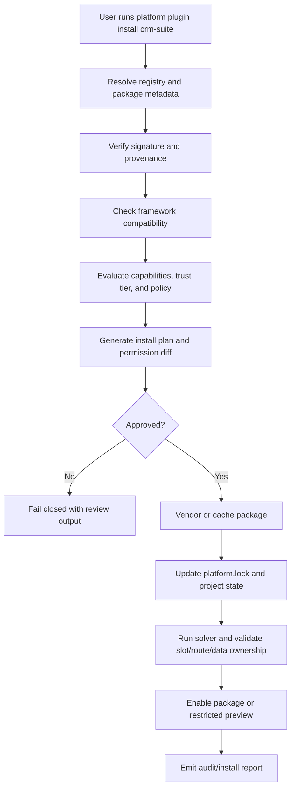
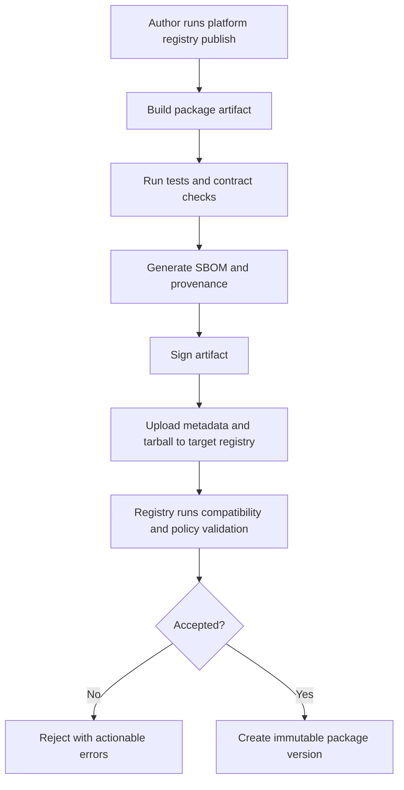

# Ecosystem CLI and Registry Plan

## Objective

Define the clean long-term ecosystem model for the framework:

- one first-class terminal CLI,
- one governed package ecosystem,
- separate plugin and library registries,
- predictable install destinations,
- lockfile-driven resolution,
- and a distribution model that keeps framework source clean.

This document is a roadmap and architecture plan for the next major program after the framework/admin baseline.

## Why This Is Needed

The repository is already structured as:

- `framework/core/*`
- `framework/libraries/*`
- `framework/builtin-plugins/*`
- `plugins/*`
- `apps/*`

That shape is good for source control and framework development, but it is not yet a full ecosystem. What is still missing is the operator layer that lets teams:

- create projects from the terminal,
- scaffold apps, plugins, libraries, bundles, and connectors,
- search/install/update governed packages,
- publish packages into registries,
- verify signatures and provenance,
- and manage dependency state with one consistent command surface.

## Product Stance

The framework should have a real terminal experience, but it should **not** behave like an ungoverned package free-for-all.

The right model is:

- `framework/*` is the shipped framework distribution
- `vendor/*` is where third-party installed code can be vendored into a project when desired
- `.platform/*` is the machine/project metadata and cache area
- registries are governed, signed, policy-aware install sources
- one CLI owns install plans, lockfiles, signatures, trust, and activation

## Design Principles

1. Framework source remains clean
   - third-party installs must never mutate `framework/core/*` or `framework/libraries/*`
   - built-in plugins remain shipped with the framework distribution

2. Plugins and libraries are different product types
   - plugins are governed installable packages with capabilities, routes, zones, policies, secrets, and trust implications
   - libraries are reusable framework-facing code packages with compatibility and API-surface implications

3. One CLI owns the workflow
   - developers should not need a pile of separate scripts to create, install, publish, validate, or inspect packages

4. Install resolution must be explicit
   - every install goes through compatibility checks, trust checks, and lockfile updates

5. The public marketplace comes last
   - private and partner registry maturity comes before a public marketplace

## Proposed Clean Structure

```text
framework/
  core/
  libraries/
  builtin-plugins/

plugins/
  domain/
  feature-packs/
  connectors/
  migrations/
  verticals/
  bundles/

vendor/
  plugins/
  libraries/

.platform/
  cache/
  registry/
  state/
  logs/

apps/
docs/
ops/
tooling/
```

### Responsibilities

| Path | Purpose |
|---|---|
| `framework/core/*` | framework engine, runtime, DB, auth, permissions, API, kernel |
| `framework/libraries/*` | shared reusable developer-facing libraries and UI/admin wrappers |
| `framework/builtin-plugins/*` | batteries-included plugins shipped with the framework |
| `plugins/*` | repo-authored optional first-party extensions |
| `vendor/plugins/*` | registry-installed external plugins vendored into a project |
| `vendor/libraries/*` | registry-installed external libraries vendored into a project |
| `.platform/cache/*` | local fetched package tarballs, unpacked metadata, registry cache |
| `.platform/state/*` | install plans, trust state, review state, registry credentials metadata |

## CLI Model

## Command Name

Use a single root command:

```txt
platform
```

That command should be the equivalent of:

- `django-admin`
- `npm`
- `pip`
- `aws`

but specialized to this framework’s governed package model.

## Command Families

### Project and workspace

```txt
platform new
gutu init
platform doctor
platform dev
platform build
platform test
platform graph
platform status
platform sync
```

### Scaffolding

```txt
platform make app
platform make plugin
platform make library
platform make connector
platform make migration-pack
platform make bundle
platform make zone
```

### Plugin lifecycle

```txt
platform plugin search
platform plugin info
platform plugin install
platform plugin update
platform plugin remove
platform plugin enable
platform plugin disable
platform plugin trust
platform plugin review
platform plugin diff
platform plugin verify
```

### Library lifecycle

```txt
platform library search
platform library info
platform library add
platform library update
platform library remove
platform library verify
```

### Registry operations

```txt
platform registry login
platform registry whoami
platform registry list
platform registry use
platform registry publish
platform registry promote
platform registry yank
platform registry verify
```

### Governance and security

```txt
platform policy check
platform policy review
platform signature verify
platform provenance verify
platform sbom generate
platform audit
```

### Data and install flows

```txt
platform bundle install
platform migrate discover
platform migrate map
platform migrate dry-run
platform migrate import
platform migrate reconcile
```

## Registry Model

## Two Distinct Registry Types

### 1. Plugin store

Use for:

- installable plugins,
- zones,
- connectors,
- migration packs,
- bundles,
- feature packs,
- vertical packs.

Plugin store requirements:

- manifests are mandatory
- capabilities are explicit
- trust tier is explicit
- signature and provenance are mandatory
- install review may be required
- compatibility with the framework version must be declared
- restricted-mode behavior must be declared

### 2. Library registry

Use for:

- reusable framework-facing code libraries
- UI extensions that stay within framework wrappers
- SDK adapters that do not become plugins themselves

Library registry requirements:

- package compatibility ranges
- signed releases
- API surface metadata
- no privileged plugin-style activation lifecycle

## Registry Tiers

| Tier | Purpose |
|---|---|
| local registry | offline/dev/test packages |
| private org registry | enterprise-owned internal packages |
| partner registry | approved third-party ecosystem |
| public registry | only after full maturity |

## Install Modes

The CLI should support two modes:

### 1. Vendored mode

The package is unpacked into:

- `vendor/plugins/*`
- `vendor/libraries/*`

Use when:

- source must be reviewable in the repo
- enterprise auditability matters
- teams want deterministic checked-in packages

### 2. Cached mode

The package stays in `.platform/cache/*` and the lockfile points to it.

Use when:

- local development speed matters
- vendoring is not required
- the environment is ephemeral

The default should be:

- plugins: vendored mode by default
- libraries: cached mode by default, with an option to vendor

## Lockfiles and Metadata

Add framework-owned metadata files:

```text
platform.project.json
platform.lock
.platform/state/trust.json
.platform/state/registry.json
```

### `platform.project.json`

Owns:

- framework version
- enabled built-in plugins
- enabled external plugins
- active registries
- install policy defaults
- vendor vs cache preferences
- environment/profile metadata

### `platform.lock`

Owns:

- resolved package versions
- resolved digests
- signature fingerprints
- provenance references
- compatibility snapshots
- transitive dependency graph summary

## End-to-End Install Flow



## Publish Flow



## Security and Governance Rules

### Plugins

- plugin installs always run through capability review
- dangerous-capability diffs are never silently accepted
- unknown publishers default to restricted preview or rejection
- zones, routes, data ownership, and slot claims are revalidated on install/update
- secret requirements and host allowlists are part of the install plan

### Libraries

- libraries still require signatures and provenance
- libraries do not get plugin activation privileges
- libraries used by admin-registered plugins must remain within wrapper policy

### Registries

- every registry has:
  - issuer metadata
  - signature roots
  - policy mode
  - allowed package kinds
  - promotion workflow

## CLI Package Design

Implement the CLI as a framework package:

```text
framework/core/cli/
```

Suggested package id:

```txt
@platform/cli
```

Binary:

```txt
platform
```

### Internal modules

```text
framework/core/cli/src/
  commands/
  registry/
  installers/
  publishers/
  renderers/
  doctor/
  policy/
  prompts/
  lockfile/
  state/
```

### Core CLI responsibilities

- command parsing
- registry configuration
- install plan rendering
- signature/provenance verification
- workspace mutations
- lockfile writes
- solver invocation
- policy checks
- scaffolding
- diagnostics

## Recommended Implementation Order

### Phase E1 - CLI foundation

- create `@platform/cli`
- implement `platform doctor`, `platform status`, `platform graph`, `platform sync`
- move existing root workspace scripts behind CLI subcommands

### Phase E2 - Scaffolding

- implement `platform new`
- implement `gutu init`
- implement `platform make plugin`
- implement `platform make library`
- implement `platform make app`
- keep generated output aligned to the current repository taxonomy

### Phase E3 - Local registry and lockfile

- implement `platform.project.json`
- implement `platform.lock`
- implement a local file-backed registry index
- support local `platform plugin install ./path` and `platform library add ./path`

### Phase E4 - Vendoring and cache engine

- implement `vendor/plugins/*`
- implement `vendor/libraries/*`
- implement `.platform/cache/*`
- add integrity verification and deterministic unpacking

### Phase E5 - Private org registry

- registry login
- publish
- promote
- yank
- signature root configuration
- provenance verification

### Phase E6 - Plugin governance workflow

- install review plans
- permission diff display
- restricted preview activation
- update rollback plans
- CLI audit and verification commands

### Phase E7 - Library registry maturity

- compatibility metadata
- library add/update/remove
- API compatibility checks
- cache/vendor policy per library

### Phase E8 - Marketplace maturity

- partner registry support
- registry review workflow
- listing metadata
- scores, warnings, health, and support metadata
- public marketplace only after supply-chain maturity remains green

## Things To Avoid

1. Do not install third-party packages into `framework/core/*`.
2. Do not install third-party packages into `framework/libraries/*`.
3. Do not make built-in plugins special at runtime just because they ship with the framework.
4. Do not treat plugins and libraries as one undifferentiated package type.
5. Do not let plugin installation bypass signatures, provenance, capability review, or solver validation.
6. Do not make the public marketplace the first registry target.
7. Do not let the CLI become only a thin wrapper around ad hoc scripts forever.

## Final Recommendation

Yes, the framework should absolutely grow a strong ecosystem layer with:

- a first-class `platform` CLI,
- a governed plugin store,
- a separate library registry,
- deterministic vendor/cache install modes,
- and a clean project structure that preserves framework source integrity.

The most important architectural rule is:

> Treat framework source as immutable distribution code, and treat external installs as governed project dependencies managed by the CLI.

That gives you the Django-like “one command does everything” experience without sacrificing the framework’s plugin governance, trust model, and long-term maintainability.
