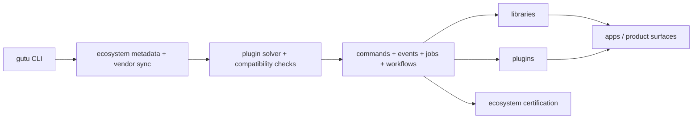

# Gutu Core

<p align="center">
  
</p>

`gutu-core` is the clean, plugin-free foundation repository for the Gutu ecosystem. It owns the runtime model, compatibility contracts, install and release machinery, and the orchestration primitives that keep the wider plugin ecosystem coherent.

## What gutu-core Is Responsible For

| Area | What gutu-core Owns | Why It Exists |
| --- | --- | --- |
| Package and repo boundaries | Kernel contracts, manifest validation, permissions, schema helpers, plugin solving | Extracted repos need one authoritative operating model |
| Ecosystem delivery | Lockfiles, vendor sync, channels, catalog metadata, rollout tooling | Consumers need reproducible installs across many repos |
| Runtime orchestration | Commands, events, jobs, workflows, and topology validation | Cross-plugin behavior must be explicit and governable |
| Release truth | Provenance, signatures, verification, doctor checks, release manifests | “Works on my machine” is not enough for a real framework |

## What Gutu Solves For Teams

| Team Problem | Without gutu-core | With gutu-core |
| --- | --- | --- |
| Independent repos drift apart | Packages compile in isolation but fail together | Compatibility metadata and certification keep the graph honest |
| Business automations become magical side effects | Teams overuse implicit callbacks or generic hooks | Commands, durable events, jobs, and workflows define the supported runtime surface |
| Split repos become hard to consume | Local workspaces and releases diverge | Vendor sync, lockfiles, and signed artifacts keep installs reproducible |
| Internal platform docs fall behind reality | New teams cannot tell what is truly supported | Doctor checks, release validation, and truth-first docs keep claims bounded |

## Why Commands, Events, Jobs, And Workflows Beat Generic Hooks

| Model | Where It Breaks | Gutu Response |
| --- | --- | --- |
| Generic hooks | Hidden ordering, poor observability, fragile coupling | Commands and resources stay explicit; events and jobs are durable and typed |
| Direct cross-plugin service calls | Tight coupling and upgrade pain | Plugin contracts are registered through manifests and stable public surfaces |
| Queue-only async systems | Hard to see business ownership and intent | Jobs and workflows are attached to domain surfaces and verification evidence |

## Architecture At A Glance



## Production Baseline

The rebuilt core baseline now includes:

- cross-platform `gutu init` bootstrapping with vendored framework installs under `vendor/framework`
- automatic `copy` fallback for Windows and other symlink-restricted hosts, with explicit `copy|symlink|auto` control
- signed release manifest generation and verification
- provenance generation for release artifacts
- remote `file://` and `http(s)` artifact fetching with digest enforcement
- signed vendor sync for consumer workspaces
- scaffolding for external plugin, library, and integration repositories
- rollout automation for batch repo scaffolding, catalog seeding, GitHub provisioning, and package publishing into live channels
- repository-boundary doctor checks for keeping `gutu-core` plugin-free
- first-party runtime packages for package metadata, permissions, schema, commands, events, jobs, database access, and plugin solving
- an explicit orchestration model built around commands, durable events, and jobs/workflows instead of generic hooks
- checked-in live topology metadata for cloning the real `gutula/*` repo graph during release orchestration and certification
- standalone catalog repos with `catalog/index.json` plus `stable` and `next` channel files backed by signed GitHub Release artifacts

## Current Core Packages

- `@gutu/kernel`: manifest and repository-boundary contracts
- `@gutu/ecosystem`: lockfile, catalog, compatibility, and workspace bootstrap contracts
- `@gutu/cli`: command surface for scaffolding and boundary checks
- `@gutu/release`: release artifact packaging, provenance, and signatures
- `@platform/kernel`: package definitions and validation errors for extracted repos
- `@platform/permissions`: install review and permission evaluation helpers
- `@platform/schema`: action/resource schema helpers and JSON schema conversion
- `@platform/commands`: explicit cross-plugin command dispatch with idempotency-aware receipts
- `@platform/events`: durable outbox-style event envelopes, subscriptions, retries, dead-lettering, and replay
- `@platform/jobs`: job definitions, retries, dead-letter handling, and workflow transitions
- `@platform/db-drizzle`: postgres database client and raw SQL helpers for extracted first-party plugins
- `@platform/plugin-solver`: dependency ordering plus command/event topology warnings

## Compare The Operating Model

| Concern | Conventional Outcome | Gutu-Core Outcome |
| --- | --- | --- |
| Packaging | Core and extensions blur together over time | `gutu-core` stays plugin-free and treats plugins as external repos |
| Cross-plugin automation | Integrators reinvent ad hoc side effects | The runtime provides commands, events, jobs, and workflows as first-class primitives |
| Consumer onboarding | Every adopter assembles their own install story | The CLI and ecosystem metadata define one repeatable path |
| Release confidence | Build success is mistaken for platform readiness | Release manifests, provenance, doctor checks, and certification add operational proof |

## Commands

```bash
bun install
bun run build
bun run typecheck
bun run lint
bun run test
bun run ci
bun run release:prepare
bun run rollout:scaffold
bun run rollout:sync-catalogs
bun run gutu -- init demo-workspace --framework-install-mode auto
bun run gutu -- rollout publish-package --target @platform/communication --kind library --channel stable
bun run gutu -- doctor
```

## Consumer Bootstrap

`gutu init` now does more than write placeholder folders. It creates the workspace, records the selected framework install mode in `gutu.project.json`, and installs a local framework root into `vendor/framework` so teams can bootstrap predictably on developer laptops and locked-down enterprise endpoints.

- `auto` prefers `symlink` only when the host can safely create directory links.
- Windows and other symlink-restricted environments fall back to `copy`.
- `copy` is the safest mode for enterprise rollouts where link policies are unknown.
- `gutu vendor sync` still handles plugin and library artifacts after the framework bootstrap is in place.

## Live Rollout Surface

- `ecosystem/rollout/live-topology.json` captures the real repo graph used for live publishing and certification.
- `gutu rollout sync-catalogs` seeds the standalone catalog indexes from the checked-out first-party repos.
- `gutu rollout publish-package` builds a target package, creates signed release assets, uploads them to GitHub Releases, and promotes the result into the live catalog repo and channel.
- The initial live stable channel is seeded with signed assets for `@platform/communication` and `@plugins/notifications-core`, which are also the consumer-smoke fixtures for the live certification lane.

## More Reading

- [Framework Overview](./docs/framework-overview.md)
- [Architecture Notes](./docs/architecture.md)
- [Status](./STATUS.md)
- [Risk Register](./RISK_REGISTER.md)
- [Implementation Ledger](./IMPLEMENTATION_LEDGER.md)
