# gutu-ecosystem-integration

<p align="center">
  
</p>

Cross-repo certification harness for the split Gutu ecosystem.

This repository clones the live `gutula/*` repo topology by default, assembles a temporary certification workspace, and verifies the ecosystem the way a real adopter experiences it. A local umbrella-workspace path still exists as an explicit override for development and debugging.

## Why This Repo Exists

| Question | Answer |
| --- | --- |
| What does it prove? | That the split ecosystem installs, builds, tests, packages, and vendor-syncs the way the docs claim it does. |
| Why does it matter? | Multi-repo frameworks often look clean on paper but break when a consumer tries to assemble them end to end. |
| How is Gutu different? | This repo turns “integration confidence” into a repeatable artifact, not a hopeful assumption. |

## What It Verifies

- dependency-closure audit across extracted libraries and plugins, with app verification kept for explicit local override runs
- zero compatibility shims across the live core runtime surface
- workspace install across the assembled ecosystem
- per-package `lint`, `typecheck`, `test`, and `build` scripts when present
- npm publication smoke checks with `npm pack --dry-run`
- consumer-workspace scaffolding and `gutu vendor sync` using signed GitHub Release artifacts referenced by the live catalog repos

## Consumer Journey Simulation

```mermaid
flowchart LR
  Repos["live repos + catalogs"] --> Assemble["clone + assemble certification workspace"]
  Assemble --> Audit["dependency + manifest audit"]
  Audit --> Certify["per-package certify matrix"]
  Certify --> Pack["pack and dry-run publish surfaces"]
  Pack --> Consumer["create demo consumer workspace"]
  Consumer --> Vendor["gutu vendor sync from live channels"]
  Vendor --> Reports["reports and certification evidence"]
```



## Commands

```bash
bun install
bun run audit
bun run certify
bun run consumer:smoke
bun run ci
bun run ci:local
```

Live mode is the default. Set `GUTU_ECOSYSTEM_MODE=local` or use the `*:local` scripts when you want to certify the umbrella workspace instead of the published repo graph.

Generated reports are written to `reports/`.
