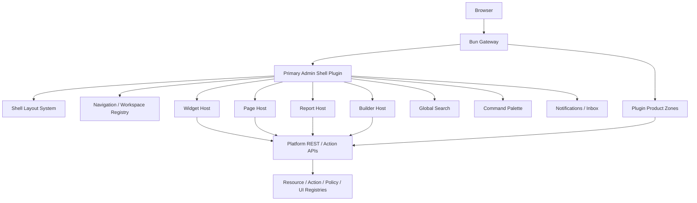

# Admin UI Developer Deep Dive — Frappe-Inspired Universal Desk

> This document is the implementation guide for the **admin UI system** of the platform.
>
> It is written for:
> - framework engineers,
> - shell/UI architects,
> - plugin authors,
> - Codex/AI implementation agents.
>
> This document should be used together with:
> - `Goal.md`
> - `Developer_DeepDive.md`

---

## 1. Objective

Build an **admin UI system** that is:

- universal,
- metadata-driven where useful,
- highly customizable,
- plugin-driven,
- secure by default,
- able to host CRUD, reports, dashboards, builders, control rooms, workflows, and product-like operator consoles,
- replaceable in the future by alternative admin-shell plugins.

The preferred inspiration is **Frappe** for the overall “universal desk/framework admin” feeling, with selective borrowing from **ToolJet** and **Metabase**.

### 1.1 What to borrow from each reference

#### Frappe — borrow heavily
Borrow:
- workspace / desk model
- unified admin information architecture
- metadata-driven list/form/report flows
- tight integration between permissions, views, and actions
- built-in global navigation and workspaces
- strong “framework admin” feel

Do **not** borrow:
- server-driven template assumptions
- Python/MariaDB framework coupling
- one-framework-does-everything mindset at the code level

#### ToolJet — borrow selectively
Borrow:
- builder UX patterns
- multi-panel layout for “page + query/editor + preview”
- component palette ideas
- state/query separation in builders
- app/editor experience for internal tools

Do **not** borrow:
- low-code-first assumptions as the primary admin UX
- mixing builder concerns into ordinary CRUD screens
- generic query execution directly in business plugins

#### Metabase — borrow selectively
Borrow:
- dashboard composition
- cards/widgets/questions/metrics patterns
- filters, drill-down, and saved views
- analytics/reporting UX and semantic drill-through ideas
- embedded analytics thinking

Do **not** borrow:
- analytics-first information architecture as the default admin shell
- BI-centric assumptions for operational CRUD

---

## 2. Core product stance

### 2.1 The admin UI is **not just a theme**
It is a governed shell system.

### 2.2 The admin UI must be implemented as:
- a **shell contract**,
- a **default admin-shell plugin**,
- a set of **surface registries**,
- a set of **standard page/view primitives**,
- and optionally **builder/product zone plugins**.

### 2.3 Required future-proof rule

> The platform must allow multiple admin-shell implementations in the future.

So the right model is:

- `admin-shell-contracts` → stable interfaces
- `admin-shell-frappe-like` → default implementation
- future alternatives:
  - `admin-shell-enterprise-console`
  - `admin-shell-minimal`
  - `admin-shell-analytics-heavy`

Only **one** admin shell should own the `primary-admin-shell` slot at a time.

---

## 3. High-level architecture



---

## 4. Design principles for the admin UI

1. **Universal desk first**
   - One admin shell must be able to host many domains consistently.

2. **Metadata where it reduces code**
   - List views, forms, dashboards, reports, filters, and actions should be driven by contracts and contributions.
   - Dense product zones should still allow custom React code.

3. **One shell, many surfaces**
   - dashboard card
   - list page
   - form page
   - detail page
   - report page
   - workflow inbox
   - builder zone
   - plugin zone

4. **Plugin contributions must be explicit**
   - navigation
   - pages
   - widgets
   - actions
   - reports
   - search providers
   - command items
   - builders
   - product zones

5. **Security-aware UI**
   - all surface registration must be permission-aware
   - all field/action visibility is policy-driven
   - the shell must never become a bypass around platform permissions

6. **Swappable shell implementation**
   - the contracts survive shell replacement

---

## 5. What the admin shell must contain

### 5.1 Mandatory capabilities

| Capability | Required | Why |
|---|---:|---|
| global navigation | yes | universal desk structure |
| workspaces | yes | Frappe-like domain grouping |
| dashboard home | yes | landing surface |
| list view system | yes | CRUD at scale |
| form/detail view system | yes | create/edit/detail patterns |
| saved filters/views | yes | operational usability |
| object and bulk actions | yes | admin power |
| report host | yes | reporting and exports |
| widget host | yes | cross-domain cards |
| command palette | yes | fast navigation/actions |
| global search | yes | discoverability |
| notifications/inbox | yes | operator awareness |
| recent / favorites | yes | convenience |
| activity / audit surfaces | yes | enterprise traceability |
| settings surface | yes | system/plugin configuration |
| extension slots | yes | plugin ecosystem |
| breadcrumbs | yes | navigation clarity |
| tenancy context switcher | yes | multitenant ops |
| impersonation banner | yes | support/admin safety |
| theme/design token support | yes | consistent UX |
| zone launcher / deep links | yes | product-oriented plugin UIs |

### 5.2 Strongly recommended capabilities

- report builder
- chart builder
- export center
- background job monitor
- task/workflow inbox
- plugin health panel
- keyboard shortcuts
- split panels / inspectors
- developer debug overlays in dev mode

---

## 6. Shell contracts

The admin shell must be built on contracts, not hardcoded assumptions.

### 6.1 Contract packages

```txt
@platform/admin-contracts
@platform/admin-shell-frappe
@platform/admin-widgets
@platform/admin-listview
@platform/admin-formview
@platform/admin-reporting
@platform/admin-builders
```

### 6.2 Core admin contracts

```ts
export interface AdminShell {
  id: string
  version: string
  mount(contributions: AdminContributionRegistry): Promise<void>
}

export interface AdminContributionRegistry {
  workspaces: WorkspaceContribution[]
  pages: PageContribution[]
  widgets: WidgetContribution[]
  reports: ReportContribution[]
  commands: CommandContribution[]
  searchProviders: SearchContribution[]
  builders: BuilderContribution[]
  zones: ZoneLaunchContribution[]
}
```

### 6.3 Shell slot ownership

The shell plugin claims:

```ts
slotClaims: [
  'primary-admin-shell',
  'admin-nav-host',
  'admin-widget-host',
  'admin-page-host',
  'admin-report-host',
  'admin-builder-host',
]
```

Only one plugin may own these primary shell slots.

---

## 7. Admin surface taxonomy

### 7.1 Workspaces

Workspaces are top-level domain clusters.

Examples:
- CRM
- Sales
- Marketing
- Commerce
- Support
- HR
- Finance
- Inventory
- Manufacturing
- Learning
- Media
- Admin / Settings
- Reports
- Tools

### 7.2 Pages

Standard page types:

| Page type | Use |
|---|---|
| list | tabular resource lists |
| form | create/edit flows |
| detail | read-only object view |
| dashboard | multi-widget pages |
| report | filters + table/chart |
| builder | internal studio/editor |
| wizard | multi-step setup/action |
| queue/inbox | task/work queue |
| settings | plugin/system config |
| timeline/activity | event history / audit |
| console | specialized operator UI |

### 7.3 Widgets

Widget types:
- KPI card
- chart
- table snippet
- activity feed
- quick actions
- status/health
- to-do/inbox card
- empty-state setup card
- approval queue summary
- drill-down widget

### 7.4 Builders

Builder types:
- page builder
- form builder
- workflow builder
- report builder
- email template builder
- dashboard builder
- automation builder
- OTT schedule builder
- LMS curriculum builder

---

## 8. Information architecture — Frappe-like desk model

### 8.1 Recommended top-level admin shell layout

```mermaid
flowchart LR
    Sidebar[Sidebar / Workspace Nav] --> Workspace[Workspace Home]
    Workspace --> Modules[Module Shortcuts]
    Workspace --> Recent[Recent]
    Workspace --> Favorites[Favorites]
    Workspace --> Pinned[Pinned Reports / Builders]
    Workspace --> Alerts[Alerts / Jobs / Tasks]
```



### 8.2 Layout areas

- **top bar**
  - global search
  - command palette entry
  - notifications
  - tenant switcher
  - user menu
  - environment indicator
  - impersonation banner when applicable

- **left sidebar**
  - workspace groups
  - module navigation
  - shortcuts
  - favorites

- **main content**
  - page host
  - widgets
  - reports
  - builders
  - inspectors

- **right utilities / inspectors**
  - activity
  - properties
  - comments/notes
  - docs/help
  - object references

### 8.3 Why this is the right model

Frappe’s strength is not merely its visual style. Its real strength is that it behaves like a **universal workbench** across many domains. The platform should emulate that universal workbench behavior, not its backend coupling.

---

## 9. Admin navigation model

### 9.1 Navigation levels

1. workspace
2. module/group
3. page
4. object/action
5. inspector/deep-link

### 9.2 Navigation registration syntax

```ts
defineAdminNav({
  workspace: 'crm',
  group: 'customers',
  items: [
    {
      id: 'crm.accounts',
      label: 'Accounts',
      icon: 'building',
      to: '/admin/crm/accounts',
      permission: 'crm.account.list',
    },
    {
      id: 'crm.contacts',
      label: 'Contacts',
      icon: 'users',
      to: '/admin/crm/contacts',
      permission: 'crm.contact.list',
    },
  ],
})
```

### 9.3 Rules

- no plugin may mount arbitrary navigation without declaring it
- every nav item must have permission binding
- deep links must remain stable
- workspaces may be hidden if the current tenant/package graph does not include relevant plugins

### 9.4 Favorites / recent

The shell must provide:
- pin/favorite items
- recent pages
- recent objects
- recent reports
- recent builders

These are shell-owned, not plugin-owned.

---

## 10. List view system

### 10.1 Core requirements

The list view is the most used admin surface. It must be first-class.

It must support:
- column definitions
- sorting
- filtering
- search
- saved views
- bulk actions
- row actions
- export
- field visibility toggles
- faceted filters where useful
- selection model
- empty states
- permission-aware actions

### 10.2 Recommended implementation stack

- TanStack Table
- TanStack Query
- platform filter DSL
- platform list contract

### 10.3 List view contract

```ts
export const AccountListView = defineListView({
  resource: 'crm.account',
  columns: [
    { key: 'name', label: 'Name', sortable: true, searchable: true },
    { key: 'ownerUserId', label: 'Owner', sortable: true },
    { key: 'createdAt', label: 'Created', sortable: true },
  ],
  filters: [
    { key: 'ownerUserId', type: 'user-select' },
    { key: 'createdAt', type: 'date-range' },
  ],
  bulkActions: [
    { id: 'reassign', action: 'crm.account.bulk.reassign' },
  ],
})
```

### 10.4 State model

List view state should contain:
- table query state
- filter state
- search state
- selected rows
- pagination
- saved view ID
- optimistic update metadata if needed

### 10.5 Do not do this

- do not hardcode SQL in frontend list pages
- do not bypass platform filter DSL
- do not mix list view state with shell-global state

---

## 11. Form and detail view system

### 11.1 Goals

Form views must feel like Frappe in ease, but be less rigid and more composable.

### 11.2 Required features

- sections
- tabs
- inline validations
- async field validations
- field visibility rules
- read-only / masked fields
- relation pickers
- timeline sidebar
- comments / notes
- attachments
- action buttons
- workflow state banner
- audit snippet
- unsaved changes guard

### 11.3 Form contract

```ts
export const AccountFormView = defineFormView({
  resource: 'crm.account',
  layout: [
    {
      section: 'Basics',
      fields: ['name', 'ownerUserId', 'status'],
    },
    {
      section: 'Metadata',
      fields: ['createdAt', 'updatedAt'],
      readonly: true,
    },
  ],
  actions: [
    { id: 'archive', action: 'crm.account.archive' },
  ],
})
```

### 11.4 Recommended implementation

- React Hook Form adapter
- Zod resolver
- field component registry
- relation/lookup abstractions
- shell-managed dirty-state guards

### 11.5 Detail vs form

Use:
- **detail pages** for high-read, low-edit operator views
- **form pages** for editable workflows

Do not use one component for both without explicit mode handling.

---

## 12. Dashboard and widget system

### 12.1 Principles

Borrow from:
- Frappe → universal desk dashboards
- Metabase → cards, saved metrics, filters, drilldowns
- ToolJet → configurable internal app surfaces

### 12.2 Widget types

```ts
type WidgetKind =
  | 'kpi'
  | 'chart'
  | 'table'
  | 'activity'
  | 'status'
  | 'actions'
  | 'inbox'
  | 'custom'
```

### 12.3 Widget contract

```ts
defineWidget({
  id: 'crm.pipeline-summary',
  kind: 'kpi',
  shell: 'admin',
  slot: 'dashboard.crm',
  permission: 'crm.opportunity.list',
  query: 'crm.pipeline.summary',
  drillTo: '/admin/crm/opportunities',
})
```

### 12.4 Dashboard composition

Dashboards should support:
- layout grid
- filters
- global date range
- widget-level refresh
- drill-down
- export/snapshot
- saved dashboards per role/team/user

### 12.5 Metabase-inspired features to borrow

Borrow:
- saved question/card mindset
- dashboard filter binding
- click-to-drill navigation
- chart-to-list drilldowns
- embedding-friendly analytics surfaces

Do not borrow:
- analytics-first shell assumptions
- BI-centric permissions model

---

## 13. Report system

### 13.1 Report classes

- tabular report
- grouped report
- pivot report
- chart-backed report
- audit report
- compliance report
- export-only report
- metric/semantic report

### 13.2 Frappe-style report ergonomics to borrow

- report page as a first-class admin surface
- filter panel
- export built in
- role-aware report access
- list-like speed with report semantics

### 13.3 Report contract

```ts
defineReport({
  id: 'finance.ar-aging',
  kind: 'tabular',
  permission: 'finance.report.ar_aging',
  query: 'finance.reports.arAging',
  filters: [
    { key: 'asOfDate', type: 'date' },
    { key: 'customer', type: 'account-select' },
  ],
  export: ['csv', 'xlsx', 'pdf'],
})
```

### 13.4 Implementation notes

- report queries should be server-owned
- no raw SQL input in end-user report pages
- report builder must work on approved semantic fields, not arbitrary tables

---

## 14. Builder and studio system

### 14.1 Builders are special surfaces

Builders should **not** be forced into ordinary CRUD pages.

Builders often deserve:
- a dedicated page type,
- sometimes a dedicated zone.

### 14.2 Examples

- page builder
- form builder
- workflow builder
- report builder
- OTT scheduler
- curriculum builder
- automation builder

### 14.3 Borrow from ToolJet

Borrow:
- palette
- central canvas
- settings panel
- data/query panel
- preview mode
- multi-page/builder structure

Do not borrow:
- direct arbitrary data query execution in production operator workflows
- low-code-only assumptions for the whole shell

### 14.4 Builder host contract

```ts
defineBuilder({
  id: 'workflow-builder',
  host: 'admin',
  route: '/admin/tools/workflow-builder',
  permission: 'workflow.builder.use',
  mode: 'embedded-or-zone',
})
```

### 14.5 Zone recommendation

Use zones for builders when:
- they are dense,
- they have many panels,
- they need advanced keyboard interactions,
- they need independent bundle splitting.

---

## 15. Admin shell plugin architecture

### 15.1 Make the admin UI itself a plugin

Yes — this is the correct design.

Use:
- `@platform/admin-contracts`
- `@platform/plugin-admin-shell-frappe`

The shell becomes replaceable later.

### 15.2 Why this is better

Because later you can support:
- `plugin-admin-shell-frappe`
- `plugin-admin-shell-minimal`
- `plugin-admin-shell-enterprise`
- `plugin-admin-shell-analytics`

without changing the rest of the platform.

### 15.3 Plugin manifest example

```ts
export default definePlugin({
  id: 'admin-shell-frappe',
  kind: 'ui-surface',
  slotClaims: [
    'primary-admin-shell',
    'admin-nav-host',
    'admin-page-host',
    'admin-widget-host',
    'admin-report-host',
    'admin-builder-host',
  ],
  providesCapabilities: [
    'ui.shell.admin',
    'ui.admin.widgets',
    'ui.admin.pages',
    'ui.admin.reports',
    'ui.admin.builders',
  ],
  requestedCapabilities: [
    'ui.mount:admin',
    'data.read.settings',
  ],
})
```

### 15.4 Future swap rule

Only one admin shell may be active per tenant/environment unless explicitly running parallel preview environments.

---

## 16. UI zones and product-oriented interfaces

### 16.1 Rule

Plugins may:
- register embedded surfaces in the default admin shell,
- and/or own a separate product-style UI zone.

### 16.2 Path conventions

Recommended:
- embedded shell pages: `/admin/...`
- product zones: `/apps/<plugin-zone>/*`

Examples:
- `/apps/page-builder/*`
- `/apps/ott-studio/*`
- `/apps/lms-studio/*`

### 16.3 Zone contract

```ts
defineZone({
  id: 'ott-studio',
  adapter: 'next-zone',
  mountPath: '/apps/ott-studio',
  assetPrefix: '/_assets/plugins/ott-studio',
  authMode: 'platform-session',
  permission: 'ott.studio.use',
})
```

### 16.4 Rules

- zone mount path must be declared before build
- zone asset prefix must be unique
- zone must use platform auth/session
- business data still goes through platform APIs
- route ownership is explicit

---

## 17. Route model for admin UI

### 17.1 Standard patterns

```txt
/admin
/admin/workspace/:workspace
/admin/:domain/:resource
/admin/:domain/:resource/:id
/admin/:domain/:resource/:id/edit
/admin/reports/:reportId
/admin/tools/:builderId
/apps/:zone/*
```

### 17.2 Object pages

Use stable resource-driven routes:
```txt
/admin/crm/accounts
/admin/crm/accounts/:accountId
/admin/hr/employees/:employeeId
/admin/inventory/items/:itemId
```

### 17.3 Builder routes

```txt
/admin/tools/report-builder
/admin/tools/form-builder
/admin/tools/workflow-builder
```

### 17.4 Zone routes

```txt
/apps/page-builder/*
/apps/ott-studio/*
/apps/lms-studio/*
```

---

## 18. Search and command palette

### 18.1 Global search

The admin shell must support:
- resource search
- page search
- command search
- help/docs search
- recent search history

### 18.2 Search provider contract

```ts
defineSearchProvider({
  id: 'crm-search',
  scopes: ['accounts', 'contacts'],
  search: async (query, ctx) => { ... },
})
```

### 18.3 Command palette

The command palette should support:
- open page
- run action
- switch workspace
- quick create
- quick search object
- open report
- jump to settings
- open builder

### 18.4 Command contract

```ts
defineCommand({
  id: 'crm.account.new',
  label: 'Create Account',
  permission: 'crm.account.create',
  run: ({ navigate }) => navigate('/admin/crm/accounts/new'),
})
```

---

## 19. Permissions and admin UI

### 19.1 UI permission rules

The shell must enforce:
- page visibility
- widget visibility
- action visibility
- field visibility
- report visibility
- builder access
- zone launcher visibility

### 19.2 Important rule

The shell must never be the source of truth for permissions.
It only reflects platform policy.

### 19.3 UI policy helpers

Provide helpers like:

```ts
canViewPage(ctx, 'crm.accounts.list')
canRunAction(ctx, 'finance.invoice.approve')
canSeeField(ctx, 'employee.salary')
```

---

## 20. Design system and component library

### 20.1 Recommended stack

- shadcn/ui for code-distributed components
- Radix primitives for accessibility
- Lucide icons
- TanStack Table for grids
- React Hook Form for form handling
- Tiptap for rich text
- React Email for templates
- Recharts or ECharts wrapper for charts (pick one inside platform UI package)

### 20.2 Required platform components

Build and standardize these wrappers:

- `DataTable`
- `FilterBar`
- `SavedViewSelector`
- `ObjectHeader`
- `FormSection`
- `RelationField`
- `TimelinePanel`
- `ActivityFeed`
- `StatusBadge`
- `KpiCard`
- `ChartCard`
- `ActionMenu`
- `CommandDialog`
- `EmptyState`
- `WizardStepper`
- `DrawerInspector`
- `BulkActionBar`

### 20.3 Rule

Apps/plugins must use platform UI wrappers, not raw third-party components directly, unless they are inside a fully isolated zone package.

---

## 21. State management

### 21.1 State layers

- shell state
- page state
- form state
- query/server state
- zone-local state

### 21.2 Recommended split

| State type | Tool |
|---|---|
| server state | TanStack Query |
| form state | React Hook Form |
| shell state | small platform store |
| route state | TanStack Router |
| complex builder local state | zone-local store (Zustand/Store) only in zone package |

### 21.3 Rule

Do not create one giant global client store for everything.

---

## 22. Theming and white-labeling

### 22.1 Theme layers

- core design tokens
- tenant overrides
- shell skin
- plugin visual tokens
- zone overrides within platform rules

### 22.2 Theme token families

- color
- typography
- spacing
- radius
- shadows
- density
- chart palette
- status colors

### 22.3 Rules

- plugins may extend tokens but not break shell invariants
- zones may restyle internally but must respect auth/error/loading shell patterns
- tenant branding belongs to the shell, not to arbitrary plugins

---

## 23. Reporting, analytics, and metabase-like logic

### 23.1 What to borrow from Metabase

Borrow:
- questions/cards as reusable report units
- dashboard cards as first-class objects
- filter linking
- drill-through
- semantic saved queries
- embedding mindset for analytics surfaces

### 23.2 What not to borrow

Do not:
- make the whole admin shell BI-first
- expose arbitrary SQL query builders to normal users by default
- treat analytics storage as the same as operational app CRUD

### 23.3 Admin shell analytics surfaces

Use analytics in admin for:
- operational dashboards
- KPI scorecards
- funnel/performance screens
- queue metrics
- domain-specific dashboards
- report drill-through

Not as the only navigation model.

---

## 24. Frappe-specific logic to borrow intentionally

### 24.1 Strongly emulate

- desk/workspace feel
- model-driven form/list/report generation
- role-aware navigation
- no-code-ish reporting inside a serious framework
- consistent CRUD and operator ergonomics
- global framework UX instead of per-module chaos

### 24.2 Rebuild differently

Do **not** reproduce:
- backend/server assumptions,
- tight Python/MariaDB coupling,
- monolithic client conventions,
- overly server-driven page composition.

### 24.3 Frappe-style “workspace” recommendation

Implement workspaces as declarative objects:

```ts
defineWorkspace({
  id: 'crm',
  label: 'CRM',
  icon: 'users',
  cards: [...],
  nav: [...],
  reports: [...],
  quickActions: [...],
})
```

---

## 25. ToolJet-specific logic to borrow intentionally

### 25.1 Strongly emulate

- builder page ergonomics
- palette + settings + preview layout
- multi-page editing mindset
- data/query separation in builder UX

### 25.2 Rebuild differently

Do **not**:
- expose arbitrary app building to all admins by default
- make SQL/query execution the default way to build admin features
- merge internal-tool builder assumptions into the universal shell

### 25.3 Where to apply ToolJet ideas

Best fit:
- report builder
- workflow builder
- page builder
- form builder
- automation builder
- data mapping studio

---

## 26. Implementation phases for admin UI

### Phase 1 — shell foundation
Build:
- admin shell contracts
- frappe-like admin shell plugin
- workspaces
- nav
- list/form/detail pages
- dashboard widgets
- command palette
- search
- notifications
- settings surface

### Phase 2 — report and analytics surfaces
Build:
- report host
- filters
- exports
- KPI widgets
- chart cards
- saved reports

### Phase 3 — builders and product zones
Build:
- builder host
- page builder zone
- workflow builder
- report builder
- first zone launcher model

### Phase 4 — advanced operator consoles
Build:
- OTT studio
- LMS studio
- warehouse/fleet consoles
- hospital ward/bed boards
- richer split-pane UIs

### Phase 5 — swappable shell implementations
Build:
- shell contract test suite
- second admin-shell implementation
- migration tooling between shell implementations

---

## 27. Testing the admin UI

### 27.1 Required test layers

- unit tests for shell components
- contract tests for contribution registration
- route ownership tests
- permission-aware rendering tests
- list/form/report integration tests
- E2E tests for:
  - admin login
  - workspace navigation
  - list/detail/form flows
  - dashboard rendering
  - zone launches
  - command palette
  - filters/saved views
  - impersonation banners

### 27.2 Browser testing

Use Playwright for:
- shell smoke
- workspace navigation
- CRUD actions
- report export flows
- widget interactions
- zone mount validation

---

## 28. What not to do

1. Do not hardcode every domain into the shell.
2. Do not let plugins inject random React trees without contracts.
3. Do not make every specialized product UI an embedded page.
4. Do not make every plugin a separate zone.
5. Do not expose raw SQL/query editors in general admin by default.
6. Do not mix analytics dashboards with operational dashboards without clear semantics.
7. Do not tie the shell to one backend framework implementation.
8. Do not let the shell own business logic.
9. Do not let zones bypass auth/session/telemetry contracts.
10. Do not copy Frappe, ToolJet, or Metabase architecture literally.

---

## 29. Codex implementation checklist

### 29.1 Before writing code
- [ ] Read `Goal.md`
- [ ] Read `Developer-DeepDive.md`
- [ ] Read this admin UI guide
- [ ] Identify whether you are building:
  - shell contract
  - shell implementation
  - widget
  - page
  - report
  - builder
  - zone

### 29.2 If building a plugin page
- [ ] Use `definePage`/`defineListView`/`defineFormView`
- [ ] Register route explicitly
- [ ] Bind permission explicitly
- [ ] Use platform UI wrappers
- [ ] Fetch through platform query adapters
- [ ] No raw DB logic in frontend

### 29.3 If building a builder
- [ ] Decide embedded vs zone
- [ ] Define a manifest route/mount
- [ ] Separate preview/editor/query concerns
- [ ] Keep save/publish flows explicit

### 29.4 If building the shell
- [ ] Use contract-first registration
- [ ] Keep workspaces configurable
- [ ] Keep theme tokens shared
- [ ] Keep nav permission-aware
- [ ] Keep route ownership explicit
- [ ] Keep zones governed

---

## 30. Final recommendation

### 30.1 The answer to your core question

Yes — the admin UI should absolutely be:

- a **framework-level universal desk**,
- inspired primarily by **Frappe**,
- enriched selectively by **ToolJet** builder UX and **Metabase** analytics/report ideas,
- implemented as a **replaceable admin-shell plugin**,
- with support for both:
  - embedded admin surfaces,
  - and separate product-oriented plugin UIs.

### 30.2 The best final shape

> **Default:** `admin-shell-frappe`
>
> **Backed by:** contracts + registries + platform UI wrappers
>
> **Extensible through:** widgets, pages, reports, builders, and zones
>
> **Replaceable later by:** alternative admin-shell plugins

That gives you:
- the universal desk feel you want,
- framework-wide consistency,
- room for product-grade UIs,
- and future shell-swappability without rewriting the platform.

### 30.3 The strongest implementation rule

> **Build the admin UI as a governed shell system, not as a pile of pages.**

That is how you get:
- Frappe-like universality,
- ToolJet-like builder power,
- Metabase-like analytics surfaces,
- without losing framework coherence.
